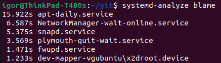

### 3.3 Инициализация системы, Init, systemd [Кулагин Игорь]

>**Задание 1.**
>Выполните systemd-analyze blame.
>Укажите, какие модули загружаются дольше всего.

- apt-daily.service
- NetworkManager-wait-online.service



>**Задание 2.**
>Какой командой вы посмотрите ошибки ядра, произошедшие начиная со вчерашнего дня?

```journalctl --since yesterday --dmesg```

>**Задание 3.**
>Запустите команду loginctl user-status.
>Что выполняет, для чего предназначена эта утилита?

Утилита ```loginctl``` предназначена для получения информации о пользовательской сессии. С ключом ```user-status``` возвращает информацию о запушенных в пользовательской сессии процессах и отображает несколько строк свежих записей логов из журнала, относящихся к этой сессии.

>**Задание 4.**
>Есть ли у вас на машине службы, которые не смогли запуститься? Как вы это определили?

```systemctl list-units --failed```

