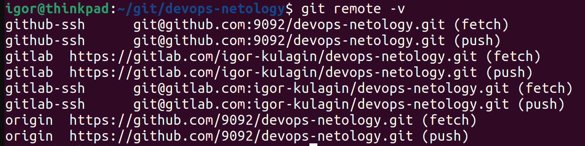
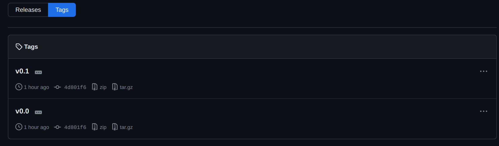
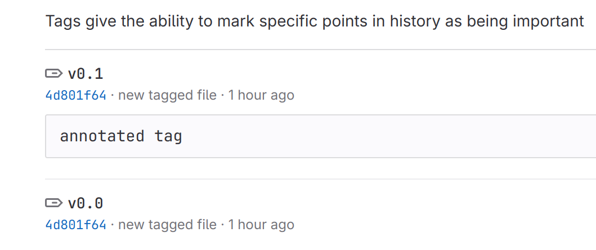
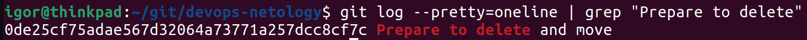
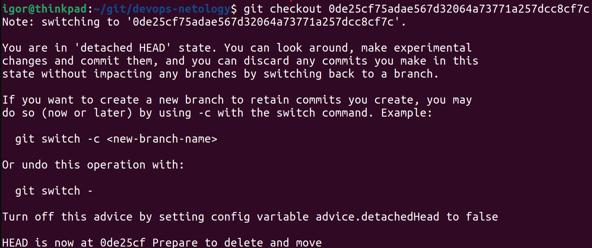

# 02. Основы Git - Кулагин Игорь
## Задание 1. Знакомимся с GitLab и Bitbucket
После регистрации в GitLab добавляем удаленные репозитории:

- По https:

`git remote add gitlab https://gitlab.com/igor-kulagin/devops-netology.git`

- По SSH (процесс генерации ключевой пары оставляем за скобками)

`git remote add gitlab-ssh git@gitlab.com:igor-kulagin/devops-netology.git`

`git remote add github-ssh git@github.com:9092/devops-netology.git`

- Результат:

 

## Задание 2. Теги

**Создаем тэги:**

- простой

`git tag v0.0`

- аннотированный

`git tag -a v0.1 -m "annotated tag`

**Пушим тэги в репозитории**

`git push gitlab-ssh v0.0 v0.1`

`git push gitlab-ssh v0.0 v0.1`

**Результат:**

- github
 
- gitlab

## Задание 3. Ветки

> Переключитесь обратно на ветку main, которая должна быть связана с веткой main репозитория на github.

`git switch main`

> Посмотрите лог коммитов и найдите хеш коммита с названием Prepare to delete and move, который был создан в пределах предыдущего домашнего задания.

> Выполните git checkout по хешу найденного коммита.

`git checkout 0de25cf75adae567d32064a73771a257dcc8cf7c`

> Создайте новую ветку fix, базируясь на этом коммите `git switch -c fix`.
> Отправьте новую ветку в репозиторий на GitHub `git push -u origin fix`.
> Посмотрите, как визуально выглядит ваша схема коммитов:

