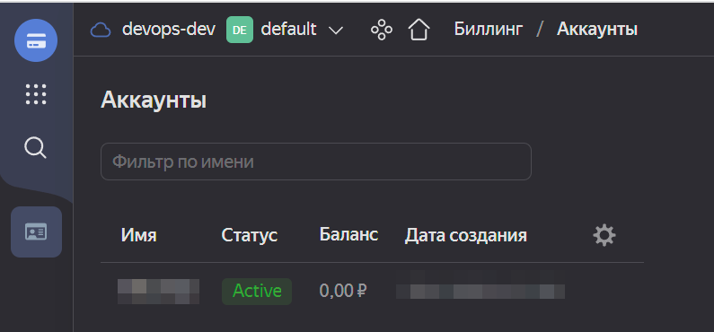
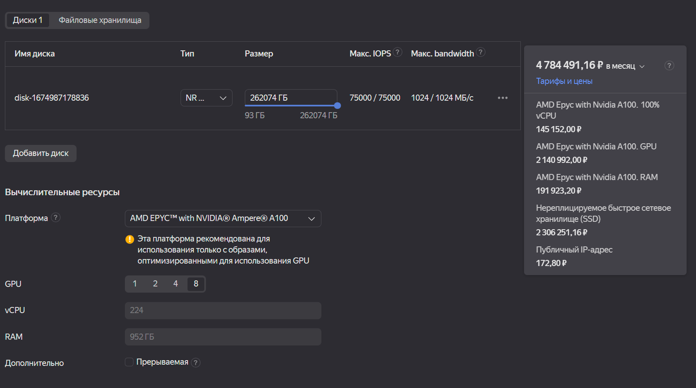
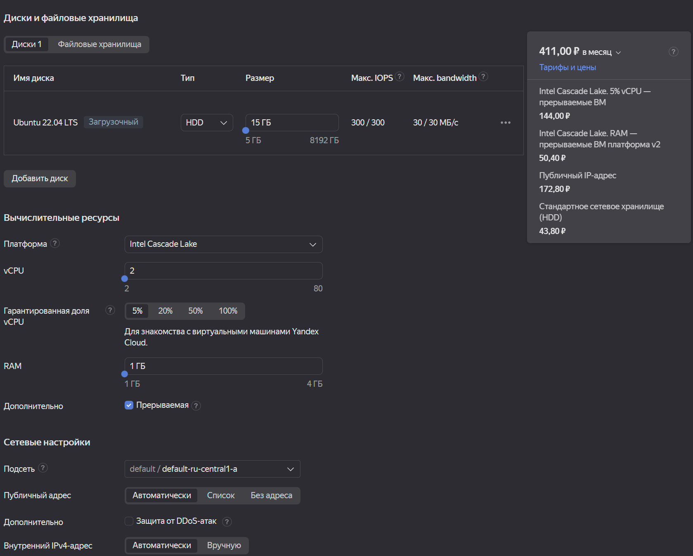
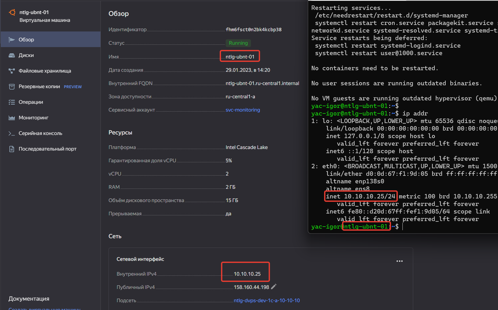

### 6.01 Виртуализация и облачные решения: AWS, GCP, Yandex Cloud, OpenStack.  [Кулагин Игорь]
**Задание 1.**
>Чем частное облако отличается от общедоступного, публичного и гибридного?

- Частное облако (Private cloud) – это виртуальный датацентр, который предоставляет услуги облачного вычисления для определенной организации или группы организаций, а не для всех пользователей. Это означает, что вычислительные ресурсы, данные и сети являются закрытыми и доступны только для внутренних пользователей.

- Общедоступное облако и публичное облако (Public cloud) - взаимозаменяемые термины, которые описывают виртуальный датацентр, предоставляющий услуги облачного вычисления для всеобщего пользования. Это означает, что вычислительные ресурсы, данные и сети являются открытыми и доступны для любых пользователей в Интернете, которые заинтересованы в использовании услуг облачных вычислений. 

- Гибридное облако (Hybrid cloud) - это архитектура облачных вычислений, которая использует комбинацию общедоступных облачных услуг и частных виртуальных датацентров. Это позволяет организациям использовать вычислительные ресурсы, предлагаемые публичным облаком, для решения задач, требующих высокой доступности, а также защищенные частные ресурсы для хранения конфиденциальных данных.

**Задание 2.**
>Что обозначают: IaaS, PaaS, SaaS, CaaS, DRaaS, BaaS, DBaaS, MaaS, DaaS, NaaS, STaaS? Напишите примеры их использования.

- IaaS (Infrastructure as a Service) - это одна из моделей облачных вычислений, которая предлагает виртуальные инфраструктурные услуги. При такой модели управление вычислениями, хранением данных, сетью и прочими компонентами инфраструктуры управляет сервис-провайдер. Пользователь может выделить ресурсы по требованию и оплачивать только за использованные услуги. Пример, сервис Compute Cloud в Яндекс.Облако.

- PaaS (Platform as a Service) - платформа, которая предоставляет разработчикам окружение для создания, тестирования и выпуска приложений. Пример, Google App Engine, Microsoft Azure, AWS Elastic Beanstalk.

- SaaS (Software as a Service) - программное обеспечение, которое предоставляется как услуга через Интернет. Например, Microsoft Office 365.

- CaaS (Communication as a Service) - это облачный сервис, который предоставляет компаниям возможность использовать коммуникационные технологии, такие как видеоконференцсвязь, голосовые звонки и текстовые сообщения, без необходимости вложения средств в оборудование или программное обеспечение.услуги связи, которые предоставляются через Интернет. Примеры сервис-провадеров: Яндекс.Видеоконференции, Zoom, различные виртуальные колцентры.

- DRaaS (Disaster Recovery as a Service) - услуги восстановления после катастрофы, которые предоставляются через Интернет. Допустим, у нас есть приватное облако, но катастрофоустойчивость в нем не реализована. В таком случае при катастрофе в инфраструктуре частного облака (пожар, например) и невозможности в короткие сроки восстановить его работоспособность можно воспользоваться сервисом DRaaS и запуститься в облаке сервис-провайдера DRaaS.

- BaaS (Backup as a Service) - услуги резервного копирования, которые предоставляются через Интернет. Пример, сервис Cloud Backup в Яндекс.Облако.

- DBaaS (Database as a Service) - услуги управления базами данных, которые предоставляются через Интернет. Пример, Managed Service for MySQL и Managed Service for PostgreSQL в Яндекс.Облако.

- MaaS (Monitoring as a Service) - услуги мониторинга, которые предоставляются через Интернет. Пример, сервисы Monitoring в различных разделах в Яндекс.Облако.

- DaaS (Desktop as a Service) - услуги виртуальных рабочих столов, которые предоставляются через Интернет. Пример, сервис Cloud Desktop в Яндекс.Облако.

- NaaS (Network as a Service) - услуги сетевого обеспечения, которые предоставляются в виде облачных услуг, доступных через Интернет. Это позволяет клиентам пользоваться сетевыми услугами без необходимости внедрения и управления физическим оборудованием. Пример, Google Cloud Interconnect и Amazon Web Services (AWS) Direct Connect.

- STaaS (Storage as a Service) - это облачный сервис, который предоставляет компаниям возможность хранить и доступаться к данным через Интернет, без необходимости вложения средств в физическое оборудование или программное обеспечение. Примеры реализации - Microsoft OneDrive, Яндекс.Диск, Amazon S3.

**Задание 3.**
>Напишите, какой вид сервиса предоставляется пользователю в ситуациях:

>Всеми процессами управляет провайдер.

SaaS

>Вы управляете приложением и данными, остальным управляет провайдер.

PaaS

>Вы управляете операционной системой, средой исполнения, данными, приложениями, остальными управляет провайдер.

IaaS

>Вы управляете сетью, хранилищами, серверами, виртуализацией, операционной системой, средой исполнения, данными, приложениями.

В данном случае никакой сервис третьими лицами не предоставляется, это обычная on-prem инфраструктура, управляемая собственными силами. Возможно, организованная как Private cloud, а возможно и нет.

**Задание 4.**
>Выполните действия и приложите скриншоты по каждому этапу:

>Создать платёжный аккаунт:

> - зайти в консоль;

> - выбрать меню биллинг;

> - зарегистрировать аккаунт.

>После регистрации выбрать меню в консоли Computer cloud.
>Приступить к созданию виртуальной машины.
>Ответьте на вопросы в свободной форме:

>Какие ОС можно выбрать?

Ubuntu, Debian, Centos, Fedora, openSuSe Leap, Fedora CoreOS, AlmaLinux, CentOS Stream

> Какие параметры сервера можно выбрать?

- Дисковая подсистема (тип (HDD/SSD/NVMe), ёмкость)

- CPU (платформа, количество vCPU, гарантированная доля)

- RAM

- Сеть (подсеть, публичный адрес, DHCP или Manual)

>Какие компоненты мониторинга можно создать?

По умолчанию создаются такие:
- CPU Utilization
- Disk bytes
- Disk operations
- Network bytes
- Network packets
- Connections quota utilization

>Какие системы безопасности предусмотрены?

- Защита от DDoS, SSH-ключ 

>Как меняется цена от выбранных характеристик?

Более производительные конфигурации с выделенными ресурсами стоят дороже.

>Приведите пример самой дорогой и самой дешёвой конфигурации.

**Задание 5.**
>Выполните действия и приложите скриншот:

>Создайте виртуальную машину на Yandex Cloud.
>Создайте сервисный аккаунт.
>Отсканируйте SSH-ключ.
>Придумайте логин.
>Подключитесь к облаку через SSH.

