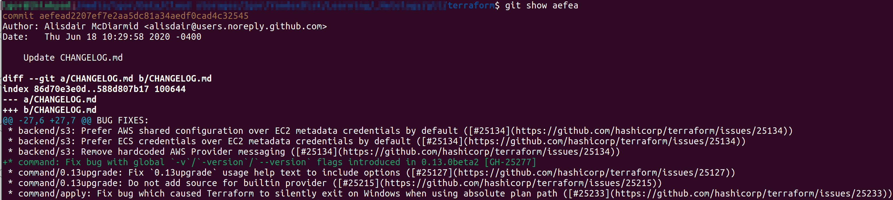
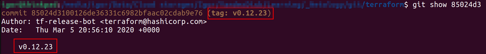
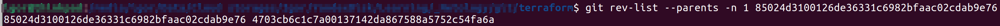
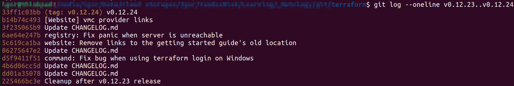
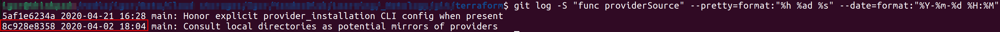
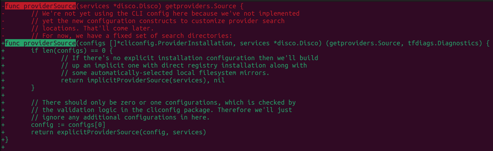
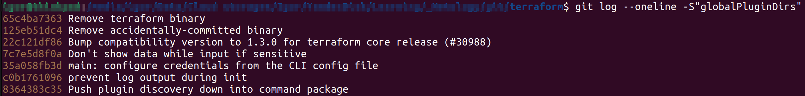
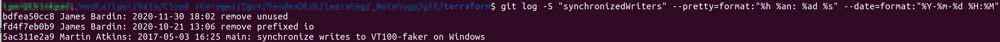
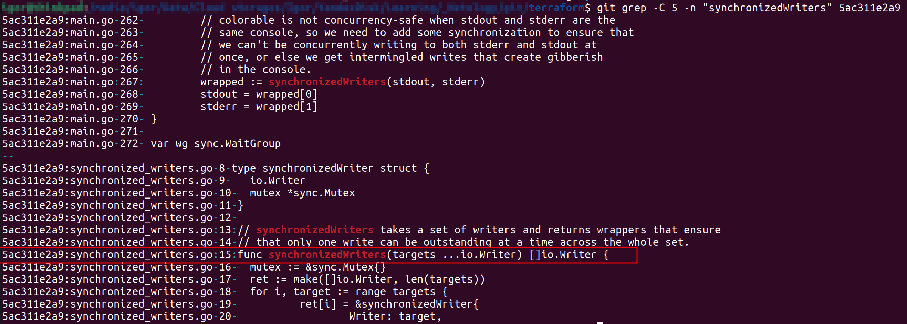

# 04. Инструменты Git - Кулагин Игорь
> 1. Найдите полный хеш и комментарий коммита, хеш которого начинается на aefea.

`git show aefea` --> `aefead2207ef7e2aa5dc81a34aedf0cad4c32545`

 

> 2. Ответьте на вопросы:
 
>  - Какому тегу соответствует коммит 85024d3?

`git show 85024d3`

 
    
> - Сколько родителей у коммита b8d720? Напишите их хеши.

`git rev-list --parents -n 1 85024d3100126de36331c6982bfaac02cdab9e76`

- 85024d3100126de36331c6982bfaac02cdab9e76
- 4703cb6c1c7a00137142da867588a5752c54fa6a

 

> - Перечислите хеши и комментарии всех коммитов, которые были сделаны между тегами v0.12.23 и v0.12.24.

`git log --oneline v0.12.23..v0.12.24`

```
33ff1c03bb (tag: v0.12.24) v0.12.24
b14b74c493 [Website] vmc provider links
3f235065b9 Update CHANGELOG.md
6ae64e247b registry: Fix panic when server is unreachable
5c619ca1ba website: Remove links to the getting started guide's old location
06275647e2 Update CHANGELOG.md
d5f9411f51 command: Fix bug when using terraform login on Windows
4b6d06cc5d Update CHANGELOG.md
dd01a35078 Update CHANGELOG.md
225466bc3e Cleanup after v0.12.23 release
```



> - Найдите коммит, в котором была создана функция func providerSource, её определение в коде выглядит так: func providerSource(...) > - (вместо троеточия перечислены аргументы).

Находим хэши и даты коммитов:

`git log -S "func providerSource" --pretty=format:"%h %ad %s" --date=format:"%Y-%m-%d %H:%M"`




Получаем два коммита: 5af1e6234a и 8c928e8358

Так как 8c928e8358 старше, то можно сделать вывод, что именно в этом коммите была создана функция `func providerSource`.

Проверяем с помощью `git diff 8c928e8358`:


"Зеленый" код похож на определение функции. Признаться, немного вводит в заблуждение наличие "красного" кода, потому что по идее это первое упоминание функции, а в этом коммите строку с `func providerSource` уже почему-то удаляют.

> - Найдите все коммиты, в которых была изменена функция globalPluginDirs.

`git log --oneline -S"globalPluginDirs"`




> - Кто автор функции synchronizedWriters?

Находим самый ранний коммит, содержащий *synchronizedWriters*: 

`git log -S "synchronizedWriters" --pretty=format:"%h %an: %ad %s" --date=format:"%Y-%m-%d %H:%M"`



Выясняем имя файла в котором определена функция и номера строк в файле, где находится код функции:

`git grep -C 5 -n "synchronizedWriters" 5ac311e2a9`

Имя файла `synchronized_writers.go`, а строки, начиная с 15.


 Хотя уже понятно, что автор Martin Atkins, попробуем в этом убедиться. Для этого найдем автора строк с 15 и до, например, 18. Переключаемся на коммит `5ac311e2a`, потому что иначе будет ошибка так как в текущем состоянии ветки этого файла уже не существует, и запускаем `git blame`:

 Убеждаемся, что автор кода Martin Atkins.
 