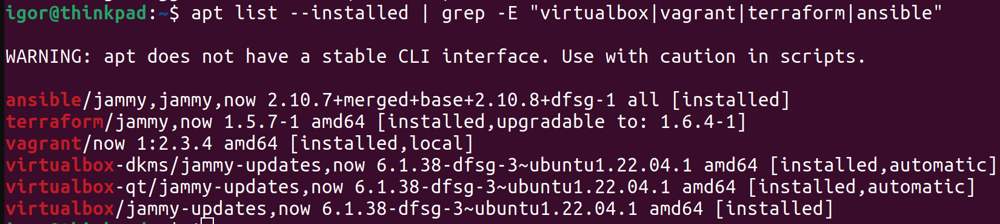

# 05.1. ВПрименение принципов IaaC в работе с виртуальными машинами - Кулагин Игорь
### Задача 1
> Опишите основные преимущества применения на практике IaaC-паттернов.


> Какой из принципов IaaC является основополагающим?


### Задача 2
> Чем Ansible выгодно отличается от других систем управление конфигурациями?


> Какой, на ваш взгляд, метод работы систем конфигурации более надёжный — push или pull?


### Задача 3
> Установите на личный linux-компьютер(или учебную ВМ с linux):
> VirtualBox, Vagrant версии 2.3.4, Terraform версии 1.5.Х, Ansible.
> Приложите вывод команд установленных версий каждой из программ, оформленный в Markdown.

```
vagrant --version
Vagrant 2.3.4
```
---
```
terraform --version
Terraform v1.5.7
on linux_amd64

Your version of Terraform is out of date! The latest version
is 1.6.4. You can update by downloading from https://www.terraform.io/downloads.html
```
---
```
ansible --version
ansible 2.10.8
  config file = None
  configured module search path = ['/home/igor/.ansible/plugins/modules', '/usr/share/ansible/plugins/modules']
  ansible python module location = /usr/lib/python3/dist-packages/ansible
  executable location = /usr/bin/ansible
  python version = 3.10.12 (main, Jun 11 2023, 05:26:28) [GCC 11.4.0]
```
---
```
vboxmanage --version
6.1.38_Ubuntur153438
```
 

### Задача 4