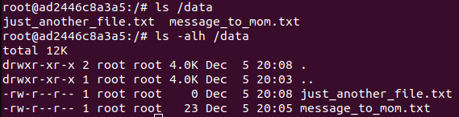

# 05.3. Введение. Экосистема. Архитектура. Жизненный цикл Docker-контейнера - Кулагин Игорь
## Задача 1.

<details>
<summary> Вспомогательные команды для Ubuntu</summary>

Создаем каталог Docker:
```
mkdir ~/docker
```

В этой папке создаем файл с именем Docker со следующим содержимым:

```
FROM nginx:latest
EXPOSE 80
COPY index.html  /usr/share/nginx/html/
```

Создаем в той же директории файл index.html следующего содержания:

```
<html>
 <head>
  <meta charset="UTF-8">
  Hey, Netology
 </head>
 <body>
  <h1>I'm DevOps Engineer!</h1>
 </body>
</html>
```
Строим образ Docker:
```
sudo docker build -t ilkul-nginx-image .
```
Создаем и запускаем контейнер:
```
sudo docker run -d -p 80:80 <имя_образа>
# Имя образа можно посмотреть командой docker image ls
```
В браузере пробуем открыть index.html, набрав в адресной строке http://127.0.0.1 

Проверяем версию nginx:
```
sudo docker exec -it <имя_контейнера> /bin/bash
# Имя контейнера можно посмотреть командой docker container ls -a

nginx -v
```
Останавливаем контейнер:
```
docker stop <имя_контейнера>
```
Тэгируем контейнер и указываем удаленный репозиторий:
```
sudo docker tag <имя_исходного_образа>:<его_тэг> <имя_пользователя_docker_hub>/<имя_образа_в_docker_hub>:<тэг_образа_в_docker_hub>
```
Логинимся в docker hub:
```
sudo chmod 666 /var/run/docker.sock

# Без этого в Ubuntu будет ошибка
https://newbedev.com/got-permission-denied-while-trying-to-connect-to-the-docker-daemon-socket-at-unix-var-run-docker-sock-post-http-2fvar-2frun-2fdocker-sock-v1-24-auth-dial-unix-var-run-docker-sock-connect-permission-denied-code-example
docker login -u <username>

# В качестве пароля используется токен, который нужно создать в разделе Account settings/Security в Docker Hub
```
Заливаем образ в репозиторий:
```
docker push <your-dockerhub-username>/<image-name>:<image-tag>
```
</details>

> Опубликуйте созданный fork в своём репозитории и предоставьте ответ в виде ссылки на 
```
docker pull ikul/ikul-nginx:1.25.3
```
https://hub.docker.com/repository/docker/ikul/ikul-nginx/general

## Задача 2

> Посмотрите на сценарий ниже и ответьте на вопрос: «Подходит ли в этом сценарии использование Docker-контейнеров или лучше подойдёт виртуальная машина, физическая машина? Может быть, возможны разные варианты?»

> Детально опишите и обоснуйте свой выбор

Думаю, вначале имеет смысл описать мысли по поводу аргументов **за** и **против** первого и второго варианта.

Итак, видится, что в случае собственной разработки в абсолютном большинстве случаев стоит отдавать предпочтение контейнеризации, так как это позволит упростить доставку приложения, обеспечить быстрое и гибкое масштабирование в случае необходимости, а также выстроить современные автоматизированные процессы разработки ПО, например CI/CD.

В случае "коробочных" приложений я бы также отдавал предпочтение развертыванию в формате контейнеров, особенно если сам разработчик ПО предоставляет его в формате контейнера и поддерживает такую инсталляцию. Исключениями, вероятно, должны стать монолитные stateful-приложения, для которых сама природа контейнеризации с возможностью прекращения существования контейнера в любой момент времени может привести к потере данных или другим проблемам с приложением.

Другими словами во всех случаях где нет весомых аргументов за развертывание приложения на выделенной виртуальной машине или физическом сервере я бы предложил использовать контейнеризацию.

> - высоконагруженное монолитное Java веб-приложение;

Очень зависит от конкретного случая, но обычно подобные приложения это корпоративные stateful-системы со стабильным,пусть и высоким, уровнем загрузки (т.е. динамическое масштабирование как правило не требуется). Здесь ключевым аргументом я бы назвал максимальную производительность и с этой точки зрения любой дополнительный слой виртуализации влечет ненужные накладные расходы. Такое приложение я бы разворачивал либо на физических серверах, либо на виртуальных машинах.

> - Nodejs веб-приложение;

Пожалуй, для большинства веб-приложений, особенно если это собственная разработка, я бы отдавал предпочтение контейнерам. Nodejs это или laravel не сильно важно. Выбираю контейнеризацию.

> - мобильное приложение c версиями для Android и iOS;

Предположу наличие микросервисной архитектуры, а для нее контейнеризация практически единственно верный выбор.

> - шина данных на базе Apache Kafka;

У RedHat даже [статья](https://www.redhat.com/en/topics/integration/why-run-apache-kafka-on-kubernetes) есть почему kafka нужно разворачивать в K8s, так что выбираем контейнеризацию.

> - Elasticsearch-кластер для реализации логирования продуктивного веб-приложения — три ноды elasticsearch, два logstash и две ноды kibana;

Тут в самом вопросе ответ есть в виде слова *ноды*. Это все инструменты современного стека разработки и как правило все эти приложения развертываются в виде контейнеров.

> - мониторинг-стек на базе Prometheus и Grafana;

Аналогично предыдущему пункту - контейнеризация. 

> - MongoDB как основное хранилище данных для Java-приложения;

Видится, что СУБД лучше все таки держать на отдельных виртуальных или даже физических машинах, так как это stateful ПО. На практике, конечно, нет особенных проблем запустит СУБД и в контейнере, но так как выбор в данном случае должен сделать я, то я бы предпочел разворачивать СУБД на виртуальной машине.

> - Gitlab-сервер для реализации CI/CD-процессов и приватный (закрытый) Docker Registry.

Инструмент современного стека разработки, как правило развертывается в виде контейнеров.

## Задача 3
> Запустите первый контейнер из образа centos c любым тегом в фоновом режиме, подключив папку /data из текущей рабочей директории на хостовой машине в /data контейнера.
```
docker pull centos:latest
sudo docker run -td -v ~/study/docker/data:/data --name centos centos
```

> Запустите второй контейнер из образа debian в фоновом режиме, подключив папку /data из текущей рабочей директории на хостовой машине в /data контейнера.
```
docker pull debian:latest
sudo docker run -td -v ~/study/docker/data:/data --name debian debian
```

> Подключитесь к первому контейнеру с помощью docker exec и создайте текстовый файл любого содержания в /data.

```
docker exec -it centos /bin/bash
echo "Look, Mom, I'm devops!" >> /data/message_to_mom.txt
```

> Добавьте ещё один файл в папку /data на хостовой машине.
```
sudo touch ~/study/docker/data/just_another_file.txt
```
> Подключитесь во второй контейнер и отобразите листинг и содержание файлов в /data контейнера.
```
docker exec -it debian /bin/bash
ls /data
```
