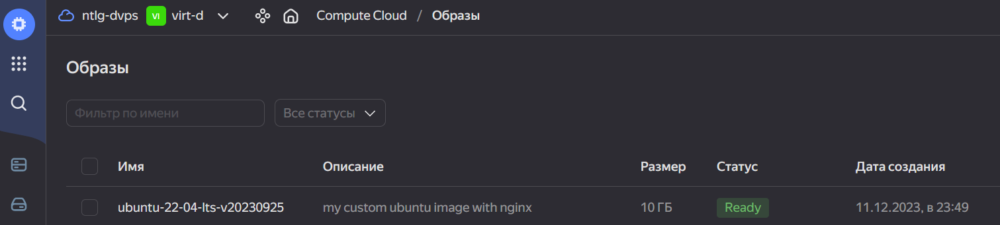
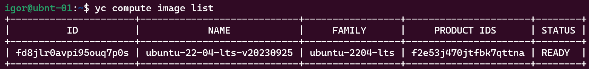

# 05.4. Оркестрация группой Docker-контейнеров на примере Docker Compose - Кулагин Игорь
## Задача 1.

 Вспомогательные команды для Ubuntu

> Создайте собственный образ любой операционной системы (например, debian-11) с помощью Packer версии 1.7.0 .

> Чтобы получить зачёт, вам нужно предоставить скриншот страницы с созданным образом из личного кабинета YandexCloud.

## Задача 2

## Задача 3

