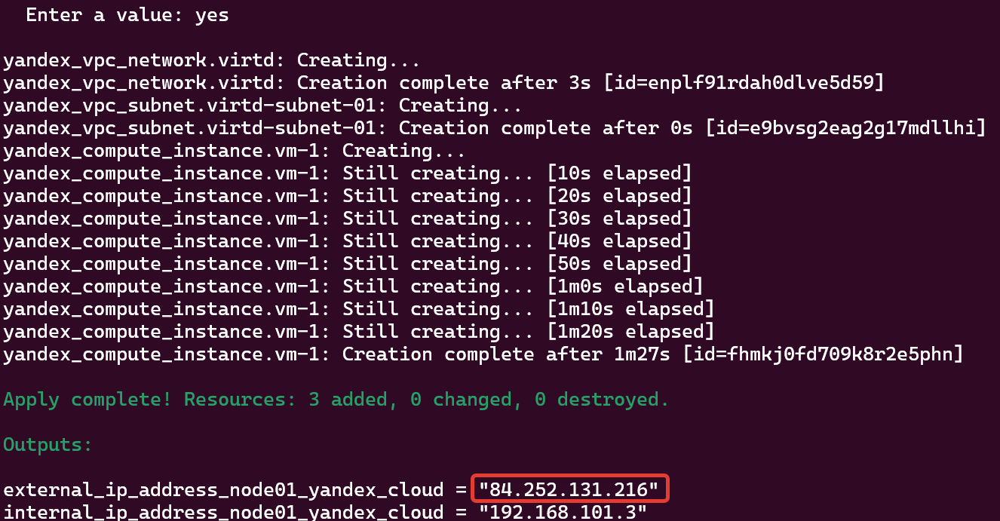
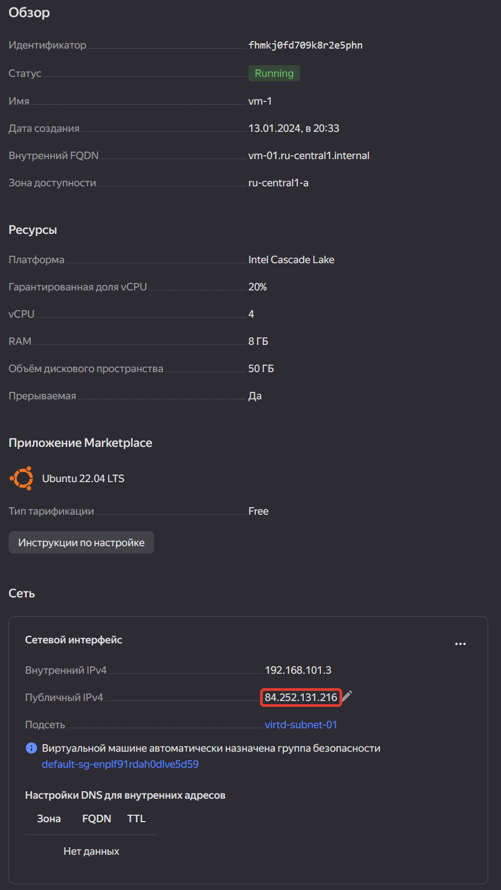
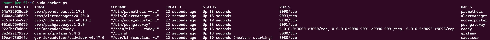
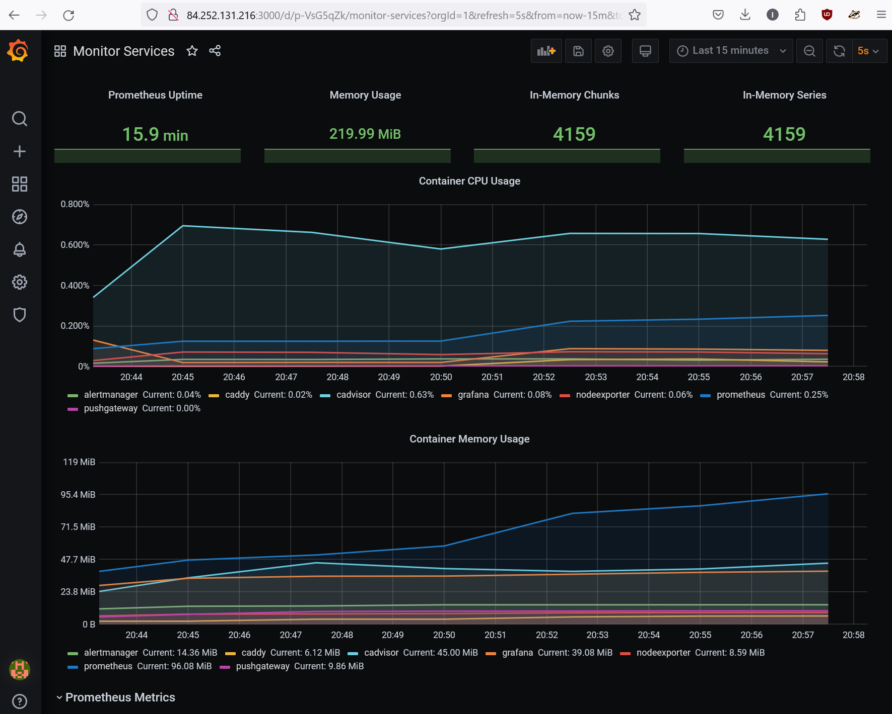

# 05.4. Оркестрация группой Docker-контейнеров на примере Docker Compose - Кулагин Игорь
## Задача 1.

 Вспомогательные команды для Ubuntu

> Создайте собственный образ любой операционной системы (например, debian-11) с помощью Packer версии 1.7.0 .

> Чтобы получить зачёт, вам нужно предоставить скриншот страницы с созданным образом из личного кабинета YandexCloud.

## Задача 2
> Создайте вашу первую виртуальную машину в YandexCloud с помощью Terraform (вместо использования веб-интерфейса YandexCloud).

>Чтобы получить зачёт, вам нужно предоставить вывод команды terraform apply и страницы свойств, созданной ВМ из личного кабинета YandexCloud.

## Задача 3
> С помощью Ansible и Docker Compose разверните на виртуальной машине из предыдущего задания систему мониторинга на основе Prometheus/Grafana.

>Чтобы получить зачёт, вам нужно предоставить вывод команды "docker ps" , все контейнеры, описанные в docker-compose, должны быть в статусе "Up".

## Задача 4

> Откройте веб-браузер, зайдите на страницу http://<внешний_ip_адрес_вашей_ВМ>:3000.
> Используйте для авторизации логин и пароль из .env-file.
> Изучите доступный интерфейс, найдите в интерфейсе автоматически созданные docker-compose-панели с графиками(dashboards).
> Подождите 5-10 минут, чтобы система мониторинга успела накопить данные.

> Чтобы получить зачёт, предоставьте скриншот работающего веб-интерфейса Grafana с текущими метриками.

