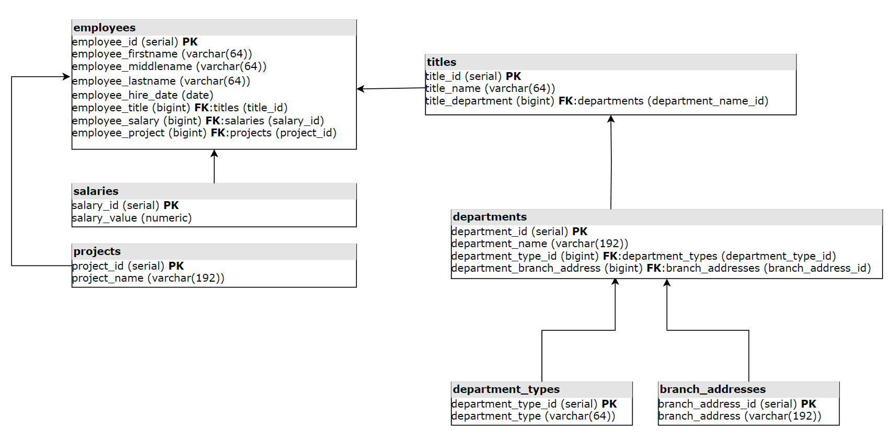

# 12.1. Базы данных  - Кулагин Игорь
## Задание 1
>Опишите не менее семи таблиц, из которых состоит база данных:

> - какие данные хранятся в этих таблицах;
> - какой тип данных у столбцов в этих таблицах, если данные хранятся в PostgreSQL.
> - Приведите решение к следующему виду:

```
Сотрудники (

идентификатор, первичный ключ, serial,
фамилия varchar(50),
...
идентификатор структурного подразделения, внешний ключ, integer).
```

