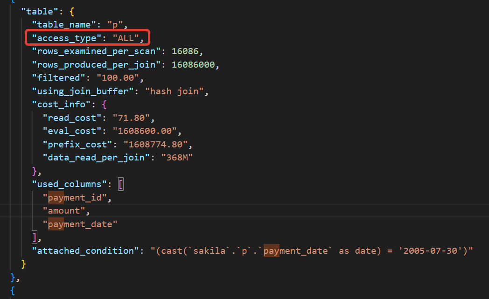
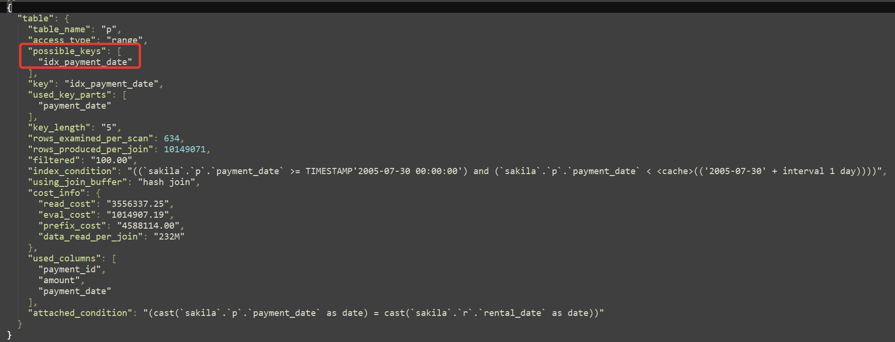

# 12.5. Индексы - Кулагин Игорь
## Задание 1
> Напишите запрос к учебной базе данных, который вернёт процентное отношение общего размера всех индексов к общему размеру всех таблиц.

```
SELECT
    CONCAT(ROUND(SUM(INDEX_LENGTH)/SUM(DATA_LENGTH) * 100), '%') AS RATIO
FROM
    INFORMATION_SCHEMA.TABLES
WHERE
    TABLE_SCHEMA = 'sakila';
```

## Задание 2
Выполните explain analyze следующего запроса:

```
select distinct concat(c.last_name, ' ', c.first_name), sum(p.amount) over (partition by c.customer_id, f.title)
from payment p, rental r, customer c, inventory i, film f
where date(p.payment_date) = '2005-07-30' and p.payment_date = r.rental_date and r.customer_id = c.customer_id and i.inventory_id = r.inventory_id
```
> - перечислите узкие места;

- Поиск в списке таблиц работает медленее, чем `JOIN`.
- Следует исключить оконную функцию `OVER`.
- Отсутсвует индекс для таблицы `payment_date`, по которй происходит поиск в условии `WHERE`. 




> - оптимизируйте запрос: внесите корректировки по использованию операторов, при необходимости добавьте индексы.


`CREATE INDEX idx_payment_date ON payment (payment_date);`

```
SELECT
    CONCAT(c.last_name, ' ', c.first_name) AS name,
    SUM(p.amount) AS total_amount
FROM 
    payment p
JOIN 
    rental r ON DATE(p.payment_date) = DATE(r.rental_date)
JOIN 
    customer c ON r.customer_id = c.customer_id
JOIN 
    inventory i ON i.inventory_id = r.inventory_id
JOIN 
    film f ON i.film_id = f.film_id
WHERE
    p.payment_date >= '2005-07-30' AND p.payment_date < DATE_ADD('2005-07-30', INTERVAL 1 DAY)
GROUP BY
    name
ORDER BY
    name;
```

 