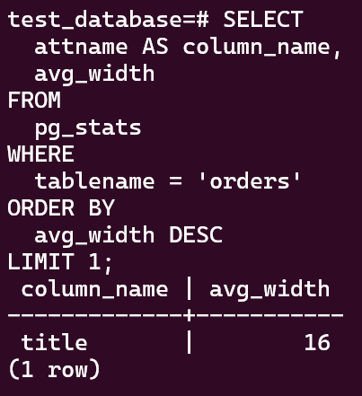

# 06.4. PostgreSQL - Кулагин Игорь
## Задача 1
> Используя Docker, поднимите инстанс PostgreSQL (версию 13). Данные БД сохраните в volume.

**Устанавливаем docker и docker-compose:**

<details>
<summary> Вспомогательные команды для Ubuntu</summary>

```
# Add Docker's official GPG key:
sudo apt-get update
sudo apt-get install ca-certificates curl gnupg
sudo install -m 0755 -d /etc/apt/keyrings
curl -fsSL https://download.docker.com/linux/ubuntu/gpg | sudo gpg --dearmor -o /etc/apt/keyrings/docker.gpg
sudo chmod a+r /etc/apt/keyrings/docker.gpg
</details>
# Add the repository to Apt sources:
echo \
  "deb [arch="$(dpkg --print-architecture)" signed-by=/etc/apt/keyrings/docker.gpg] https://download.docker.com/linux/ubuntu \
  "$(. /etc/os-release && echo "$VERSION_CODENAME")" stable" | \
  sudo tee /etc/apt/sources.list.d/docker.list > /dev/null
sudo apt-get update
```

</details>

```
sudo apt install docker-ce docker-ce-cli containerd.io docker-buildx-plugin docker-compose-plugin docker-compose -y
```
**Создаем манифест для docker-compose:**

```
version: '3'

services:
  postgres:
    image: postgres:13
    container_name: pgsql-13
    environment:
      POSTGRES_USER: dbadmin
      POSTGRES_PASSWORD: 
    volumes:
      - /var/lib/docker/volumes/infra/postgresql/data:/var/lib/postgresql/data
      - /var/lib/docker/volumes/infra/postgresql/backups:/backups
    ports:
      - "5432:5432"
```

**Запускаем контейнер:** `sudo docker-compose up -d`

> Подключитесь к БД PostgreSQL, используя psql

```
sudo docker exec -it pgsql-13 bash
psql -U dbadmin
```

> Найдите и приведите управляющие команды для:
>вывода списка БД

`\l`

>подключения к БД

`\c <database_name>`

>вывода списка таблиц

`\dt`

>вывода описания содержимого таблиц

`\d <table_name>`


>выхода из psql.

`\q`

## Задача 2
>Используя psql, создайте БД test_database.

```
CREATE DATABASE test_database;
```

>Восстановите бэкап БД в test_database.
```
wget https://raw.githubusercontent.com/netology-code/virt-homeworks/virt-11/06-db-04-postgresql/test_data/test_dump.sql
sudo mv ./test_dump.sql /var/lib/docker/volumes/infra/postgresql/backups/test_dump.sql
psql -U dbadmin -d test_database < /backups/test_dump.sql
```

>Подключитесь к восстановленной БД и проведите операцию ANALYZE для сбора статистики по таблице.
>Используя таблицу pg_stats, найдите столбец таблицы orders с наибольшим средним значением размера элементов в байтах.
>Приведите в ответе команду, которую вы использовали для вычисления, и полученный результат.

```
SELECT
  attname AS column_name,
  avg_width
FROM
  pg_stats
WHERE
  tablename = 'orders'
ORDER BY
  avg_width DESC
LIMIT 1;
```



### Задача 3
> Архитектор и администратор БД выяснили, что ваша таблица orders разрослась до невиданных размеров и поиск по ней занимает долгое время. Вам как успешному выпускнику курсов DevOps в Нетологии предложили провести разбиение таблицы на 2: шардировать на orders_1 - price>499 и orders_2 - price<=499.

>Предложите SQL-транзакцию для проведения этой операции.
```
-- Создаем две таблицы, данные в которых должны удовлетворять заданным условиям
-- Первая - со значением price <= 499 
CREATE TABLE orders_1 (
    LIKE orders INCLUDING ALL,
    CHECK (price <= 499)
);


-- Вторая - со значением price > 499 
CREATE TABLE orders_2 (
    LIKE orders INCLUDING ALL,
    CHECK (price > 499)
);

-- Переносим данные из исходной таблицы orders во вновь созданные
INSERT INTO orders_1 SELECT * FROM orders WHERE price <= 499;
INSERT INTO orders_2 SELECT * FROM orders WHERE price > 499;

-- Так как все данные из старой таблицы мы перенесли, а новые будут создаваться в таблицах orders_1 и orders_2, имеет смысл удалить исходную таблицу orders:
DROP TABLE orders;
```

>Можно ли было изначально исключить ручное разбиение при проектировании таблицы orders?

Не совсем понятен вопрос. В целом нужно было бы продумать на этапе проектирования по какому принципу шардировать данные по таблицам и сделать тоже самое, что описано в предыдущем пункте, но только на этапе создания БД. Тогда все вносимые данные автоматически бы "раскидывались" по нужным таблицам в соответствии с условиями, указанными в CHECK.

### Задача 4
> Используя утилиту pg_dump, создайте бекап БД test_database.

`pg_dump -U dbadmin -d test_database > /backups/test_database.sql`

> Как бы вы доработали бэкап-файл, чтобы добавить уникальность значения столбца title для таблиц test_database?

В коней файла можно добавить директиву, которая сделает столбец title уникальным:
```
ALTER TABLE orders ADD UNIQUE (title);
```