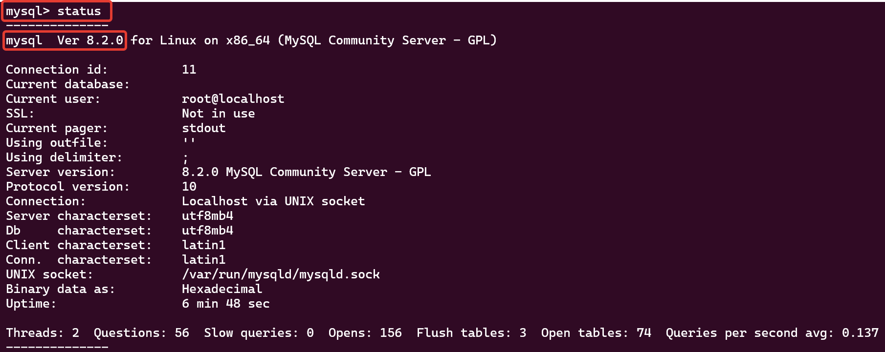
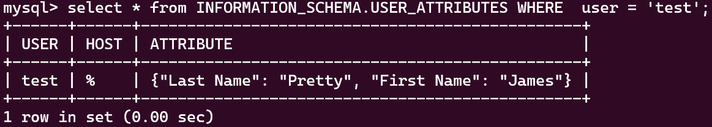
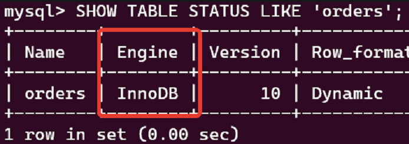
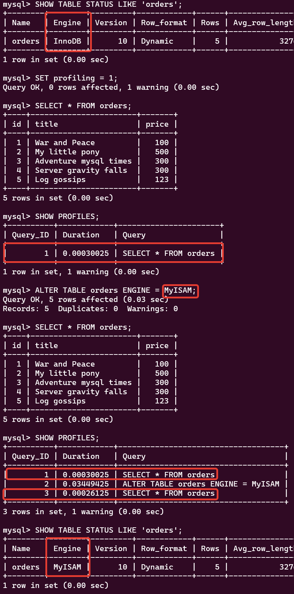
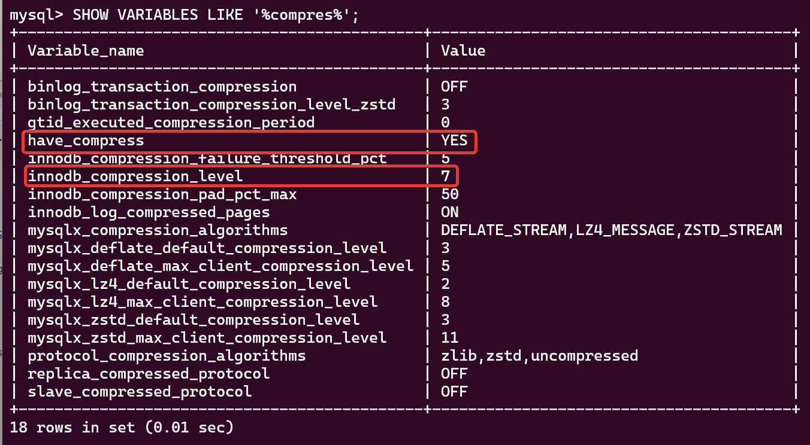

# 06.4. PostgreSQL - Кулагин Игорь
## Задача 1
> Используя Docker, поднимите инстанс MySQL (версию 8). Данные БД сохраните в volume.

**Устанавливаем docker и docker-compose:**

<details>
<summary> Вспомогательные команды для Ubuntu</summary>

```
# Add Docker's official GPG key:
sudo apt-get update
sudo apt-get install ca-certificates curl gnupg
sudo install -m 0755 -d /etc/apt/keyrings
curl -fsSL https://download.docker.com/linux/ubuntu/gpg | sudo gpg --dearmor -o /etc/apt/keyrings/docker.gpg
sudo chmod a+r /etc/apt/keyrings/docker.gpg
</details>
# Add the repository to Apt sources:
echo \
  "deb [arch="$(dpkg --print-architecture)" signed-by=/etc/apt/keyrings/docker.gpg] https://download.docker.com/linux/ubuntu \
  "$(. /etc/os-release && echo "$VERSION_CODENAME")" stable" | \
  sudo tee /etc/apt/sources.list.d/docker.list > /dev/null
sudo apt-get update
sudo apt install docker-ce docker-ce-cli containerd.io docker-buildx-plugin docker-compose-plugin docker-compose -y
```

</details>

**Создаем манифест для docker-compose:**

```
version: '3.8'

services:
  mysql:
    image: mysql:8
    container_name: mysql-8
    environment:
      MYSQL_ROOT_PASSWORD: 123456
      MYSQL_DATABASE: test_db
    ports:
      - "3306:3306"
    volumes:
      - /var/lib/docker/volumes/infra/mysql:/var/lib/mysql

volumes:
  mysql_data:
```

**Запускаем контейнер:**
```
sudo docker-compose up -d
```
<details>
<summary> Команда для корректной остановки контейнера </summary>

```
sudo docker-compose down
```
</details>

>Изучите бэкап БД и восстановитесь из него.

**Скачиваем бэкап и помещаем его в persistent volume**

```
wget https://raw.githubusercontent.com/netology-code/virt-homeworks/virt-11/06-db-03-mysql/test_data/test_dump.sql
sudo cp ./test_mysql_dump.sql  /var/lib/docker/volumes/infra/mysql
```

**Подключаемся к контейнеру и восстанавливаем базу из дампа**
```
sudo docker exec -it mysql-8 bash
mysql -u root -p test_db < /var/lib/mysql/test_mysql_dump.sql
```

>Перейдите в управляющую консоль mysql внутри контейнера.

```
mysql -u root -p
```
>Найдите команду для выдачи статуса БД и приведите в ответе из её вывода версию сервера БД.



>Приведите в ответе количество записей с price > 300.
```
-- Подключаемся к базе test_db
USE test_db;

-- Получаем список таблиц в ней
SHOW TABLES;

-- Выполняем запрос для получения указанных данных
SELECT COUNT(*)
FROM orders
WHERE price > 300
```

Итого найдена одна запись, удовлетворяющая условию `price > 300`


## Задача 2

>Создайте пользователя test в БД c паролем test-pass, используя:

>плагин авторизации mysql_native_password

>срок истечения пароля — 180 дней

>количество попыток авторизации — 3

>аттрибуты пользователя:

>Фамилия "Pretty"

>Имя "James".

```
CREATE USER 'test'@'%' IDENTIFIED WITH mysql_native_password BY 'P@$$w0rd' PASSWORD EXPIRE INTERVAL 180 DAY FAILED_LOGIN_ATTEMPTS 3 ATTRIBUTE '{"Last Name": "Pretty", "First Name": "James"}';
```
>максимальное количество запросов в час — 100

```
ALTER USER 'test'@'%' WITH MAX_QUERIES_PER_HOUR 100;
```

>Предоставьте привелегии пользователю test на операции SELECT базы test_db.
```
GRANT SELECT ON test_db.* TO 'test'@'%';
```

> Используя таблицу INFORMATION_SCHEMA.USER_ATTRIBUTES, получите данные по пользователю test и приведите в ответе к задаче. 



## Задача 3

>Установите профилирование SET profiling = 1. Изучите вывод профилирования команд SHOW PROFILES;
>Исследуйте, какой engine используется в таблице БД test_db и приведите в ответе.

Используется движок InnoDB:



>Измените engine и приведите время выполнения и запрос на изменения из профайлера в ответе:
>на MyISAM,
>на InnoDB.



## Задача 4

>Изучите файл my.cnf в директории /etc/mysql.
>Измените его согласно ТЗ (движок InnoDB):
> - скорость IO важнее сохранности данных;
> - нужна компрессия таблиц для экономии места на диске;
> - размер буффера с незакомиченными транзакциями 1 Мб;
> - буффер кеширования 30% от ОЗУ;
> - размер файла логов операций 100 Мб.
>Приведите в ответе изменённый файл my.cnf.

Создадим файл /etc/mysql/conf.d/my.cnf следующего содержания: 
```
[mysqld]
# Увеличиваем бюджет работы движка InnoDB с операциями ввода/вывода с 200 (по умолчанию) до 1000
innodb_io_capacity = 1000

# Согласно документации компрессия работает только с включенной опцией innodb_file_per_table
innodb_file_per_table = 1

# И задаем уровень компрессии.
innodb_compression_level = 7

# Устанавливаем размер буфера для незакомиченных транзакций в 1 Мб
innodb_log_buffer_size = 1M

# Задаем буффер кеширования в 30% от ОЗУ (от 1,8GB лимита на контейнер с MySQL)
innodb_buffer_pool_size = 540M

# Задаем размер файла логов операций 100 Мб
innodb_redo_log_capacity = 100M
```

