# 06.2 SQL - Кулагин Игорь
### Задача 1

> Используя Docker, поднимите инстанс PostgreSQL (версию 12) c 2 volume, в который будут складываться данные БД и бэкапы.

> Приведите получившуюся команду или docker-compose-манифест.

```
version: '3'

services:
  postgres:
    image: postgres:12
    container_name: pgsql-12
    environment:
      POSTGRES_USER: dbadmin
      POSTGRES_PASSWORD: 
    volumes:
      - /home/igor/docker/infra/pgsql12:/var/lib/postgresql/data
      - /home/igor/docker/infra/pgsql12:/backups
    ports:
      - "5432:5432"
```

### Задача 2

>создайте пользователя test-admin-user и БД test_db;

```
psql -U dbadmin
CREATE USER "test-admin-user" WITH PASSWORD 'password';
CREATE DATABASE test_db;
```

>в БД test_db создайте таблицу orders и clients (спeцификация таблиц ниже);

**Таблица orders:**

- id (serial primary key);
- наименование (string);
- цена (integer).

```
\c test_db;

CREATE TABLE orders (
    id SERIAL PRIMARY KEY,
    наименование VARCHAR(255),
    цена INTEGER
);
```
**Таблица clients:**

- id (serial primary key);
- фамилия (string);
- страна проживания (string, index);
- заказ (foreign key orders).

```
\c test_db;
CREATE TABLE clients (
    id SERIAL PRIMARY KEY,
    фамилия VARCHAR(255),
    страна_проживания VARCHAR(255),
    заказ_id INTEGER REFERENCES orders(id)
);
```

>предоставьте привилегии на все операции пользователю test-admin-user на таблицы БД test_db;

```
\c test_db;
GRANT ALL PRIVILEGES ON ALL TABLES IN SCHEMA public TO "test-admin-user";
```
>создайте пользователя test-simple-user;

`CREATE USER "test-simple-user" WITH PASSWORD 'password';`

>предоставьте пользователю test-simple-user права на SELECT/INSERT/UPDATE/DELETE этих таблиц БД test_db.

```
\c test_db;
GRANT SELECT, INSERT, UPDATE, DELETE ON TABLE orders, clients TO "test-simple-user";
```

>Приведите:
>итоговый список БД после выполнения пунктов выше;

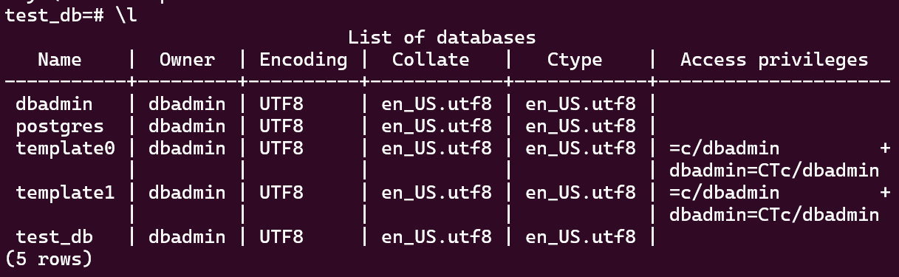

>описание таблиц (describe);

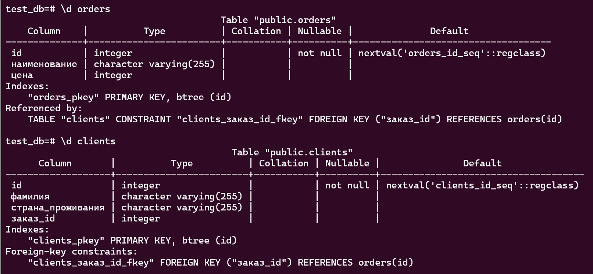

>SQL-запрос для выдачи списка пользователей с правами над таблицами test_db;
```
SELECT grantee
FROM information_schema.table_privileges
WHERE table_catalog = 'test_db'
GROUP BY grantee;
```

>список пользователей с правами над таблицами test_db.

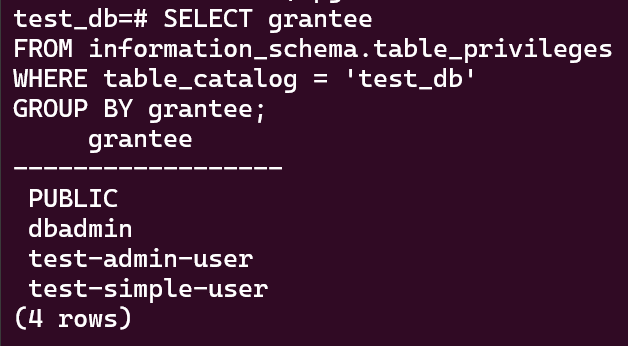

### Задача 3
> Используя SQL-синтаксис, наполните таблицы следующими тестовыми данными:

```
INSERT INTO orders ("наименование", "цена")
VALUES 
  ('Шоколад', 10),
  ('Принтер', 3000),
  ('Книга', 500),
  ('Монитор', 7000),
  ('Гитара', 400);
```
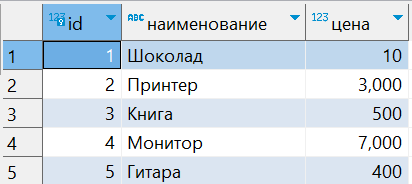

```
INSERT INTO clients ("фамилия", "страна_проживания")
VALUES 
  ('Иванов Иван Иванович', 'USA'),
  ('Петров Петр Петрович', 'Canada'),
  ('Иоганн Себастьян Бах', 'Japan'),
  ('Ронни Джеймс Дио', 'Russia'),
  ('Ritchie Blackmore', 'Russia'); 
```
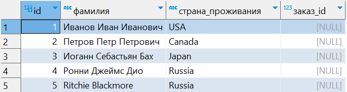

>вычислите количество записей для каждой таблицы.

`SELECT COUNT(*) FROM orders;`

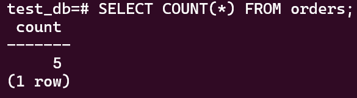

`SELECT COUNT(*) FROM clients;`

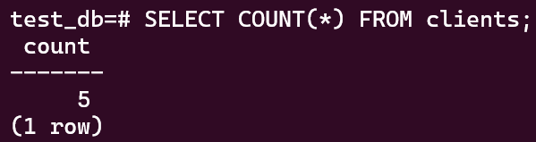

### Задача 4
>Приведите SQL-запросы для выполнения этих операций.

**Опция 1**
```
UPDATE clients
SET заказ_id = 4  
WHERE "фамилия" = 'Петров Петр Петрович';

UPDATE clients
SET заказ_id = 5  
WHERE "фамилия" = 'Иоганн Себастьян Бах';

UPDATE clients
SET заказ_id = 3  
WHERE "фамилия" = 'Иванов Иван Иванович';
```
**Опция 2**
```
UPDATE clients
SET заказ_id = CASE
    WHEN "фамилия" = 'Петров Петр Петрович' THEN 4
    WHEN "фамилия" = 'Иоганн Себастьян Бах' THEN 5
    WHEN "фамилия" = 'Иванов Иван Иванович' THEN 3
    ELSE заказ_id
END;

```
> Приведите SQL-запрос для выдачи всех пользователей, которые совершили заказ, а также вывод этого запроса.
```
SELECT *
FROM clients
WHERE заказ_id IS NOT NULL;
```
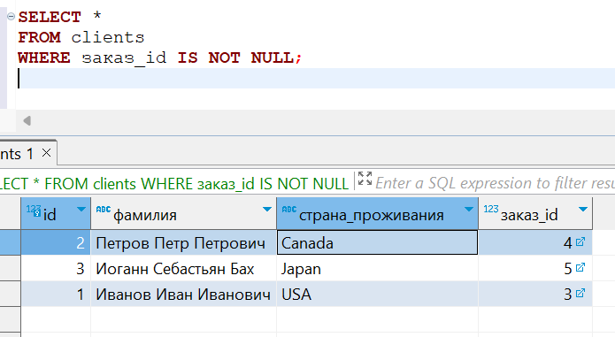

### Задача 5
> Получите полную информацию по выполнению запроса выдачи всех пользователей из задачи 4 (используя директиву EXPLAIN).
> Приведите получившийся результат и объясните, что значат полученные значения

```
explain analyze SELECT *
FROM clients
WHERE заказ_id IS NOT NULL;
                                              QUERY PLAN
------------------------------------------------------------------------------------------------------
 Seq Scan on clients  (cost=0.00..10.70 rows=70 width=1040) (actual time=0.008..0.009 rows=3 loops=1)
   Filter: ("заказ_id" IS NOT NULL)
   Rows Removed by Filter: 2
 Planning Time: 0.049 ms
 Execution Time: 0.018 ms
(5 rows)
```

1. `Seq Scan on clients:` - последовательный скан (Seq Scan), что подразумевает полный проход по таблице для выполнения запроса.
2. `cost=0.00..10.70 rows=70 width=1040:`
- `cost` - оценочная стоимость выполнения запроса;
- `rows` - оценочное количество строк, которые обработает запрос;
- `width` - "Estimated average width (in bytes) of rows output by this plan node". Оценка среднего размера строки в байтах. В контексте операции Seq Scan (последовательного сканирования) таблицы, ширина строки представляет собой оценку того, сколько места в байтах занимает одна строка данных.
3. `actual time=0.008..0.009 rows=3 loops=1:` Фактическое время выполнения запроса, количество обработанных строк и количество выполненных циклов. Здесь запрос выполнился за очень короткое время (от 0.008 до 0.009 секунд), обработано 3 строки, и запрос выполнился в одном цикле.
Filter: ("заказ_id" IS NOT NULL):

4. `Filter: ("заказ_id" IS NOT NULL): Rows Removed by Filter: 2:` - условие фильтрации вывода и количество отфильтрованных строк.

5. `Planning Time: 0.049 ms:` - время, затраченное на планирование выполнения запроса.
6. `Execution Time: 0.018 ms:` фактическое время выполнения запроса.

### Задача 6

> Создайте бэкап БД test_db и поместите его в volume, предназначенный для бэкапов

`pg_dump -U dbadmin -d test_db > /backups/test_db.sql`

> Остановите контейнер с PostgreSQL, но не удаляйте volumes.

`sudo docker stop pgsql-12`

> Поднимите новый пустой контейнер с PostgreSQL.

- Создаем новый файл `docker-compose` и запускаем контейнер:
```
version: '3'

services:
  postgres:
    image: postgres:12
    container_name: pgsql-12-2
    environment:
      POSTGRES_USER: pgadmin
      POSTGRES_PASSWORD: 
      #POSTGRES_DB: your_database_name
    volumes:
      - /home/igor/docker/infra/pgsql12-2:/var/lib/postgresql/data
      - /home/igor/docker/infra/backup:/backups
    ports:
      - "5432:5432"
```
`sudo docker-compose up -d`

- Убеждаемся, что запущен новый контейнер `pgsql-12-2`:

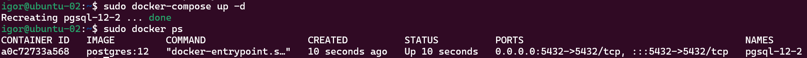

- Запускаем `bash` в контейнере:

`sudo docker exec -it pgsql-12-2 bash`

- Подключаемся к серверу PostgreSQL и проверяем, что базы `test_db` на нем нет:

`psql -U pgadmin`

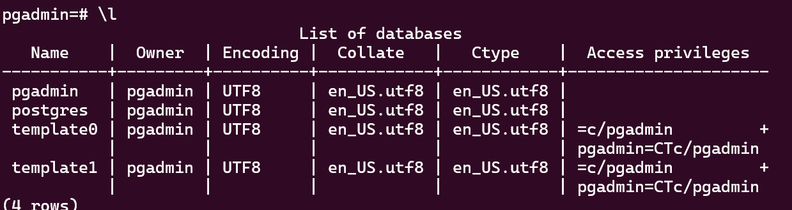

> Восстановите БД test_db в новом контейнере.

Предсоздаем БД:

`CREATE DATABASE test_db;`

Восстанавливаем БД:
`psql -U pgadmin -d test_db < /backups/test_db.sql`

Проверяем, что данные восстановились на примере таблицы 'orders':

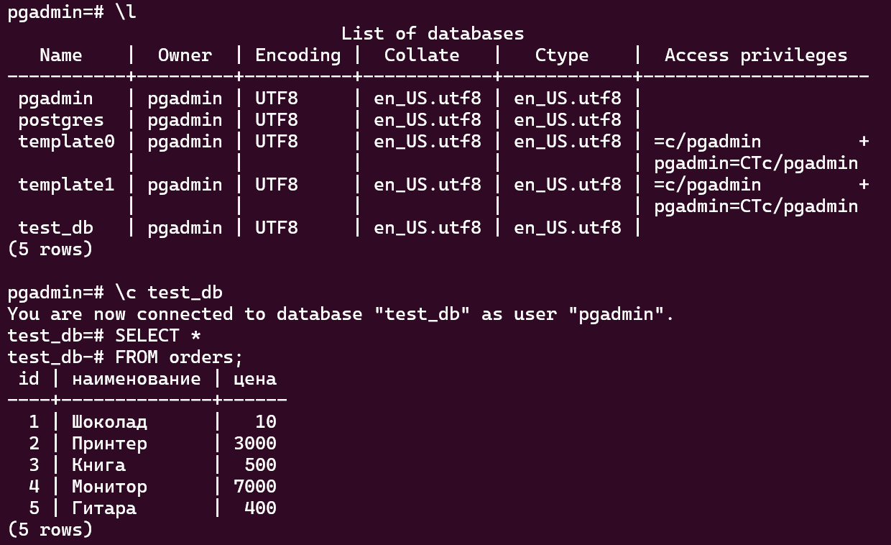