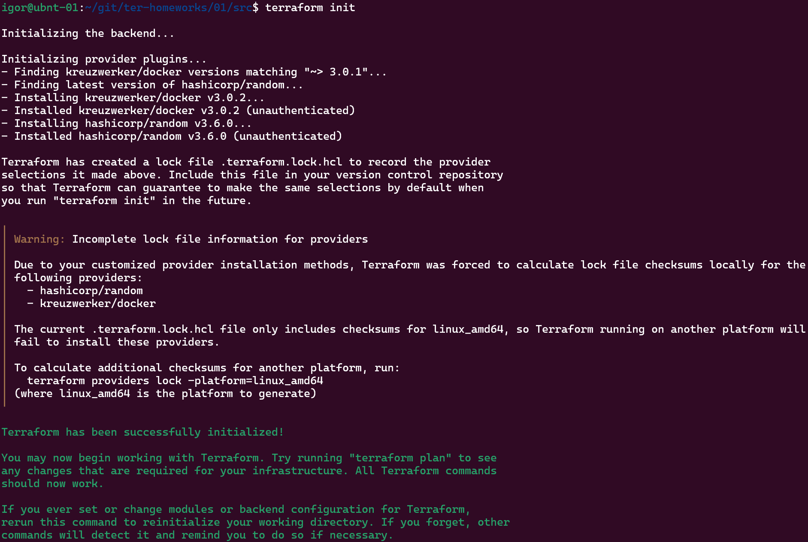
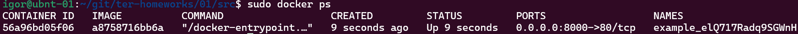
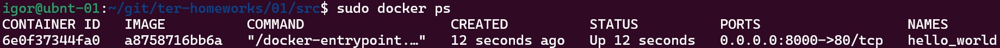
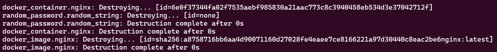
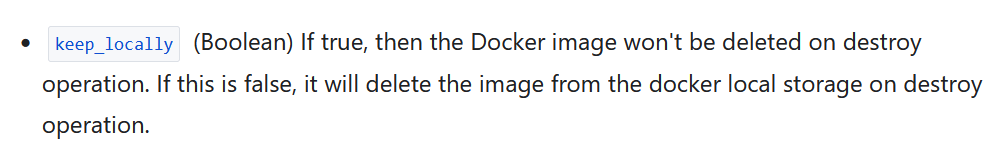

# 09.01. Введение в Terraform - Кулагин Игорь
### Задача 1
> Перейдите в каталог src. Скачайте все необходимые зависимости, использованные в проекте.

`terraform init`



> Изучите файл .gitignore. В каком terraform-файле, согласно этому .gitignore, допустимо сохранить личную, секретную информацию?

`personal.auto.tfvars`

> Выполните код проекта. Найдите в state-файле секретное содержимое созданного ресурса random_password, пришлите в качестве ответа конкретный ключ и его значение.

`elQ717Radq9SGWnH`

> Раскомментируйте блок кода, примерно расположенный на строчках 29–42 файла main.tf. Выполните команду terraform validate. Объясните, в чём заключаются намеренно допущенные ошибки.
```
│ Error: Missing name for resource
│
│   on main.tf line 24, in resource "docker_image":
│   24: resource "docker_image" {
│
│ All resource blocks must have 2 labels (type, name).
```

В данном случае не на задано имя ресурса, только тип. 

```
│ Error: Invalid resource name
│
│   on main.tf line 29, in resource "docker_container" "1nginx":
│   29: resource "docker_container" "1nginx" {
│
│ A name must start with a letter or underscore and may contain only letters, digits, underscores, and dashes.
```

Имя начинается с `1`, что нарушает требования.

```
│ Error: Reference to undeclared resource
│
│   on main.tf line 31, in resource "docker_container" "nginx":
│   31:   name  = "example_${random_password.random_string_FAKE.resulT}"
│
│ A managed resource "random_password" "random_string_FAKE" has not been declared in the root module.
```
Неверно указана ссылка на переменную. 


> Выполните код. В качестве ответа приложите: исправленный фрагмент кода и вывод команды docker ps.

Корректный код файла main.tf:

```
terraform {
  required_providers {
    docker = {
      source  = "kreuzwerker/docker"
      version = "~> 3.0.1"
    }
  }
  required_version = ">=0.13" /*Многострочный комментарий.
 Требуемая версия terraform */
}
provider "docker" {}

#однострочный комментарий

resource "random_password" "random_string" {
  length      = 16
  special     = false
  min_upper   = 1
  min_lower   = 1
  min_numeric = 1
}


resource "docker_image" "nginx"{
  name         = "nginx:latest"
  keep_locally = true
}

resource "docker_container" "nginx" {
  image = docker_image.nginx.image_id
  name  = "example_${random_password.random_string.result}"

  ports {
    internal = 80
    external = 8000
  }
}
```



>Замените имя docker-контейнера в блоке кода на hello_world. В качестве ответа дополнительно приложите вывод команды docker ps.



>  Выполните команду `terraform apply -auto-approve`. Объясните своими словами, в чём может быть опасность применения ключа `-auto-approve`

При использовании ключа `-auto-approve` Terraform не будет запрашивать подтверждение пользователя перед внесением изменений в инфраструктуру. Это чревато тем, что нельзя будет проконтролировать нет ли ошибки в изменениях, которые будут применены.

> Догадайтесь или нагуглите зачем может пригодиться данный ключ?

Ключ может быть полезен для того, чтобы автоматизировать процесс применения изменений, когда есть уверенность в том, что эти изменения не вызовут неожиданных результатов.

> Уничтожьте созданные ресурсы с помощью terraform.



> Приложите содержимое файла terraform.tfstate.

```
{
  "version": 4,
  "terraform_version": "1.5.7",
  "serial": 11,
  "lineage": "56aa6593-7787-a265-9c75-851345d066e6",
  "outputs": {},
  "resources": [],
  "check_results": null
}
```

> Объясните, почему при этом не был удалён docker-образ nginx:latest.

Все дело в опции `keep_locally = true`, которая указана в `файле main.tf`:


Документация про эту опцию говорит следующее:

