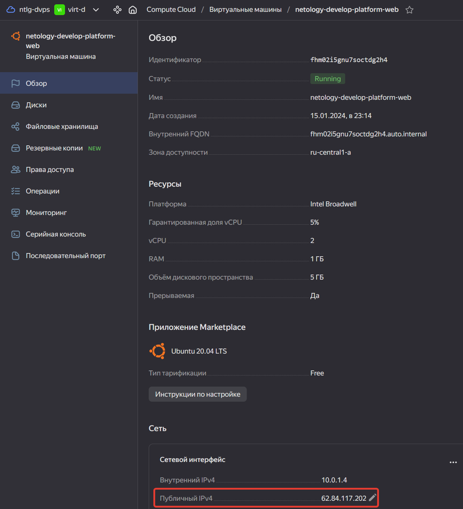
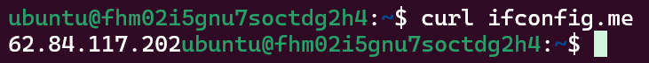

# 09.02. Основы Terraform. Yandex Cloud - Кулагин Игорь
### Задание 1

> Инициализируйте проект, выполните код. Исправьте намеренно допущенные синтаксические ошибки. Ищите внимательно, посимвольно. Ответьте, в чём заключается их суть.

Опечатка в слове `standart`, должно быть `standard`. Также указана платформа `v4`, но в ЯО максимально доступная версия платформы `v3`. Изменено на `standard-v1` и `cores = 2`, так как для `core_fraction = 5` число ядер должно быть `2` или `4`.

> Ответьте, как в процессе обучения могут пригодиться параметры preemptible = true и core_fraction=5 в параметрах ВМ.

Обе опции позволяют снизить расходы на вычислительные ресурсы в ЯО:
- `preemptible = true` - эта опция позволяет создать прерываемую виртуальную машину, т.е. такую, которая может быть принудительно остановлена в любой момент со стороны ЯО. 
- `core_fraction = 5` - параметр определяет уровень производительности (утилизации хостового) CPU

>скриншот ЛК Yandex Cloud с созданной ВМ, где видно внешний ip-адрес;

>скриншот консоли, curl должен отобразить тот же внешний ip-адрес;

### Задание 2

> Замените все хардкод-значения для ресурсов yandex_compute_image и yandex_compute_instance на отдельные переменные. К названиям переменных ВМ добавьте в начало префикс vm_web_ . Пример: vm_web_name.

> Объявите нужные переменные в файле variables.tf, обязательно указывайте тип переменной. Заполните их default прежними значениями из main.tf.

> Проверьте terraform plan. Изменений быть не должно.

