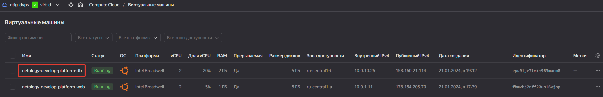

# 09.02. Основы Terraform. Yandex Cloud - Кулагин Игорь
### Задание 1

> Инициализируйте проект, выполните код. Исправьте намеренно допущенные синтаксические ошибки. Ищите внимательно, посимвольно. Ответьте, в чём заключается их суть.

Опечатка в слове `standart`, должно быть `standard`. Также указана платформа `v4`, но в ЯО максимально доступная версия платформы `v3`. Изменено на `standard-v1` и `cores = 2`, так как для `core_fraction = 5` число ядер должно быть `2` или `4`.

<details>
<summary> Исправленный код файла main.tf </summary>

```
resource "yandex_vpc_network" "develop" {
  name = var.vpc_name
}

resource "yandex_vpc_subnet" "develop" {
  name           = var.vpc_name
  zone           = var.default_zone
  network_id     = yandex_vpc_network.develop.id
  v4_cidr_blocks = var.default_cidr
}

data "yandex_compute_image" "ubuntu" {
  family = "ubuntu-2004-lts"
}

resource "yandex_compute_instance" "platform" {
  name        = "netology-develop-platform-web"
  platform_id = "standard-v1"
  resources {
    cores         = 2
    memory        = 1
    core_fraction = 5
  }

  boot_disk {
    initialize_params {
      image_id = data.yandex_compute_image.ubuntu.image_id
    }
  }

  scheduling_policy {
    preemptible = true
  }

  network_interface {
    subnet_id = yandex_vpc_subnet.develop.id
    nat       = true
  }

  metadata = {
    serial-port-enable = 1
    ssh-keys           = "ubuntu:${var.vms_ssh_root_key}"
  }

}
```

</details>

---
> Ответьте, как в процессе обучения могут пригодиться параметры preemptible = true и core_fraction=5 в параметрах ВМ.

Обе опции позволяют снизить расходы на вычислительные ресурсы в ЯО:
- `preemptible = true` - эта опция позволяет создать прерываемую виртуальную машину, т.е. такую, которая может быть принудительно остановлена в любой момент со стороны ЯО. 
- `core_fraction = 5` - параметр определяет уровень производительности (утилизации хостового) CPU

>скриншот ЛК Yandex Cloud с созданной ВМ, где видно внешний ip-адрес;


>скриншот консоли, curl должен отобразить тот же внешний ip-адрес;


### Задание 2

> Замените все хардкод-значения для ресурсов yandex_compute_image и yandex_compute_instance на отдельные переменные. К названиям переменных ВМ добавьте в начало префикс vm_web_ . Пример: vm_web_name.

> Объявите нужные переменные в файле variables.tf, обязательно указывайте тип переменной. Заполните их default прежними значениями из main.tf.

> Проверьте terraform plan. Изменений быть не должно.

<details>
<summary> Измененный код файла main.tf </summary>

```
resource "yandex_vpc_network" "develop" {
  name = var.vpc_name
}

resource "yandex_vpc_subnet" "develop" {
  name           = var.vpc_name
  zone           = var.default_zone
  network_id     = yandex_vpc_network.develop.id
  v4_cidr_blocks = var.default_cidr
}

data "yandex_compute_image" "ubuntu" {
  family = var.vm_web_image_name
}

resource "yandex_compute_instance" "platform" {
  name        = var.vm_web_compute_instance_name
  platform_id = var.vm_web_platform_name
  resources {
    cores         = var.vm_web_compute_map.cores
    memory        = var.vm_web_compute_map.memory
    core_fraction = var.vm_web_compute_map.core_fraction
  }

  boot_disk {
    initialize_params {
      image_id = data.yandex_compute_image.ubuntu.image_id
    }
  }

  scheduling_policy {
    preemptible = true
  }

  network_interface {
    subnet_id = yandex_vpc_subnet.develop.id
    nat       = true
  }

  metadata = {
    serial-port-enable = 1
    ssh-keys           = "ubuntu:${var.vms_ssh_root_key}"
  }

}
```

</details>

---

<details>
<summary> Измененный код файла variables.tf </summary>

```
###cloud vars
variable "token" {
  type        = string
  description = "OAuth-token; https://cloud.yandex.ru/docs/iam/concepts/authorization/oauth-token"
}

variable "cloud_id" {
  type        = string
  default     = "b1get9r87fgg41m2mrgu"
  description = "https://cloud.yandex.ru/docs/resource-manager/operations/cloud/get-id"
}

variable "folder_id" {
  type        = string
  default     = "b1g90asbm64681hb6q3p"
  description = "https://cloud.yandex.ru/docs/resource-manager/operations/folder/get-id"
}

variable "default_zone" {
  type        = string
  default     = "ru-central1-a"
  description = "https://cloud.yandex.ru/docs/overview/concepts/geo-scope"
}
variable "default_cidr" {
  type        = list(string)
  default     = ["10.0.1.0/24"]
  description = "https://cloud.yandex.ru/docs/vpc/operations/subnet-create"
}

variable "vpc_name" {
  type        = string
  default     = "develop"
  description = "VPC network & subnet name"
}

###ssh vars

variable "vms_ssh_root_key" {
  type        = string
  description = "ssh-keygen -t ed25519"
}


variable "vm_web_compute_map" {
  type    = map(number)
  default = {
    cores         = 2
    memory        = 1
    core_fraction = 5
  }
}

variable "vm_web_image_name" {
  type         = string
  default       = "ubuntu-2004-lts"
  description   = "vm web image name"
}

variable "vm_web_platform_name" {
  type          = string
  default       = "standard-v1"
  description   = "wm web platform id at yc"
}

variable "vm_web_compute_instance_name" {
  type          = string
  default       = "netology-develop-platform-web"
  description   = "vm web compute instance name"
}
```

</details>

---

Результат запуска команды `terraform plan`


### Задание 3

>   Создайте в корне проекта файл 'vms_platform.tf' . Перенесите в него все переменные первой ВМ.
    Скопируйте блок ресурса и создайте с его помощью вторую ВМ в файле main.tf: "netology-develop-platform-db" , cores  = 2, memory = 2, core_fraction = 20. Объявите её переменные с префиксом vm_db_ в том же файле ('vms_platform.tf'). ВМ должна работать в зоне "ru-central1-b"
    Примените изменения.


<details>
<summary> Код файла vms_platform.tf </summary>

```
### db vm variables

variable "vm_db_zone" {
  type        = string
  default     = "ru-central1-b"
  description = "db vm zone"
}

variable "vm_db_compute_resources_map" {
  type    = map(number)
  default = {
    cores         = 2
    memory        = 2
    core_fraction = 20
  }
}

variable "vm_db_image_name" {
  type         = string
  default       = "ubuntu-2004-lts"
  description   = "vm web image name"
}

variable "vm_db_platform_name" {
  type          = string
  default       = "standard-v1"
  description   = "wm web platform id at yc"
}

variable "vm_db_compute_instance_name" {
  type          = string
  default       = "netology-develop-platform-db"
  description   = "vm web compute instance name"
}

variable "vm_db_subnet" {
  type          = list(string)
  default       = ["10.0.10.0/24"]
  description   = "subnet for vm db"
}

variable "vm_db_subnet_name" {
  type          = string
  default       = "platform_db_subnet"
  description   = "subnet for vm db"
}

### create a subnet in new zone

resource "yandex_vpc_subnet" "platform_db" {
  name           = var.vm_db_subnet_name
  zone           = var.vm_db_zone
  network_id     = yandex_vpc_network.develop.id
  v4_cidr_blocks = var.vm_db_subnet
}

### db compute node instance declaration

resource "yandex_compute_instance" "platform_db" {
  name        = var.vm_db_compute_instance_name
  zone        = var.vm_db_zone
  platform_id = var.vm_db_platform_name
  resources {
    cores         = var.vm_db_compute_resources_map.cores
    memory        = var.vm_db_compute_resources_map.memory
    core_fraction = var.vm_db_compute_resources_map.core_fraction
  }

  boot_disk {
    initialize_params {
      image_id = data.yandex_compute_image.ubuntu.image_id
    }
  }

  scheduling_policy {
    preemptible = true
  }

  network_interface {
    subnet_id = yandex_vpc_subnet.platform_db.id
    nat       = true
  }

  metadata = {
    serial-port-enable = 1
    ssh-keys           = "ubuntu:${var.vms_ssh_root_key}"
  }

}
```

</details>

---

Результат выполнения кода - создана VM и подсеть:



