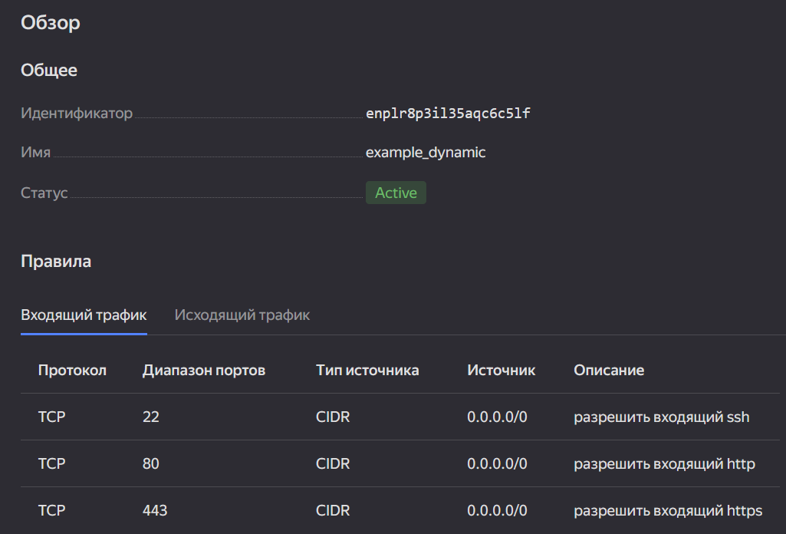
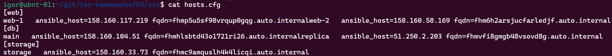
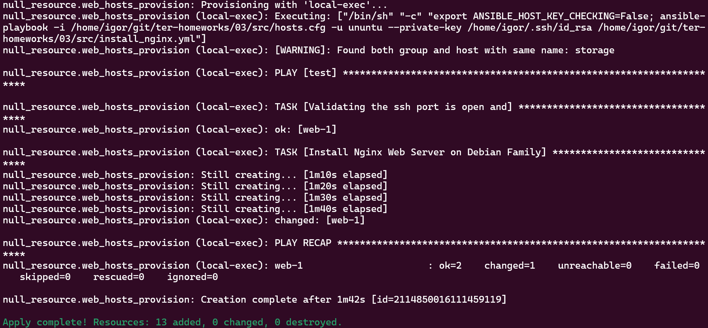

# 09.03. Управляющие конструкции в коде Terraform - Кулагин Игорь

## [Ссылка на исходный код](./src)

### Задание 1

> Изучите проект.
> Заполните файл personal.auto.tfvars.
> Инициализируйте проект, выполните код. Он выполнится, даже если доступа к preview нет.

> Приложите скриншот входящих правил «Группы безопасности» в ЛК Yandex Cloud или скриншот отказа в предоставлении доступа к preview-версии.




### Задание 2

> Создайте файл count-vm.tf. Опишите в нём создание двух одинаковых ВМ web-1 и web-2 (не web-0 и web-1) с минимальными параметрами, используя мета-аргумент count loop. Назначьте ВМ созданную в первом задании группу безопасности.(как это сделать узнайте в документации провайдера yandex/compute_instance )

---

<details>
<summary> Содержимое файла count-vm.tf</summary>

```
data "yandex_compute_image" "ubuntu" {
  family = var.vm_image_name
}

resource "yandex_compute_instance" "web" {
  count         = 2

  name          = "web-${count.index + 1}"
  platform_id   = var.platform_id

  resources {
    cores         = var.vm_web_cores
    memory        = var.vm_web_memory
    core_fraction = var.core_fraction
  }

  boot_disk {
    initialize_params {
      image_id = data.yandex_compute_image.ubuntu.image_id
      size = var.boot_disk_size
    }
  }

  scheduling_policy {
    preemptible = true
  }

  network_interface {
    subnet_id = yandex_vpc_subnet.develop.id
    security_group_ids = [yandex_vpc_security_group.example.id]
    nat       = true
  }

  metadata = {
    serial-port-enable = var.serial_port_state
    ssh-keys           = "ubuntu:${file(local.ssh_key_path)}"
  }

  depends_on = [
    yandex_compute_instance.db["main"],
    yandex_compute_instance.db["replica"]
  ]
}
```
</details>

---

> Создайте файл for_each-vm.tf. Опишите в нём создание двух ВМ для баз данных с именами "main" и "replica" разных по cpu/ram/disk_volume , используя мета-аргумент for_each loop. Используйте для обеих ВМ одну общую переменную типа:

```
variable "each_vm" {
  type = list(object({  vm_name=string, cpu=number, ram=number, disk_volume=number }))
}
```

---

<details>
<summary> Содержимое файла for_each-vm.tf</summary>

```
resource "yandex_compute_instance" "db" {
  for_each      = var.each_vm

  name          = each.key

  resources {
    cores       = each.value.cpu
    memory      = each.value.ram
  }

  boot_disk {
    initialize_params {
      image_id  = data.yandex_compute_image.ubuntu.image_id
      size      = each.value.disk_volume
    }
  }

  network_interface {
     subnet_id  = yandex_vpc_subnet.develop.id
     security_group_ids = [yandex_vpc_security_group.example.id]
     nat        = true
  }

  metadata = {
     serial-port-enable = var.serial_port_state
     ssh-keys           = "ubuntu:${file(local.ssh_key_path)}"
  }
}
```

</details>

---

> Используйте функцию file в local-переменной для считывания ключа ~/.ssh/id_rsa.pub и его последующего использования в блоке metadata, взятому из ДЗ 2. 6. Инициализируйте проект, выполните код.

---

<details>
<summary> Содержимое файла locals.tf </summary>

```
locals {
  ssh_key_path = "~/.ssh/id_rsa.pub"
}
```

</details>

---

### Задание 3

> Создайте 3 одинаковых виртуальных диска размером 1 Гб с помощью ресурса yandex_compute_disk и мета-аргумента count в файле disk_vm.tf .

---

<details>
<summary> Содержимое файла disk_vm.tf </summary>

```
resource "yandex_compute_disk" "extra_disks" {
  count = 3
  name = "disk-${count.index}"
  size = 1
}
```

</details>

---

> Создайте в том же файле одиночную(использовать count или for_each запрещено из-за задания №4) ВМ c именем "storage" . Используйте блок dynamic secondary_disk{..} и мета-аргумент for_each для подключения созданных вами дополнительных дисков.

---

<details>
<summary> Обновленное содержимое файла disk_vm.tf </summary>

```
resource "yandex_compute_disk" "extra_disks" {
  count = 3

  name = "disk-${count.index}"
  size = 1
}

resource "yandex_compute_instance" "storage_vm" {
  name = "storage"

  platform_id   = var.platform_id

  resources {
    cores         = var.vm_web_cores
    memory        = var.vm_web_memory
    core_fraction = var.core_fraction
  }

  boot_disk {
    initialize_params {
      image_id = data.yandex_compute_image.ubuntu.image_id
      size = var.boot_disk_size
    }
  }

  scheduling_policy {
    preemptible = true
  }

  network_interface {
    subnet_id = yandex_vpc_subnet.develop.id
    security_group_ids = [yandex_vpc_security_group.example.id]
    nat       = true
  }

  metadata = {
    serial-port-enable = var.serial_port_state
    ssh-keys           = "ubuntu:${file(local.ssh_key_path)}"
  }

  # Использование dynamic блока для подключения дополнительных дисков
  dynamic "secondary_disk" {
    for_each = yandex_compute_disk.extra_disks.*.id

    content {
      disk_id = secondary_disk.value
      mode    = "READ_WRITE"
    }
  }
}
```

</details>

### Задание 4

> В файле ansible.tf создайте inventory-файл для ansible. Используйте функцию tepmplatefile и файл-шаблон для создания ansible inventory-файла из лекции. Готовый код возьмите из демонстрации к лекции demonstration2. Передайте в него в качестве переменных группы виртуальных машин из задания 2.1, 2.2 и 3.2, т. е. 5 ВМ.

> Инвентарь должен содержать 3 группы [webservers], [databases], [storage] и быть динамическим, т. е. обработать как группу из 2-х ВМ, так и 999 ВМ.

> Добавьте в инвентарь переменную fqdn.

> Выполните код. Приложите скриншот получившегося файла.

---
<details>
<summary> Код файла ansible_hosts.tftpl </summary>

```
[web]

%{~ for i in web ~}
${i["name"]}   ansible_host=${i["network_interface"][0]["nat_ip_address"]} fqdn=${i["fqdn"]}
%{~ endfor ~}

[db]

%{~ for i in db ~}
${i["name"]}   ansible_host=${i["network_interface"][0]["nat_ip_address"]} fqdn=${i["fqdn"]}
%{~ endfor ~}

[storage]

%{~ for i in storage ~}
${i["name"]}   ansible_host=${i["network_interface"][0]["nat_ip_address"]} fqdn=${i["fqdn"]}
%{~ endfor ~}
```

</details>

---

<details>
<summary> Релевантный код файла ansible.tf </summary>

```
resource "local_file" "ansible_inventory" {
  content       = templatefile("${path.module}/ansible_hosts.tftpl",
    {
        web     =  yandex_compute_instance.web,
        db      =  yandex_compute_instance.db,
        storage =  [yandex_compute_instance.storage_vm]
    }
)

  filename = "${abspath(path.module)}/hosts.cfg"
}

```

</details>

---

Скриншот получившегося в итоге файла `hosts.cfg`:



Я, по всей видимости, немного неправильно понял задание. Решил, что целью является запуска плейбука ансибл для установки nginx. Собственно, playbook отработал ¯\\\_(ツ)\_/¯.
Ниже приведен листинг релевантных файлов. 

---

<details>
<summary> Код файла install_nginx.yml </summary>

```
---
- name: test
  gather_facts: false
  hosts: web
  vars:
    ansible_ssh_user: ubuntu
  become: yes

  pre_tasks:
    - name: Validating the ssh port is open and
      wait_for:
        host: "{{ansible_host}}"
        port: 22
        delay: 0
        timeout: 600
        state: started
        msg: "ssh server is not running"

  tasks:
    - name: Install Nginx Web Server on Debian Family
      apt:
        name:
          - nginx
          - jq
        state: latest
        update_cache: yes
```

</details>

---

<details>
<summary> Полный листинг кода файла ansible.tf </summary>

```
resource "local_file" "ansible_inventory" {
  content       = templatefile("${path.module}/ansible_hosts.tftpl",
    {
        web     =  yandex_compute_instance.web,
        db      =  yandex_compute_instance.db,
        storage =  [yandex_compute_instance.storage_vm]
    }
)

  filename = "${abspath(path.module)}/hosts.cfg"
}

# Prepare and launch ansible playbook install_nginx.yml

resource "null_resource" "web_hosts_provision" {
  # Ждем создания инстанса
  depends_on = [yandex_compute_instance.web, local_file.ansible_inventory]

  # Добавление ПРИВАТНОГО ssh ключа в ssh-agent
  provisioner "local-exec" {
    command = "eval $(ssh-agent) && cat ~/.ssh/id_rsa | ssh-add -"
  }

  # Костыль!!! Даем ВМ 60 сек на первый запуск. Лучше выполнить это через wait_for port 22 на стороне ansible
  # В случае использования cloud-init может потребоваться еще больше времени
  provisioner "local-exec" {
    command = "sleep 60"
  }

  # Запуск ansible-playbook
  provisioner "local-exec" {
    #command = "export ANSIBLE_HOST_KEY_CHECKING=False; ansible-playbook -i ${abspath(path.module)}/hosts.cfg ${abspath(path.module)}/install_nginx.yml"
    command = "export ANSIBLE_HOST_KEY_CHECKING=False; ansible-playbook -i ${abspath(path.module)}/hosts.cfg -u ununtu --private-key /home/igor/.ssh/id_rsa ${abspath(path.module)}/install_nginx.yml"
    on_failure = continue #Продолжить выполнение terraform pipeline в случае ошибок
    environment = { ANSIBLE_HOST_KEY_CHECKING = "False" }
  }

# Срабатывание триггера при изменении переменных
  triggers = {

      # Всегда т.к. дата и время постоянно изменяются
      always_run         = "${timestamp()}"

      # При изменении содержимого playbook файла
      playbook_src_hash  = file("${abspath(path.module)}/install_nginx.yml")
      ssh_public_key     = var.ssh_root_public_key # при изменении переменной
    }
}
```
</details>

---

Результат выполнения `terrform apply`, включая применение плейбука ансибл:


