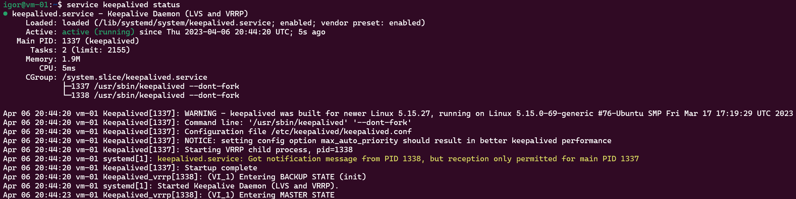
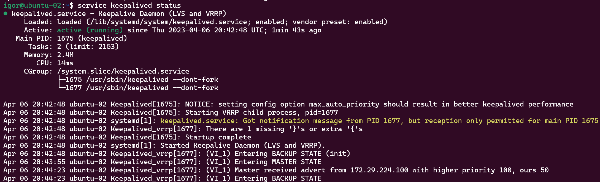
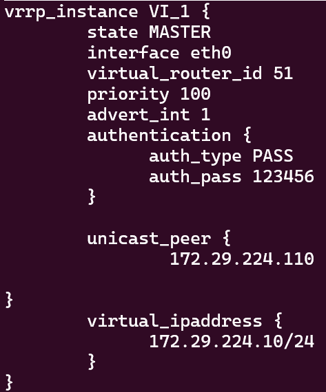
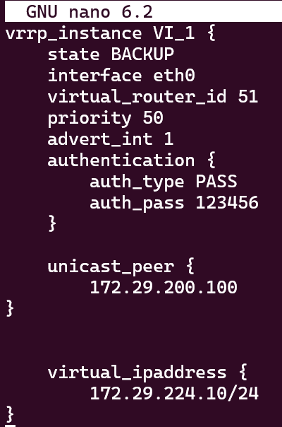

# 10.1. Keepalived/vrrp - Кулагин Игорь
## Задание 1
>Разверните топологию из лекции и выполните установку и настройку сервиса Keepalived.

>Пришлите скриншот рабочей конфигурации и состояния сервиса для каждого нода.

