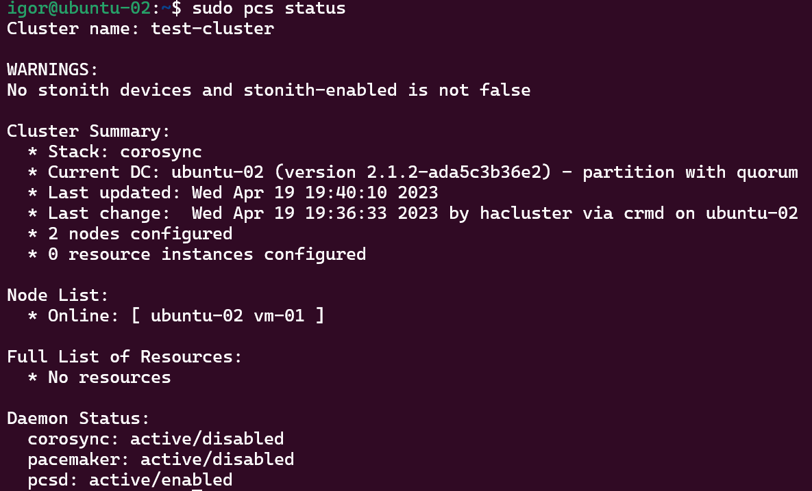
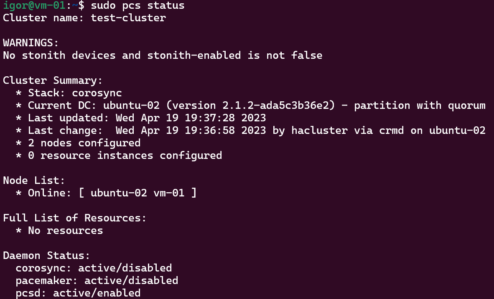
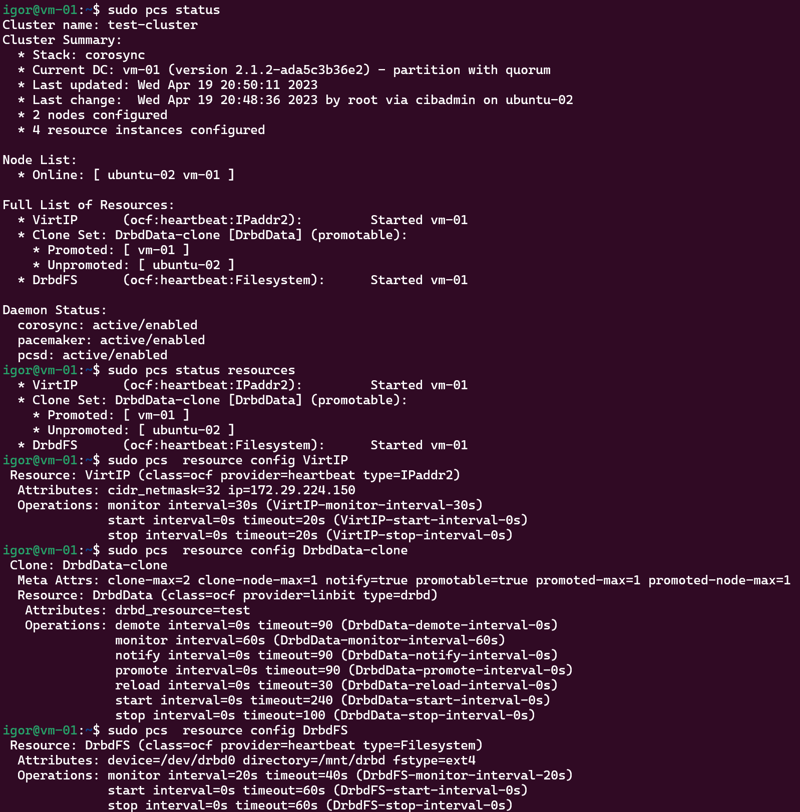
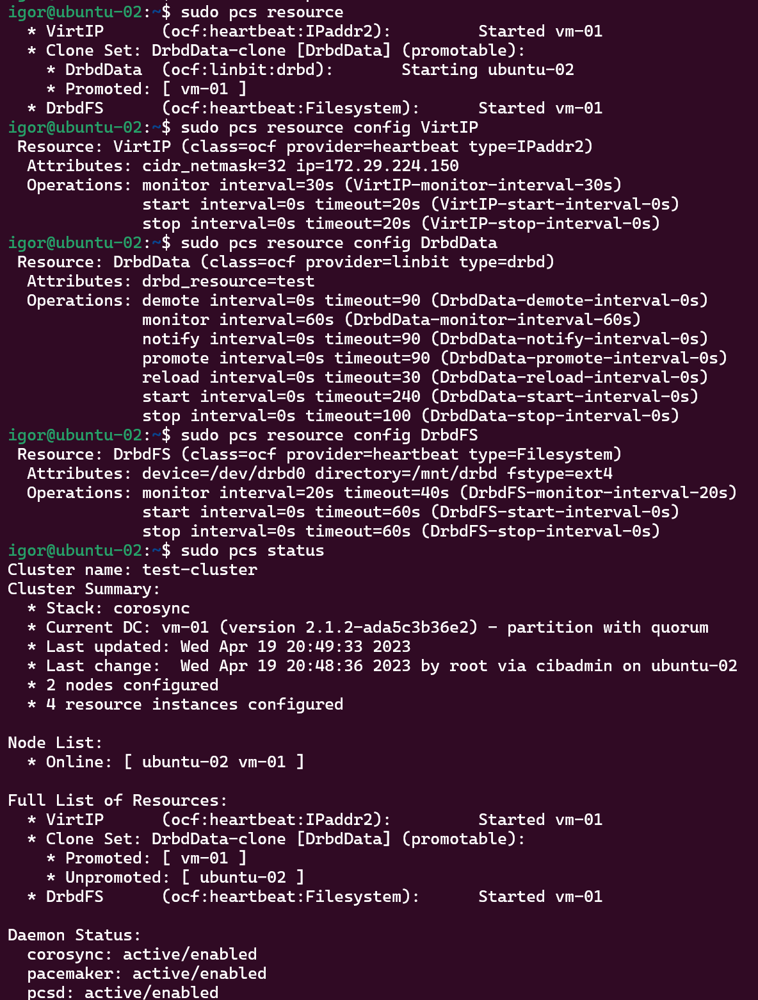

# 10.3. Pacemaker - Кулагин Игорь
## Задание 1
>Опишите основные функции и назначение Pacemaker.

**Corosync** - это фреймворк для организации надежного и масштабируемого обмена сообщениями между нодами кластера. Он отвечает за то, чтобы все узлы в кластере могли взаимодействовать друг с другом и синхронизировать свою деятельность.

## Задание 2
>Опишите основные функции и назначение Corosync.

**Pacemaker** — это менеджер ресурсов кластера, работающий поверх Corosync. Он отслеживает ресурсы кластера, такие как службы, приложения и виртуальные машины, и управляет их аварийным переключением и восстановлением в случае отказа узла или ресурса.

## Задание 3
>Соберите модель, состоящую из двух виртуальных машин. Установите Pacemaker, Corosync, Pcs. Настройте HA кластер.

>Пришлите скриншот рабочей конфигурации и состояния сервиса для каждого нода.

---

---

---

## Задание 4
> Установите и настройте DRBD-сервис для настроенного кластера.

> Пришлите скриншот рабочей конфигурации и состояние сервиса для каждого нода.

---

