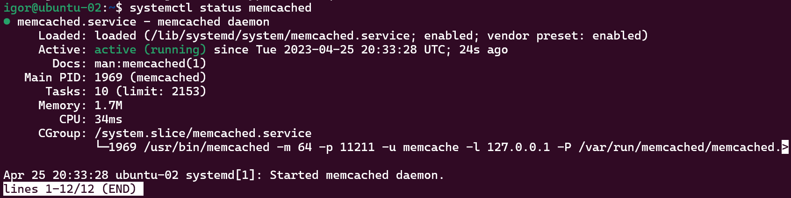
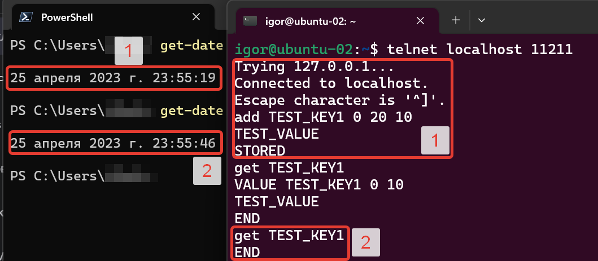
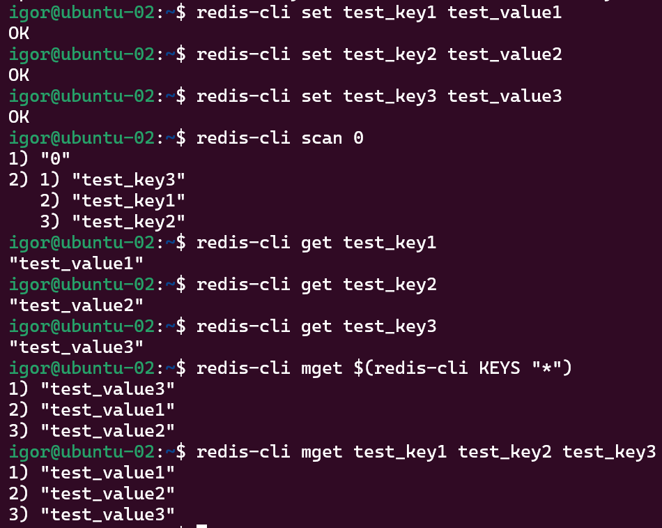
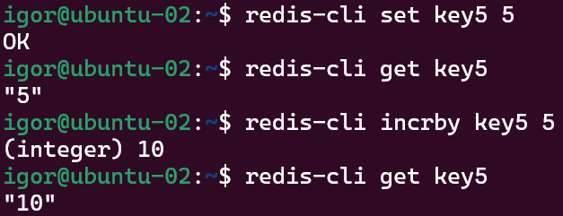

# 11.2. Кеширование Redis/memcached  - Кулагин Игорь
## Задание 1
>Приведите примеры проблем, которые может решить кеширование.

- **Повышение производительности / Ускорение получения данных** -  представляется самой распространенной задачей, для решения которой используется кэширование. Для конечного пользователя это может выглядеть как более быстрая загрузка веб-страницы или более быстрый ответ от приложения по сравнению с вариантом без использования кэширования. 

- **Экономия ресурсов** - получить данные их кэша с точки зрения утилизации ресурсов дешевле, чем, например, выполнить запрос к базе данных или вытащить данные из любого другого хранилища. 

- **Возможность справляться с пиковыми нагрузками**, которые без использования кэширования могли бы привести к исчерпанию ресурсов, например, сервера СУБД. 

## Задание 2
>Установите и запустите memcached.

>Приведите скриншот systemctl status memcached, где будет видно, что memcached запущен.

## Задание 3
>Запишите в memcached несколько ключей с любыми именами и значениями, для которых выставлен TTL 5.

>Приведите скриншот, на котором видно, что спустя 5 секунд ключи удалились из базы.

С пятью секундами как-то незаладилось, как и с десятью - `get` сразу возвращал `end`. Получилось с 20 секундами:

## Задание 4
>Запишите в Redis несколько ключей с любыми именами и значениями.

>Через redis-cli достаньте все записанные ключи и значения из базы, приведите скриншот этой операции.

## Задание 5*. Работа с числами
>Запишите в Redis ключ key5 со значением типа "int" равным числу 5. Увеличьте его на 5, чтобы в итоге в значении лежало число 10.

>Приведите скриншот, где будут проделаны все операции и будет видно, что значение key5 стало равно 10.

