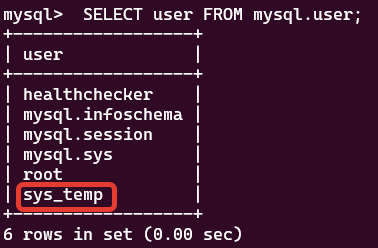
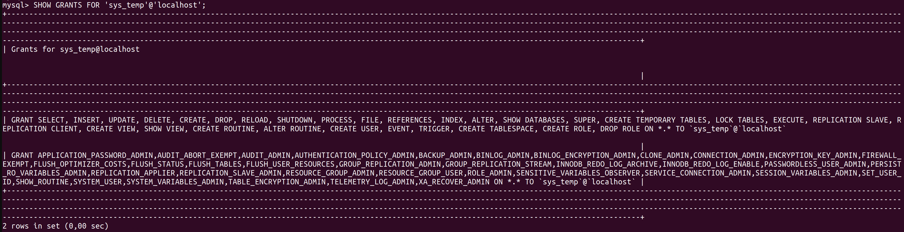
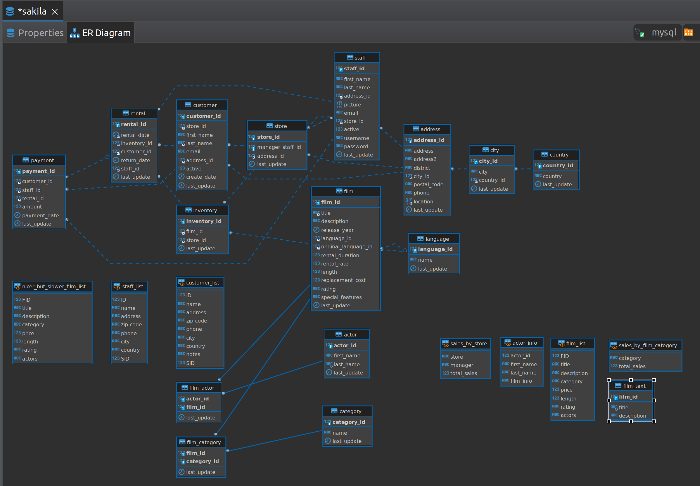
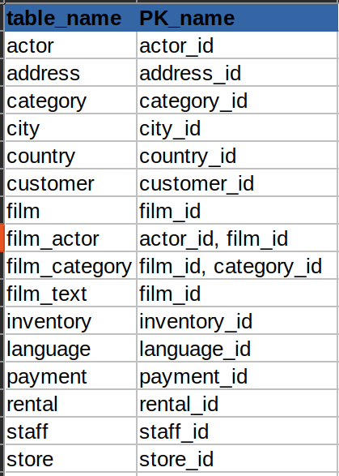

# 12.2. Работа с данными (DDL/DML)  - Кулагин Игорь
## Задание 1

>1.1. Поднимите чистый инстанс MySQL версии 8.0+. Можно использовать локальный сервер или контейнер Docker.

```
docker pull mysql
docker run --name mysql --restart on-failure -d mysql:latest
mysql --host=172.17.0.2 -uroot -p mysql
```
>1.2. Создайте учётную запись sys_temp.

`CREATE USER 'sys_temp'@'%' IDENTIFIED BY 'PASSWORD';`

>1.3. Выполните запрос на получение списка пользователей в базе данных. (скриншот)

`SELECT user FROM mysql.user;`



>1.4. Дайте все права для пользователя sys_temp.

```
GRANT ALL PRIVILEGES ON *.* TO 'sys_temp'@'localhost';
```

>1.5. Выполните запрос на получение списка прав для пользователя sys_temp. (скриншот)

```
SHOW GRANTS FOR 'sys_temp'@'localhost';
```



>1.6. Переподключитесь к базе данных от имени sys_temp.

`mysql --host=172.17.0.2 -usys_temp -p mysql`

>1.7. Восстановите дамп в базу данных.

`mysql --host=172.17.0.2 -usys_temp -p sakila < ~/Downloads/sakila-db/sakila-schema.sql`
`mysql --host=172.17.0.2 -usys_temp -p sakila < ~/Downloads/sakila-db/sakila-data.sql`

>1.8. При работе в IDE сформируйте ER-диаграмму получившейся базы данных. При работе в командной строке используйте команду для получения всех таблиц базы данных. (скриншот)



## Задание 2

> Составьте таблицу, используя любой текстовый редактор или Excel, в которой должно быть два столбца: в первом должны быть названия таблиц восстановленной базы, во втором названия первичных ключей этих таблиц.

