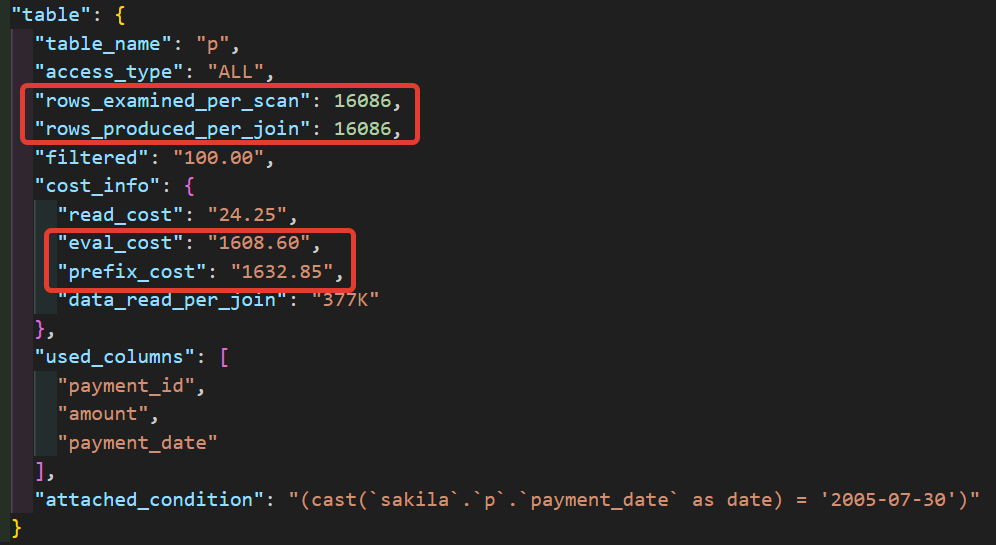

# 12.5. Индексы - Кулагин Игорь
## Задание 1
> Напишите запрос к учебной базе данных, который вернёт процентное отношение общего размера всех индексов к общему размеру всех таблиц.

```
SELECT
    CONCAT(ROUND(SUM(INDEX_LENGTH)/SUM(DATA_LENGTH) * 100), '%') AS RATIO
FROM
    INFORMATION_SCHEMA.TABLES
WHERE
    TABLE_SCHEMA = 'sakila';
```

## Задание 2
Выполните explain analyze следующего запроса:

```
select distinct concat(c.last_name, ' ', c.first_name), sum(p.amount) over (partition by c.customer_id, f.title)
from payment p, rental r, customer c, inventory i, film f
where date(p.payment_date) = '2005-07-30' and p.payment_date = r.rental_date and r.customer_id = c.customer_id and i.inventory_id = r.inventory_id
```
> - перечислите узкие места;

- К сожалению, я не могу перечислить узкие места, так как не понимаю как из вывода EXPLAIN ANALYZE понять, что можно оптимизировать. На лекции этого хоть сколько-нибудь внятно не объяснили, к сожалению.
- Могу сказать, что по какой-то причине поиск в списке таблиц работает гораздо медленнее, чем JOIN. Я понятия не имею почему.
- Коллеги подсказали, что нужно сделать индекс по столбцу payment_date таблицы payment. Тут хоть немного понятно откуда это взялось:


- Что не понятно, так это почему в EXPLAIN ANALYZE для исходного запроса row_produces_per_join и соответсвенно eval_cost составляет 1 608 600, а для "оптимизированного" - 16 086. 



 


> - оптимизируйте запрос: внесите корректировки по использованию операторов, при необходимости добавьте индексы.

Фактически, я просто написал запрос с нуля и работает он существенно быстрее исходного. К сожалению, я не имею представления почему и, как уже упомянул выше, не понимаю, как из EXPLAIN ANALYZE эту информацию получить.

```
SELECT
    CONCAT(c.last_name, ' ', c.first_name) AS name,
    SUM(p.amount) AS total_amount
FROM 
    payment p
JOIN 
    rental r ON p.payment_date = r.rental_date
JOIN 
    customer c ON r.customer_id = c.customer_id
JOIN 
    inventory i ON i.inventory_id = r.inventory_id
JOIN 
    film f ON i.film_id = f.film_id
WHERE
    DATE(p.payment_date) = '2005-07-30'
GROUP BY
    name
ORDER BY
	name;
```