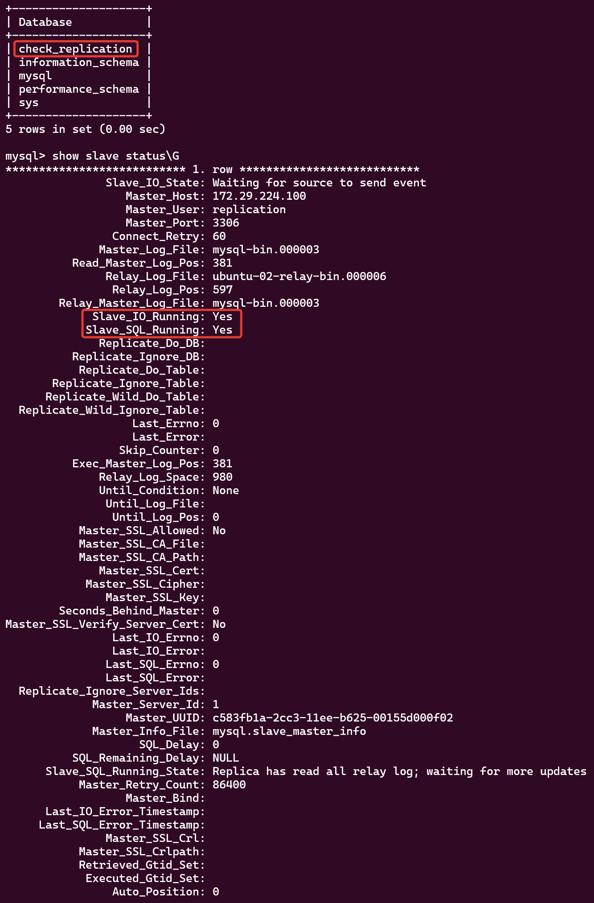
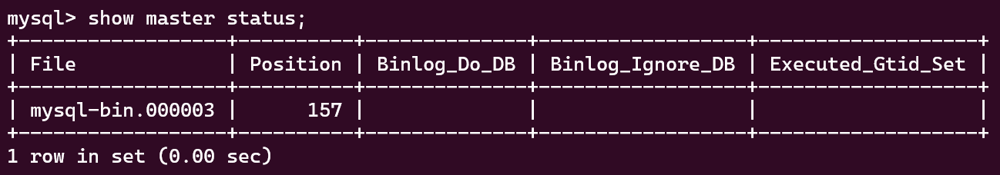

# 12.6. Репликация и масштабирование. Часть 1 - Кулагин Игорь
## Задание 1
>На лекции рассматривались режимы репликации master-slave, master-master, опишите их различия.

**Режим репликации master-slave**
В этом режиме у нас есть один основной (master) сервер и один или несколько реплик (slave) серверов.

- Master-сервер отвечает за запись данных и выполнение всех операций изменения данных.
- Slave-серверы получают изменения данных с основного сервера и применяют их, с целью синхронизации их с мастером.
- Реплики доступны только для чтения, так как записи производятся только на основном сервере, но это обеспечивает отказоустойчивость и масштабируемость для чтения.

**Режим репликации master-master**
В этом режиме у нас есть два или более сервера, каждый из которых может выполнять операции записи и чтения.

- Каждый сервер может выступать как master для других серверов и как slave для других.
- Все серверы могут принимать запросы на чтение и запись, что обеспечивает балансировку нагрузки и распределение операций записи.
- Этот режим обеспечивает более высокую отказоустойчивость, так как записи могут выполняться на любом из серверов. Однако его настройка и управление сложнее, а вероятность отказов и внештатных ситуацй гораздо выше , чем у режима master-slave

## Задание 2
>Выполните конфигурацию master-slave репликации, примером можно пользоваться из лекции.
>Приложите скриншоты конфигурации, выполнения работы: состояния и режимы работы серверов.

```
[mysqld]
user                    = mysql
bind-address            = 0.0.0.0
mysqlx-bind-address     = 0.0.0.0
server-id               = 2
key_buffer_size         = 16M
myisam-recover-options  = BACKUP
log_error               = /var/log/mysql/error.log
log_bin                 = /var/log/mysql/mysql-bin.log
max_binlog_size         = 100M
```

`show slave status;`
 

`show master status;`
 
