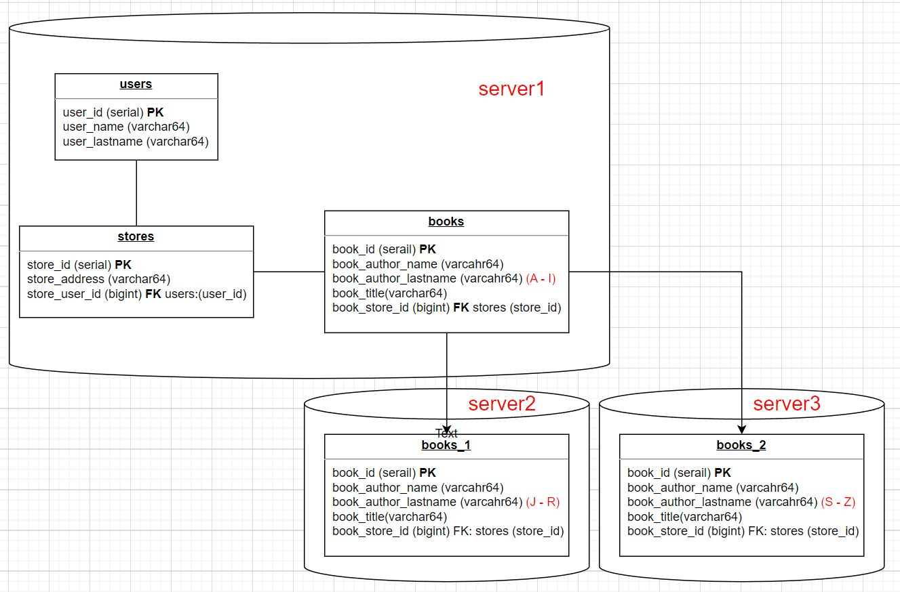

# 12.7. Репликация и масштабирование. Часть 2 - Кулагин Игорь
## Задание 1
>Опишите основные преимущества использования масштабирования методами:

>- активный master-сервер и пассивный репликационный slave-сервер;

1. Отказоустойчивость - при выходе мастера их строя slave станет новым мастором и СУБД продолжит работу.
2. Увеличение скорости чтения данных, так как чтение можно распарллелить на два сервера.

>- master-сервер и несколько slave-серверов;

Все тоже самое, что и для схемы master-slave, однако за счет большего количества slave-реплик  скорость чтения данных можно существенно увеличить.

>- активный сервер со специальным механизмом репликации — distributed replicated block device (DRBD);

1. Отказоустойчивость - DRBD обеспечивает репликацию данных между активным и пассивным серверами, что позволяет быстро переключиться на пассивный сервер в случае сбоя активного, обеспечивая высокую доступность системы.
2. Производительность - использование DRBD позволяет снизить задержку при записи данных, так как операции записи выполняются локально на активном сервере, а репликация происходит на пассивном.

>- SAN-кластер.

1. Высокая производительность по сравнению со всеми описанными выше вариантами из-за использования специальной сети хранения данных вместо неспецилизированной TCP/IP-сети.
2. Отказоусточивость на уровне СХД.

## Задание 2
>Разработайте план для выполнения горизонтального и вертикального шаринга базы данных. База данных состоит из трёх таблиц:

>- пользователи,
>- книги,
>- магазины (столбцы произвольно).

>Опишите принципы построения системы и их разграничение или разбивку между базами данных.

**Вертикальное шардинг** - одна огромная таблица разбивается по определнной лдогике на более маленькие таблицы. За счет того, что данные хранятся в разных таблицах, их выборка работает быстрее, так как поиск данных вместо одной огромной таблицы осуществляется в конкретной "небольшой" таблице. При это все эти таблицы продолжают храниться на одном сервере.

**Вертикальный шардинг** - тоже самое, что и вертикальный шардинг, однако таблицы располгаются на разных серверах. Данные на серверах связаны путем настройки СУБД. Такая конструкция более сложна в настройки и поддержке по сравнению с вертикальным шардингом, однако она дает практически неограниченные возможности по масштабирования.

>Пришлите блоксхему, где и что будет располагаться. Опишите, в каких режимах будут работать сервера.

Для иллюстрации будем осуществлять горизонтальное шардирование по таблице books. Сегментирование осуществляется по полю authot_lastname. Выделины три сегмента, каждый из них размещен в отдельном инстансе СУБД на отдельном сервере:

 

