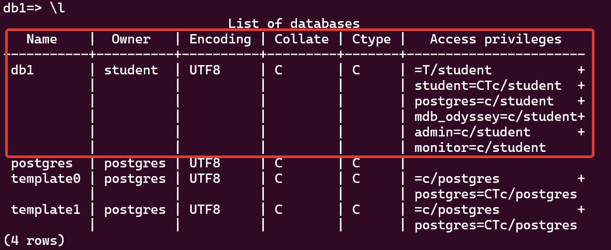
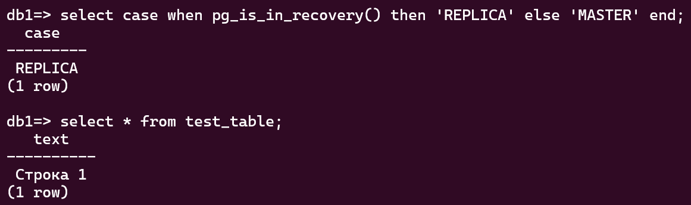

# 12.9. Базы данных в облаке - Кулагин Игорь
## Задание 1
>В качестве результата вашей работы пришлите скриншоты:

> 1. Созданной базы данных

 

> 2. Результата вывода команды на реплике select * from test_table;

 