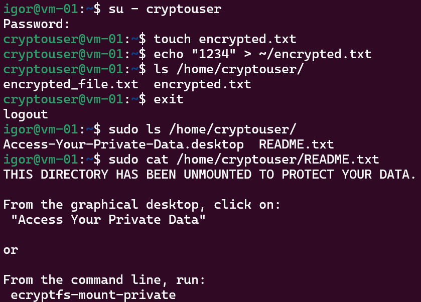
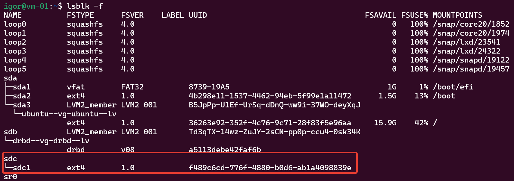
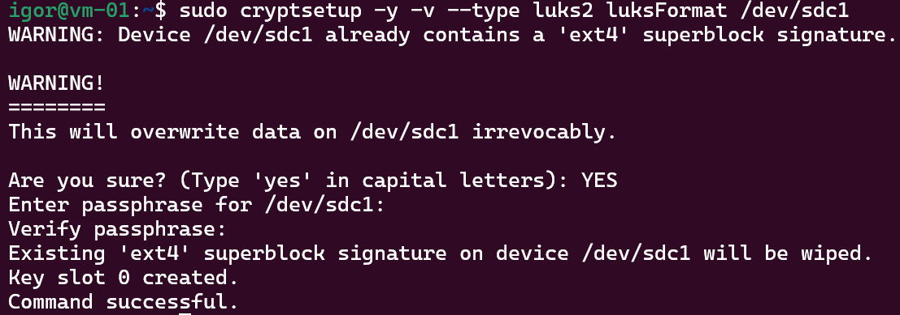
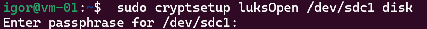
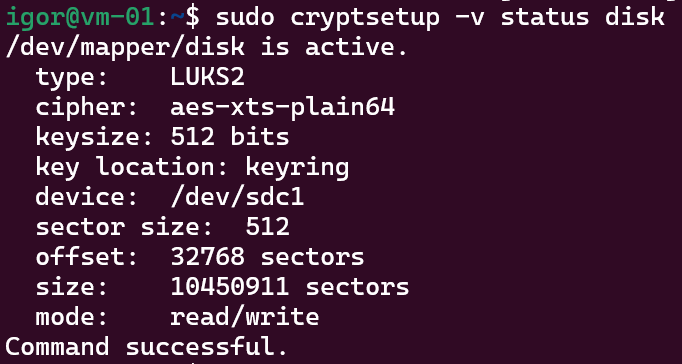
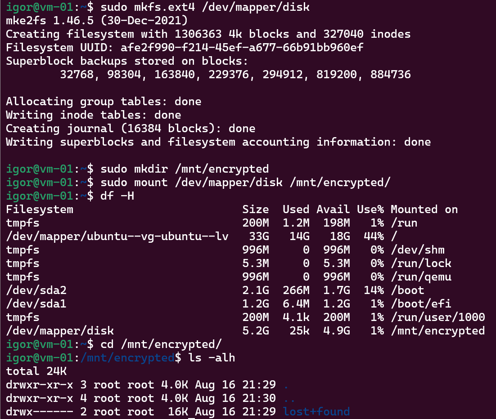

# 13.2. Защита хоста - Кулагин Игорь
## Задание 1
> 1. Установите eCryptfs.
> 2. Добавьте пользователя cryptouser.
> 3. Зашифруйте домашний каталог пользователя с помощью eCryptfs.

> В качестве ответа пришлите снимки экрана домашнего каталога пользователя с исходными и зашифрованными данными.

 

## Задание 2
> 1. Установите поддержку LUKS.
> 2. Создайте небольшой раздел, например, 100 Мб.
> 3. Зашифруйте созданный раздел с помощью LUKS.

> В качестве ответа пришлите снимки экрана с поэтапным выполнением задания.

- Подключаем новый диск `/dev/sdc` и делаем на нем раздел `/dev/sdc1`:
 

- Готовим раздел к шифрованию:

- Создаем зашифрованный LUKS-раздел:

- Проверяем статус зашифрованного раздела:

- Для усиления безопасности затираем все данные на диске нулями:

`dd if=/dev/zero of=/dev/mapper/disk`

- Создаем файловую систему `ext4` и монтируем раздел:

