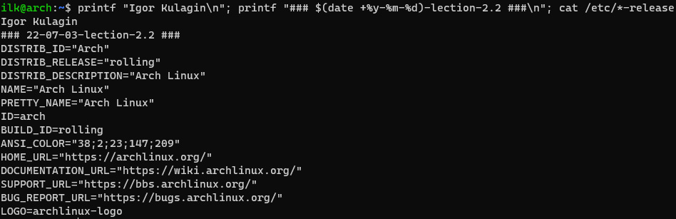

### 2.2. Основы работы с командной строкой [Кулагин Игорь]

## Задание 1

## Задание 2
```console
printf "Igor Kulagin\n"; printf "### $(date +%y-%m-%d)-lection-2.2 ###\n"; cat /etc/*-release
```

## Задание 3

## Задание 4
```console
mv ~/2.2.\ Igor\ Kulagin ~/2.2.\ Igor\ Kulagin\ $(date +%y-%m-%d); cd ~/2.2.\ Igor\ Kulagin\ $(date +%y-%m-%d); printf "Игорь Кулагин\n" > concept.1;printf "2.2. Основы работы с командной строкой\n" >> concept.1; cat /etc/*release >> concept.1; head -n 1 ./concept.1
```

## Задание 5
```console
sudo ln -s /home/ilk/2.2.\ Igor\ Kulagin\ 22-07-03/ /opt/ln_new_name
cp ~/2.2.\ Igor\ Kulagin\ 22-07-03/concept.1 /opt/ln_new_name/concept.1.old
rm 2.2.\ Igor\ Kulagin\ 22-07-03/concept.1
ls -alh ./2.2.\ Igor\ Kulagin\ 22-07-03/
````

## Задание 6
<details><summary>*Замечание о данном задании*</summary>
Ни в Debian/Ubuntu, ни тем более в Arch мне не удалось найти команды для менеджера пакетов, которые бы вернули именно установленные мной пакеты. Лучшее, что получилось сделать - это получить список пакетов, установленных вручную. Однако это не тоже самое что установленные мной (конкретным пользователем пакеты), потому что эти пакеты мог установить любой другой пользователь системы,а не я. Хотелось бы узнать, что именно подразумевалось в задании и как предполагалось его решить. 
</details>


## Задание 7
