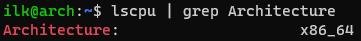
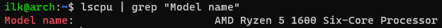
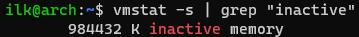
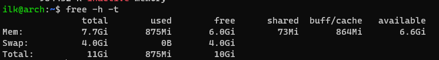
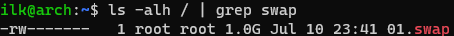
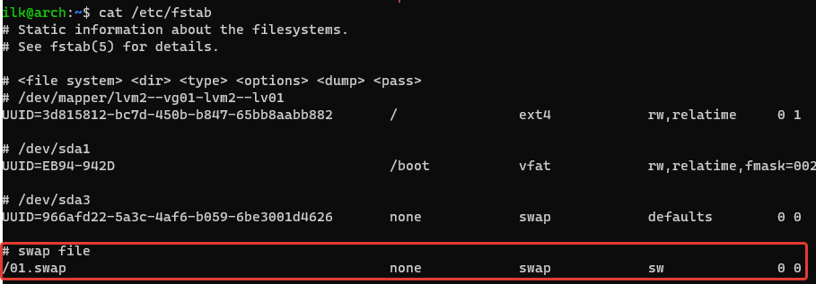
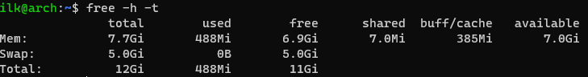
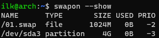

### 2.4 Память, управление памятью  [Кулагин Игорь]

## Задание 1
**Q** Что происходит с оперативной памятью во время перехода ПК в:
1. сон (suspend)
2. гибернацию (hibernate)

**A**
1. Сон (Sleep) - режим энергосбережения, который позволяет приостановить работу, а потом максимально оперативно ее восстановить с того момента, на котором она остановилась. При это все данные системного и прикладного ПО хранятся в оперативной памяти, что подразумевает подачу питания на нее. Т.е. компьютер включен, но потребляет очень мало электроэнергии и может очень быстро восстановить работу.
2. Гибернация (Hibernation) - аналогичный предыдущему режим с той разницей, что данные хранятся не в RAM, а на дисках HDD или SSD. При переходе в режим гибернации содержимое RAM выгружается на диск, а ПК выключается, т.е. никакого питания не потребляет. При включении ПК данные с диска загружаются в RAM и работа восстанавливается с того момента, на котором была прервана. В связи с тем, что данные загружаются с диска в память, а также ПК происходит все этапы обычной загрузки, время выхода из гибернации превышает время выхода из режима сна.

## Задание 2
**Q** *Как называется эта команда? Что такое si и so в примере на картинке? *

**A** vmstat - Report virtual memory statistics
- si - объем памяти, которое система считывает из swap-файла в секунду. 
- so - объем памяти, которое система выгружает в swap-файл в секунду.

## Задание 3
**Q**
Приведите 3 команды, которые выведут на экран следующее:

1. Архитектуру ПК
2. Модель процессора
3. Количество памяти, которая уже не используется процессами, но еще остается в памяти(ключевое слово - inactive).

**A**
1. ```lscpu | grep Architecture```


2. ```lscpu | grep "Model name"```


3. ```vmstat -s | grep "inactive"```



## Задание 4
1. Создайте скрин вывода команды free -h -t


2. Создайте swap-файл размером 1Гб


3. Добавьте настройку чтобы swap-файл подключался автоматически при перезагрузке виртуальной машины (подсказка: необходимо внести изменения в файл /etc/fstab)


4. Создайте скрин вывода команды free -h -t


5. Создайте скрин вывода команды swapon -s


6. Измените процент свободной оперативной памяти, при котором начинает использоваться раздел подкачки до 30%. Сделайте скрин внесенного изменения.

**A**

1. 
2
2. 
