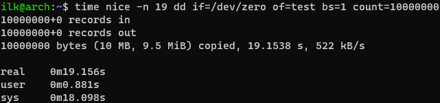
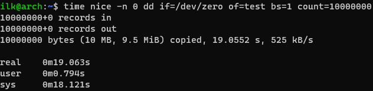
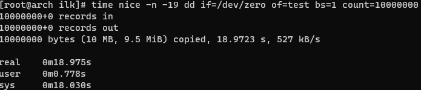

### 2.5 Шедулер [Кулагин Игорь]
>1. Какие операции замедляют работу компьютера в многозадачных системах? Приведите ответ в свободной форме со своим комментарием.

Основной источник замедления в многозадачной системе - смена контекста. Следовательно любые операции, требующие смены контекста, замедляют работу систему. Примером такой операции может быть перевод программы в режим ожидания готовности ввода/вывода для кооперативной многозадачности. Прерывания также вызывают как минимум частичную смену контекста..

>2. В каких ситуациях планировщик ввода / вывода ```noop``` может быть производительней ```cfq```? Приведите ответ в свободной форме со своим комментарием.

```noop``` предполагает отсутствие планировщика IO и передачу управления процессом IO соответствующим контроллерам устройства ввода-вывода. Следовательно, отсутствует дополнительная нагрузка на CPU (никакое алгоритм очереди не просчитывается). При хорошем исполнении контроллера ввода-вывода здесь noop может выиграть за счет разгрузки CPU. Однако планировщики придумали не просто так и при большом количестве процессов, обращающихся к ресурсам устройств I/O, использование планировщика представляется более выигрышным вариантом.
В Интернете есть [пример](<https://sites.google.com/site/sumeetsingh993/home/experiments/io-schedulers-noop-vs-deadline-vs-cfq> "I/O schedulers (noop vs deadline vs cfq)") о том, что для работы с базами данных ```cfq``` может проигрывать по производительности ```noop``` опять же при большом количестве обращающихся к I/O-устройствам процессов.

### Дополнительные задания (со звездочкой*)

>3. Запустите следующий код, имитирующий нагрузку типа ввод / вывод, с разными приоритетами. Объясните получившееся различие во времени исполнения для разных запусков. ```dd if=/dev/zero of=test bs=1 count=10000000``` Приведите ответ в свободной форме со своим комментарием.







Выглядит все логично: чем ниже значение, тем быстрее выполняется задача. Хотя разница в небольшая, в долях секунды. Полагаю, что столь несущественная разница может быть обусловлена тем тем, что у системы достаточно ресурсов для выполнения имеющихся задач, и задачи с низким приоритетом не ждут своей очереди на исполнения слишком долго.

>4. При каких условиях лучше увеличить time slice планирования, а когда лучше уменьшить? Приведите ответ в свободной форме со своим комментарием.

Могу предположить, что чем меньше в системе запущено процессов, тем больше пользы будет от увеличения slice из-за того, что с одной стороны уменьшаться накладные расходы на переключение контекста, а с другой - из-за небольшого количества процессов не будет ситуации, когда один или несколько процессов слишком долго ждут своей очереди из-за увеличенного slice.
