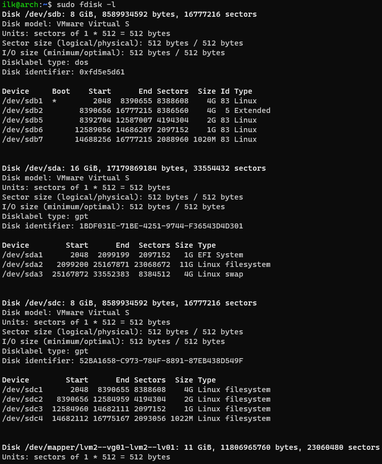
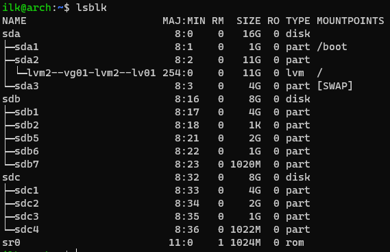
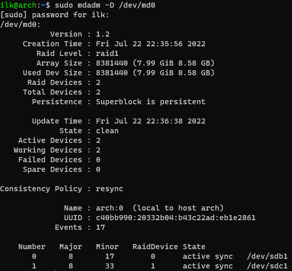

### 2.6 Дисковые системы [Кулагин Игорь]

>1. Какие виды RAID увеличивают производительность дисковой системы?

RAID0, RAID1 и RAID10.

>2. Влияет ли количество операций ввода-вывода на параметр ```load average```?

Влияет, так как параметр ```load average``` кроме числа активных процессов считает так же те, которые находятся в ```uninterruptible state```. Uninterruptible state используется для маркировки состояния процесса, когда последние не "хотят" получить прерывание. Примером перехода процесса в такое состояние являются, например, совершение им операции I/O [тыц](<https://www.brendangregg.com/blog/2017-08-08/linux-load-averages.html> "тыц") . 

>3. Подключите к виртуальной машине 2 новых диска.

>На первом диске создайте таблицу разделов MBR, Создайте 4 раздела: первый раздел на 50% диска, остальные любого размера на ваше усмотрение. Хотя бы один из разделов должен быть логическим.

>На втором диске создайте таблицу разделов GPT. Создайте 4 раздела: первый раздел на 50% диска, остальные любого размера на ваше усмотрение.

Добавлены диски sbd и sdc:






### Дополнительные задания (со звездочкой*)
>4. Создайте программный RAID 1 в вашей ОС используя программу ```mdadm```. В качестве ответа приложите скриншот вывода команды mdadm -D /dev/md0


