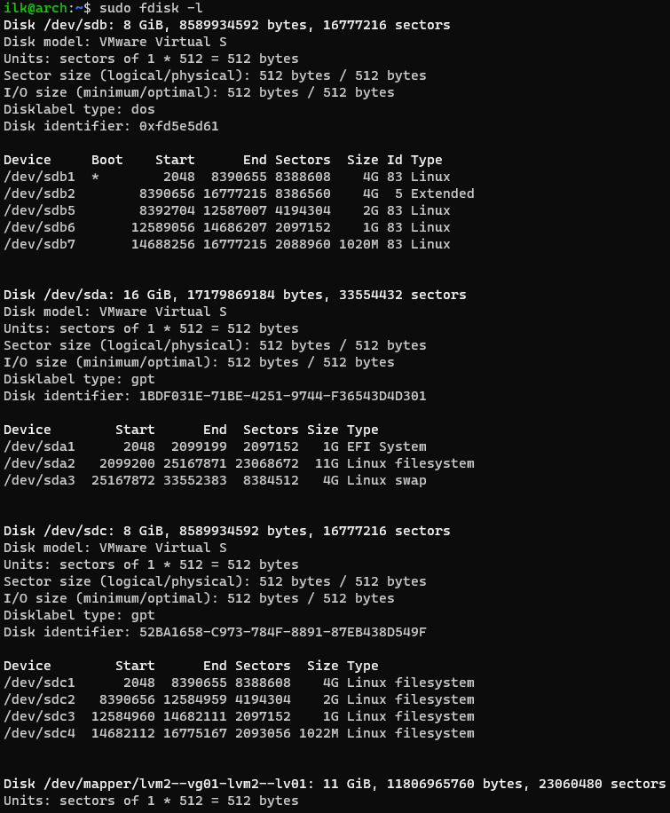
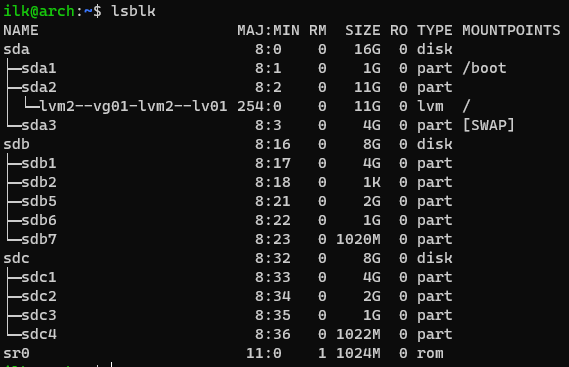
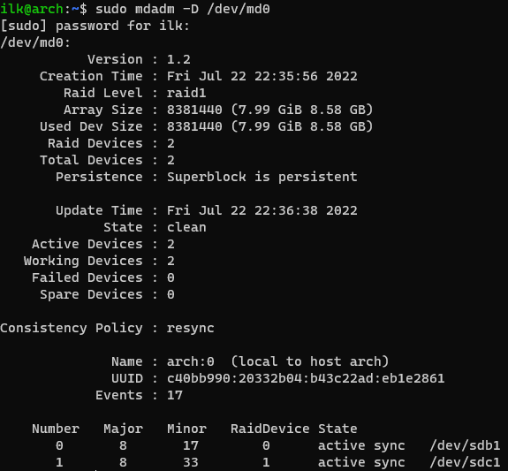

### 2.6 Дисковые системы [Кулагин Игорь]

>1. Какие виды RAID увеличивают производительность дисковой системы?

RAID0, RAID1 и RAID10.

>2. Влияет ли количество операций ввода-вывода на параметр ```load average```?


>3. Подключите к виртуальной машине 2 новых диска.
>3. 1. На первом диске создайте таблицу разделов MBR, Создайте 4 раздела: первый раздел на 50% диска, остальные любого размера на ваше усмотрение. Хотя бы один из разделов должен быть логическим.
>3. 2. На втором диске создайте таблицу разделов GPT. Создайте 4 раздела: первый раздел на 50% диска, остальные любого размера на ваше усмотрение.






### Дополнительные задания (со звездочкой*)
>4. Создайте программный RAID 1 в вашей ОС используя программу ```mdadm```. В качестве ответа приложите скриншот вывода команды mdadm -D /dev/md0



>5. Задание 5. TO DO