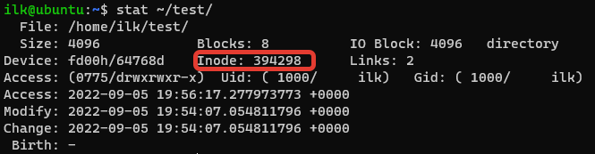
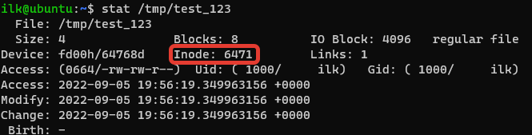

### 2.7 Файловые системы [Кулагин Игорь]

>**Задание 1.**
>1. Файл ~/test и /tmp/test_123 это один и тот же файл(одинаковые inode)?

Это разные файлы





>2. Файл /tmp/soft_link и /tmp/hard_link это один и тот же файл(одинаковые inode)?

Это разные файлы


>3. Файл /tmp/test_123 и /tmp/hard_link это один и тот же файл(одинаковые inode)?

Это тоже разные файлы


>4. Докажите что одна из ссылок символическая, а другая жесткая. Обязательно приложите в ответ скриншоты команд, которые иллюстрируют различия ссылок разного типа или(если не уверены) ход решения задания.


>**Задание 2.**
>Создайте файл ```~/netology```.
>Создайте каталог ```~/netology/```.
>Поместите файл ```netology``` в каталог ```netology```.
>Какое(ие) из трех действий выполнить невозможно? Почему?

Невозможно создать файл и каталог с одинаковым именем в одном каталоге, потому что с точки зрения Linux это один и тот же объект - файл, (каталог - файл специального типа, содержащий другие файлы), а имя файла в каталоге должно быть уникальным.

>**Задание 3.**
>Как посмотреть количество ```inodes?```

```df -i```

>каких файловых системах не может возникнуть проблемы нехватки ```inodes?```

В системах с динамическим выделение индексных дескрипторов. Например, btrfs

>**Задание 4.**
>Подключите к системе новый диск 3ГБ.
>Создайте на нем один раздел размером 2 ГБ.
>Разметьте раздел как xfs.
>Смонтируйте раздел по пути /mnt. Создайте любой файл на смонтированной файловой системе. Выполните скриншот вывода команды "df -hT".


>Увеличьте раздел до 3 ГБ.
>Расширьте файловую систему на новое свободное пространство.
>Убедитесь что созданный вами файл остался внутри раздела и файловой системы после всех манипуляций.
>Выполните скриншот вывода команды "df -hT".


