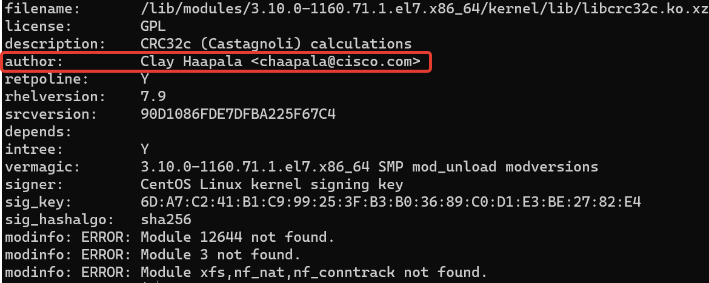
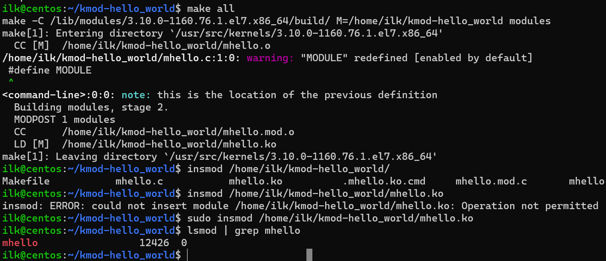

### 2.8 Ядро операционной системы [Кулагин Игорь]

>**Задание 1.**
>При каких событиях выполнение процесса переходит в режим ядра?

1. Системный вызов
2. Прерывание
3. Исключение 

>**Задание 2.**
>Найдите имя автора модуля ```libcrc32c```.



>**Задание 3.**
>Используя утилиту strace выясните какой системный вызов использует команда ```cd```.

```chdir```
 
 ### Дополнительные задания (со звездочкой*)
>**Задание 4.**
>Соберите свой модуль и загрузите его в ядро.

