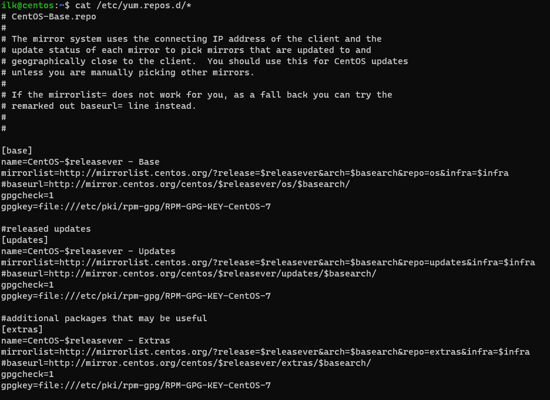

>**Задание 1.**
>Что такое дистрибутив? Какие компоненты могут входить в поставку дистрибутива?

Ядро ОС, пакетный менеджер, система инициализации, графический менеджер 

>**Задание 2.**
>Какую роль в появлении Linux сыграл Танненбаум?

Линус Торвальдс был студентом Андрю Таненбаума, что очень вероятно повлияло на Линуса.
Кроме того, Андрю Таненбаум выпустил UNIX-like ОС MINIX из-за недовольства которой, точнее условием использования только для целей обучения, Торвальдс и начал разработку Linux. Причем делал он это, используя для разработки MINIX.

>**Задание 3.**
>А теперь перейдем к практике
>Вам желательно иметь 2 виртуальные машины (RPM и Debian), чтобы наглядно видеть как отличается в них работа:

>**3.1**

>```yum install mc```

>```apt install mc```

>Как получить информацию из какого репозитория был установлен пакет?


>**3.2** Какой командой можно получить список доступных репозиториев в RPM и Deb- based системах? Два ответа для каждой из систем.





>**3.3** Как узнать версию ОС в Linux? Как узнать версию ядра? Укажите для вашей системы, неважно какой.

```cat /etc/*-release``` - узнаем детали об ОС: ```DISTRIB_DESCRIPTION="Ubuntu 20.04.4 LTS" CentOS Linux release 7.9.2009 (Core)```
```cat /proc/version``` - узнаем детали о ядре: ```Linux version 5.4.0-122-generic (buildd@lcy02-amd64-095) (gcc version 9.4.0 (Ubuntu 9.4.0-1ubuntu1~20.04.1)) #138-Ubuntu SMP Wed Jun 22 15:00:31 UTC 2022```

>**3.4** Как узнать какая система инициализации используется в Linux? Укажите для вашей системы, неважно какой.
```stat /sbin/init```


**Дополнительные задания (со звездочкой)**

>**3.5** Работайте на любом RPM или Deb- based Linux:
> - отключите автоматическую загрузку графической оболочки;
> - установите графическую оболочку, которой у вас нет в системе. Например, Mate, Xfce, Openbox;
> - включите автоматическую загрузку графической оболочки;
> - загрузитесь в новую графическую оболочку.
> - Приложите скриншоты вашего старого и нового рабочих столов.