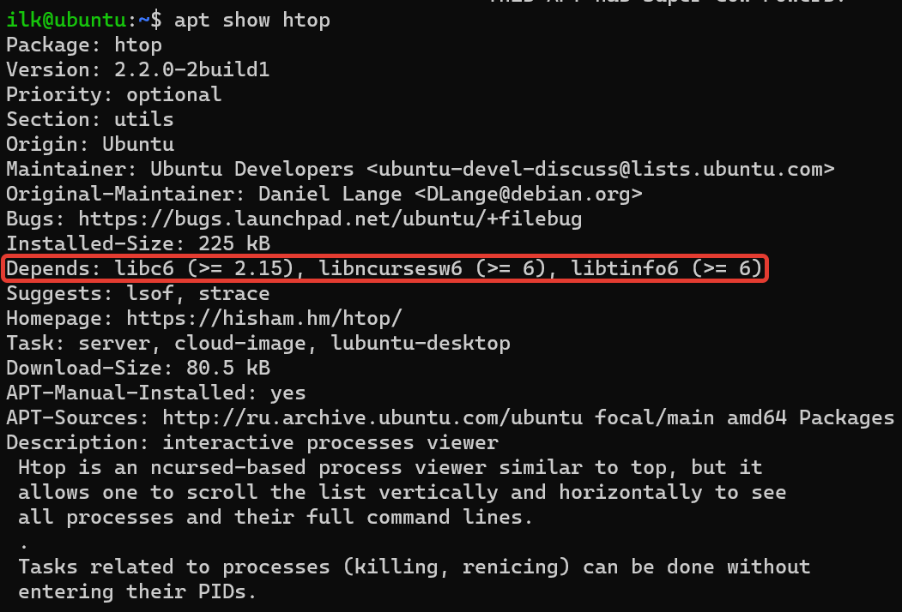
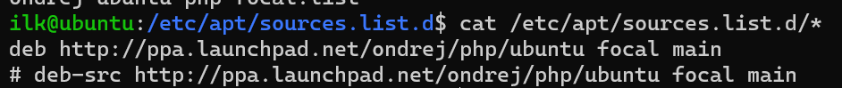
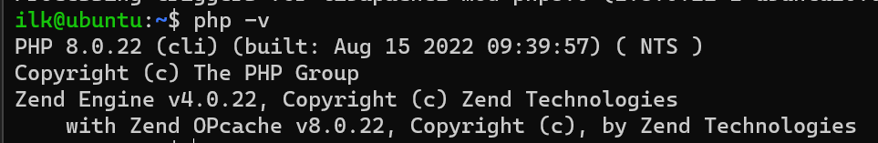
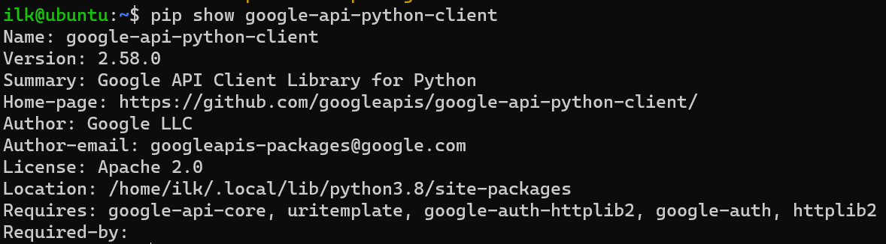
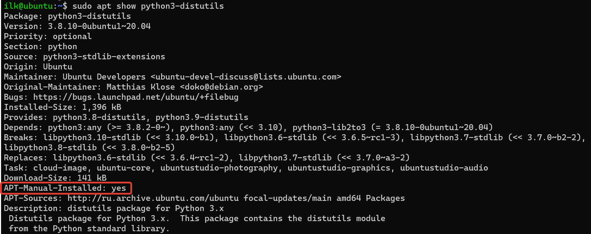

### 3.2 Управление пакетами[Кулагин Игорь]

>**Кейс 1.**
>Опишите плюсы работы с пакетным менеджером и репозиторием.
>1. Как вы считаете, в чем основные достоинства такой организации ПО?
>2. Есть ли минусы?

1. 
    - Не нужно лазить в Интернете в поисках нужного ПО, достаточно выполнить простую команду по его установке из репозитория. Иногда добавить нужный репозиторий.
    - Возможность автоматизации, в том числе простая поддержка ПО в актуальном состоянии. В Windows для этого требуется дополнительный софт.
2. 
    - Если будет скомпрометирован репозиторий, это может стать довольно серьезной проблемой информационной безопасности.
    - Не всегда актуальные пакеты в репозиториях. При необходимости установить конкретную версию ПО могут возникнуть проблемы с разрешением зависимостей (например, если в репозиториях не оказалось пакетов из зависимостей нужных версий).

>**Кейс 2.**
>При подключении стороннего репозитория надо выполнить ряд определенных действий.
>1. Каких?
>2. В чем опасность такого способа распространения ПО?
>3. Как это решается?

1. Подключить репозиторий, выполнить обновление базы пакетного менеджера (apt update или аналог)
2. При подключении внешнего репозитория необходимо довериться тому, что его поддерживает. Это доверие может быть обмануто. Например, в пакеты может быть добавлен вредоносный код.
3.  Собирать пакеты самостоятельно из исходников. Предварительно подробно изучать информацию и отзывы о подключаемом репозитории.

>**Кейс 3.**
>Какие зависимости требует htop?

>**Кейс 4.**
>1. Подключите репозиторий PHP и установите PHP 8.0.
>2. При помощи команды php -v убедитесь, что бы поставлена корректная версия PHP.

1. 

2. 

>**Кейс 5.**
> Ваш коллега-программист просит вас установить модуль google-api-python-client на сервер, который необходим для программы, работающей с Google API.
> Установите данный пакет при помощи менеджера пакетов pip

