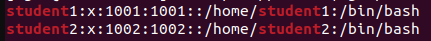
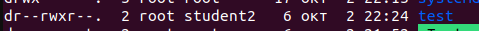
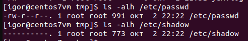
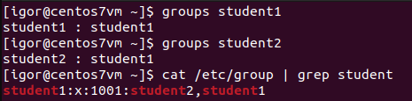

### 3.4 Управление пользователями [Кулагин Игорь]

>**Задание 1.**
>Создайте пользователя student1 с оболочкой bash, входящего в группу student1.
>Создайте пользователя student2, входящего в группу student2.



>**Задание 2.**
>Создайте в общем каталоге (например, /tmp) директорию и назначьте для неё полный доступ со стороны группы student2 и доступ на чтение всем остальным



>**Задание 3.**
>Какой режим доступа установлен для файлов /etc/passwd и /etc/shadow?



>Объясните, зачем понадобилось именно два файла?

В файле ```/etc/passwd``` хранится общедоступная информация. Любой пользователь или сервис могут прочитать этот файл, так как это может быть необходимо для авторизации, например. В файле ```/etc/shadow``` хранятся хэши паролей пользователей. Чтобы уменьшить вероятность инцидентов подбора пароля по хешу (например, через радужные таблицы) надежнее ограничить доступ к такой чувствительной информации - только ```root``` и члены группы ```root``` могут читать содержимое этого файла. 

>**Задание 4.**
>Удалите группу student2, а пользователя student2 добавьте в группу student1.


