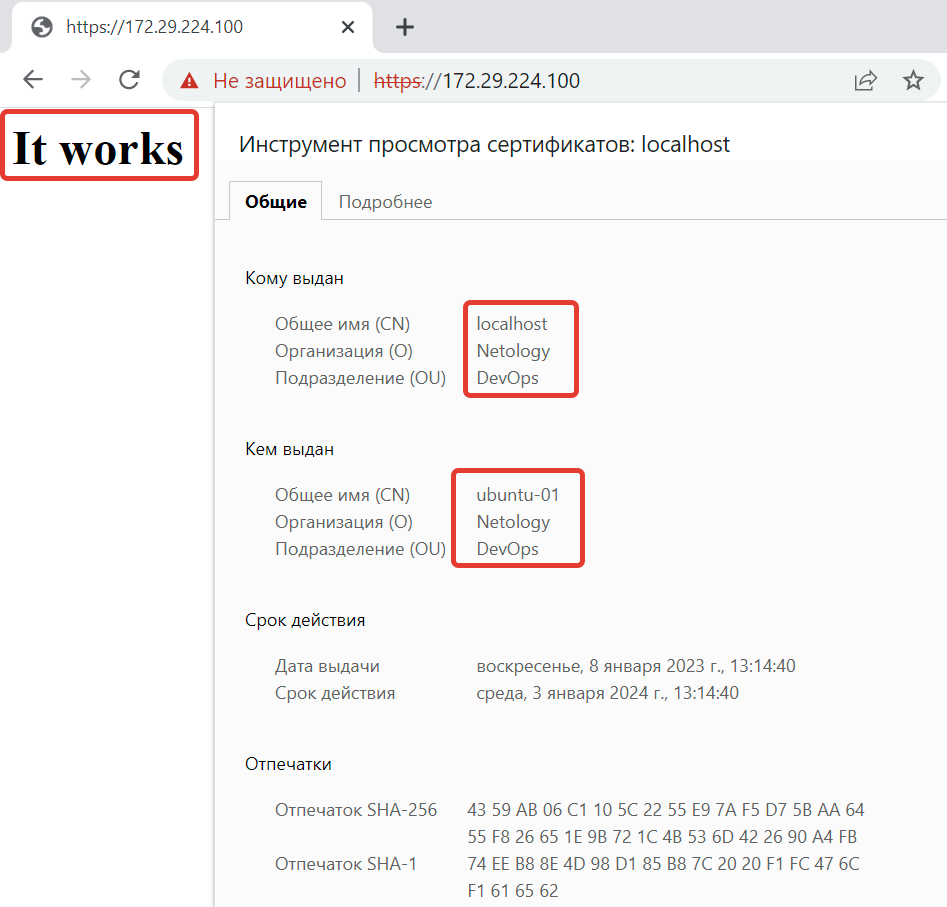
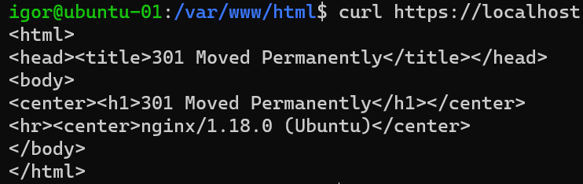

### 4.12. HTTP/HTTPS [Кулагин Игорь]
**Задание 1.**
>Какие коды ответов HTTP лучше соответствуют описанным ситуациям?
>Данная страница не найдена;

404

>Страница была перенесена на новый сайт;

301

>Ресурс удален;

410

>Пользователь не авторизован для просмотра страницы;

401

>Превышен лимит запросов от пользователя.

429

**Задание 2.**
>Установите Nginx.
>Сгенерируйте сертификат для него указав localhost в качестве CN.
>Отредактируйте модуль http в файле /etc/nginx/nginx.conf.
>Пришлите скриншот работающей страницы https://localhost.

Обращение к веб-серверу nginx выполнено по IP, так как сам сервер поднят на удаленной VM без GUI и обращение к localhost  с моей рабочей станции не приведет к обращению к серверу:

**Задание 3.**
>Измените конфигурацию сервера добавив переадресацию c Вашего сервера на сайт netology.ru.
>Используя curl сделайте запрос к своему серверу и в качестве ответа пришлите скриншот с 301 ответом.

