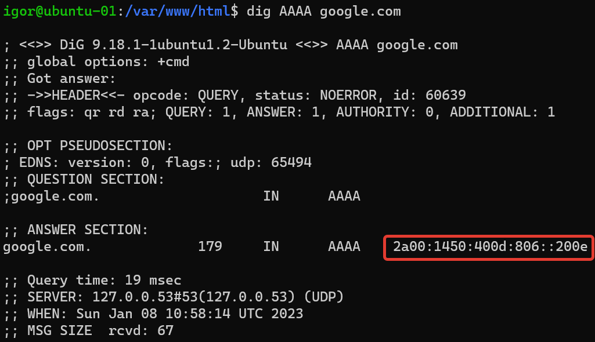

### 4.13. IPv6 [Кулагин Игорь]
**Задание 1.**
>Какая нотация используется для записи IPv6-адресов:

>какие и сколько символов?

>какие разделители?

Длина адреса IPv6 составляет 128 бит и отображаются они как восемь четырёхзначных шестнадцатеричных чисел (то есть 8 групп по четыре символа), разделённых двоеточием.


**Задание 2.**
>Какой адрес используется в IPv6 как loopback?

::1

**Задание 3.**
>Что такое Unicast, Multicast, Anycast адреса?

Упражнение по переписываю википедии:

- Unicast - пакет, посланный на такой адрес, достигает в точности интерфейса, который этому адресу соответствует.

- Multicast - адреса типа Multicast идентифицируют группу интерфейсов. Пакет, посланный на такой адрес, достигнет всех интерфейсов, привязанных к группе многоадресного вещания.

- Anycast - адреса типа Anycast синтаксически неотличимы от адресов Unicast, но они адресуют группу интерфейсов. Пакет, направленный такому адресу, попадёт в ближайший (согласно метрике маршрутизатора) интерфейс. Адреса Anycast могут использоваться только маршрутизаторами.пакет, направленный такому адресу, попадёт в ближайший (согласно метрике маршрутизатора) интерфейс. Адреса Anycast могут использоваться только маршрутизаторами.

**Задание 4.**
>Используя любую консольную утилиту в Linux, получите IPv6-адрес для какого либо ресурса.



**Задание 5.**
>Как выглядят IPv6-адреса, которые маршрутизируются в интернете?

Могут находиться в любом не занятом диапазоне. В настоящее время региональные интернет-регистраторы распределяют блок адресов ```2000::/3```.

>Как выглядят локальные IPv6 адреса?

- Link-local (аналог адресов, сконфигурированных APIPA) - начинаются с ```FE80:```.
- Unique-Local (аналог внутренним IP-адресам, которыми в версии IPv4 являлись ```10.0.0.0/8```, ```172.16.0.0/12``` и ```192.168.0.0/16```) - начинаются с цифр ```FCxx:``` и ```FDxx:```.

