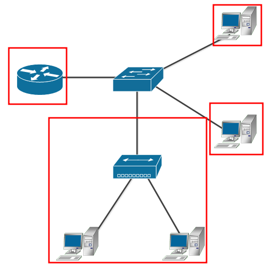
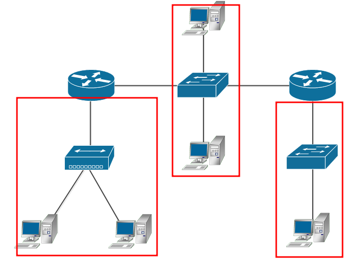

### 4.2. L2-сеть [Кулагин Игорь]
**Задание 1.**
> Адрес канального уровня – MAC адрес – это 6 байт, первые 3 из которых называются OUI – Organizationally Unique Identifier или уникальный идентификатор организации.
>Какому производителю принадлежит MAC 38:f9:d3:55:55:79?

Apple, Inc

**Задание 2.**
>Какой ключ нужно добавить в tcpdump, чтобы он начал выводить не только заголовки, но и содержимое фреймов в:
>текстовом виде;

-A

>текстовом и шестнадцатиричном виде?

-X или -XX

**Задание 3.**
>Можно ли изменить MAC-адрес вашего Linux сервера?

Да

>Если да, то какой командой, если нет - почему?

sudo macchanger -m [your_custom_MAC_address] [Targeted_network_interface]

>Для чего может понадобиться изменять MAC-адреса?

1. Например, бывали ситуации когда из-за производственного брака сетевые карты в одной партии получали идентичные MAC-адреса. Очевидно в одной широковещательной сети две карты с идентичными MAC-адресами работать не смогут. Тут может пригодится возможность смены МАСа.

2. Для безопасности в публичных беспроводных сетях чтобы не "светить" свой настоящий (прошитый в сетевой карте) МАС и для усложнение слежки за конечным устройством.

3. Некоторые провайдеры связи привязывают услугу доступа в Интернет к МАСу подключенного абонентского устройства. Установив старый МАС на новое устройство можно заменить девайс на своей стороне без участия оператора связи в этом процессе, что удобно. 

**Задание 4.**
>Каким образом можно зафиксировать соответствие IP-MAC и избежать установления этого соответствия по протоколу ARP?

Путем внесения статической записи в ARP-таблицу: arp -s ```IP``` ```MAC```

>Каковы положительные и отрицательные стороны такой настройки?

Из плюсов - не будет тратиться время на выяснение MAC адреса для конкретного IP.
Из минусов - если IP будет назначен другому хосту, а статическую запись не удалить/обновить, то "достучатся" до этого IP не получится. Траблшутить такую ситуацию удовольствие ниже среднего :). Вообще на мой взгляд лучше не делать статический маппинг в ARP без веских на то причин.

**Задание 5.**
>Какой механизм проверки на наличие ошибок используется в Ethernet?

Механизм Frame Check Sequence: подсчет контрольных сумм (CRC32 BZIP2) некоторых заголовков кадра ethernet на стороне отправителя и получателя, и их последующее сравнение.

**Задание 6.**
>Как вы думаете, почему серверы в большинстве случаев подключают проводом, а не через WiFi?

Wi-Fi менее надежен с точки зрения безопасности и стабильности передачи данных. По задержкам и скорости провода тоже выигрывают у беспроводной связи.

**Задание 7.**
>Сколько доменов коллизий изображено на рисунке?

4



**Задание 8.**
>Сколько широковещательных доменов изображено на рисунке?

3




