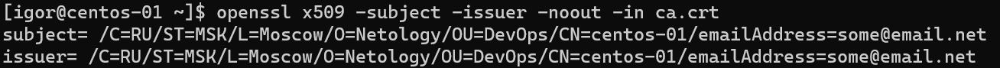
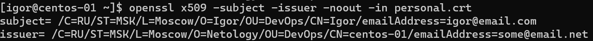
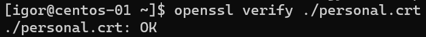

### 4.7. Высокоуровневые протоколы [Кулагин Игорь]
**Задание 1.**

>Какие порты используются протоколами:
> Telnet;

tcp/23

>SSH;

tcp/22

>FTP;

tcp/20 + 21 

>SNMP;

udp (как правило, но можно и tcp использовать) 161 + 162

**Задание 2.**
>Какой по счету уровень модели OSI называется прикладным (application layer)?
>Зашифруйте ответ с помощью ключа: {5, 21}.

Application layer это 7-ой уровень модели OSI.

Шифруем цифру 7 (P=7) в соответствии с формулой: (P^e)%n, где e = 5, а n = 21:

7^5 =  16807
16807 % 21 = 7

Ответ: 7

**Задание 3.**
>Создайте свой корневой сертификат, добавьте его в систему.
>Затем подпишите им свой сертификат.
>В качестве ответа приложите снимки экрана с выводом информации о сертификатах и результатом верификации:

