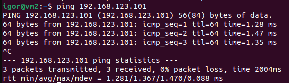

### 4.9. Firewall [Кулагин Игорь]
**Задание 1.**
>1.1 Создайте с помощью VirtualBox две виртуальных машины с debian, назовите их vm1 и vm2

>1.2 В VirtualBox создайте виртуальную сеть 192.168.123.0/24

>1.3 В VirtualBox настройте сетевые интерфейсы vm1 так, чтобы один интерфейс имел доступ в интернет (bridge или NAT), а второй интерфейс смотрел в виртуальную сеть 192.168.123.0/24

>1.4 В VirtualBox настройте сетевой интерфейс vm2 так, чтобы он смотрел только в виртуальную сеть 192.168.123.0

>1.5 Для vm1: настройте статический IP адрес у интерфейса смотрящего в сеть 192.168.123.0 (адрес в сети 123.0 выберите на своё усмотрение). Настройте IP адрес интерфейса смотрящего в вашу локальную сеть так, чтобы c vm1 ходили пинги до 8.8.8.8.

>1.6 Для vm2: настройте статический IP адрес у интерфейса смотрящего в сеть 192.168.123.0 (адрес в сети 123.0 выберите на своё усмотрение), шлюзом укажите IP vm1 из сети 192.168.123.0

>1.7 Попингуйте vm2 с vm1 по IP и приложите скриншот результата

>1.8 Попингуйте vm1 с vm2 по IP и приложите скриншот результата

>1.9 Настройте пересылку трафика на vm1, чтобы с vm2 можно было попинговать 8.8.8.8 и приложите скриншот результата

