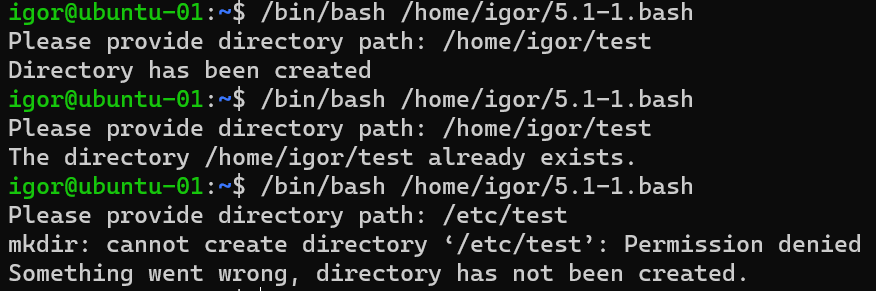

### 5.1 Программирование на Bash : Переменные и условные операторы.  [Кулагин Игорь]
**Задание 1.**
>Напишите скрипт, который при запуске спрашивает у пользователя путь до директории и создает ее при условии, что ее еще не существует. Если директория существует – пользователю выводится сообщение, что директория существует. Скрипт должен принимать абсолютный путь до директории, например /tmp/testdir или /home/user/testdir

```
#!/bin/bash
read -p "Please provide directory path: " path
if [[ -d "$path" ]];
then
        echo "The directory $path already exists."
else
        mkdir $path
        if [[ $? -eq "0" ]]; then
                echo "Directory has been created"
        else
                echo "Something went wrong, directory has not been created."
        fi;
fi;
```



**Задание 2.**
>Напишите скрипт:
>-При запуске скрипта пользователь вводит два числа.
>-Необходимо вычесть из большего числа меньшее и вывести результат в консоль.
>-Если числа равны – умножить их друг на друга (или возвести в квадрат одно из чисел) и вывести результат в консоль.

```
#!/bin/bash
declare  -i first
declare -i second

read -p "Please enter first digit: " first
read -p "Please enter second digit: " second

if [[ $first -eq $second ]]
then
        echo "Values are equal. The result is: $(($first*$second))"

elif [[ $first -gt $second ]]
then
        echo "First is grater than second. The result is: $(($first-$second))"

else
        echo "Second is grater than first. The result is: $(($second-$first))"
fi;
```

**Задание 3.**
>Напишите скрипт с использованием оператора case:
>При запуске скрипта пользователь вводит в консоль имя файла с расширением, например 123.jpg или track.mp3.
>Необходимо сообщить пользователю тип файла.
>-Если jpg, gif или png – вывести слово «image»
>-Если mp3 или wav – вывести слово «audio»
>-Если txt или doc – вывести слово «text»
>-Если формат не подходит под заданные выше – написать «unknown»

```
#!/bin/bash
declare  -i first
declare -i second

read -p "Please enter first digit: " first
read -p "Please enter second digit: " second

if [[ $first -eq $second ]]
then
        echo "Values are equal. The result is: $(($first*$second))"

elif [[ $first -gt $second ]]
then
        echo "First is grater than second. The result is: $(($first-$second))"

else
        echo "Second is grater than first. The result is: $(($second-$first))"
fi;
```