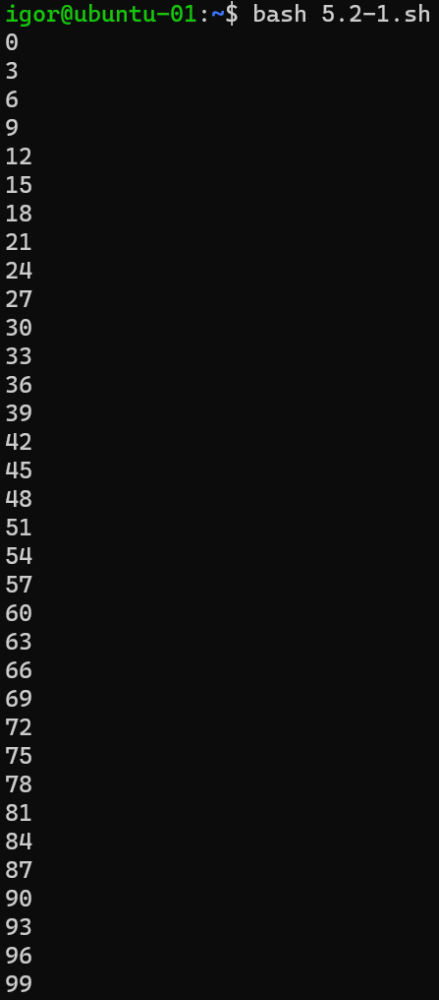
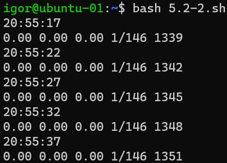

### 5.2 Программирование на Bash. Циклы и функции.  [Кулагин Игорь]
**Задание 1.**
>Напишите скрипт, который выводит на экран все числа от 1 до 100, которые делятся на 3.

```
#!/bin/bash
i=0
while [ $i -le 100 ]
do
        if [[ $(($i%3)) -eq 0 ]];then
                echo $i
        fi;
        ((i++))
done
```



**Задание 2.**
>Напишите скрипт, который каждые 5 секунд будет выводить на экран текущее время и содержимое файла /proc/loadavg.



**Задание 3.**
>Напишите функцию для подсчета среднего размера файла в директории.
>-путь к директории должен передаваться параметром, например avgfile /home/username;
>-функция должна проверять, что такая директория существует, подсчитывать и выводить на экран средний размер файла в ней;
>-при подсчете не нужно учитывать поддиректории и символьные ссылки, считать только средний размер файлов в заданной директории.

```
#!/bin/bash
averagefilesize(){
        dir=$1
        size=0
        count=0

        if [[ -d $dir  ]];then
                for file in $(ls $dir)
                do
                        if [[ -f $dir$file ]];then
                                size=$(( $size + $(stat -c "%s" $dir$file) ))
                                ((count++))
                        fi;
                done
                if [[ $count -ne 0 ]];then
                        echo "There are $count files in the $dir. The avarage size of a file is $(( $size/$count )) byt>
                else
                        echo "There are no files in the $dir."
                fi;
        else echo "$dir does not exist."
        fi;
}

averagefilesize /home/igor/
averagefilesize /etc/
averagefilesize /etc/nginx/
```
