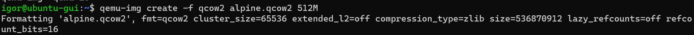
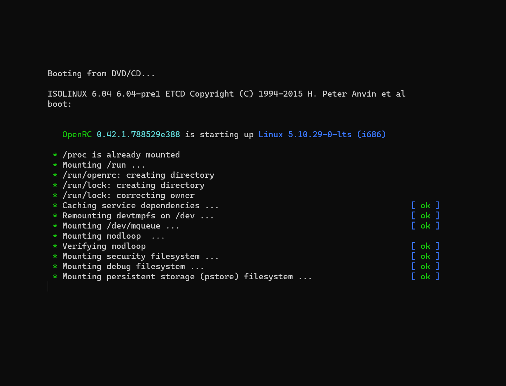
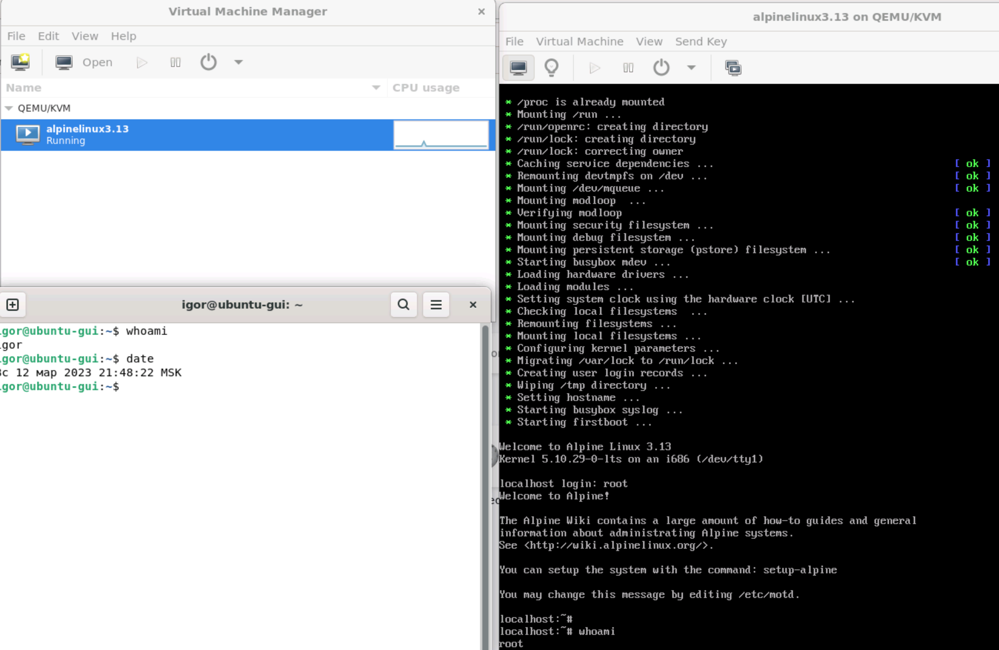
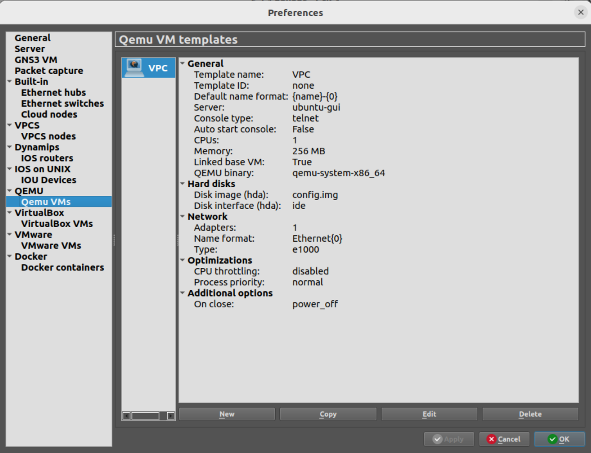
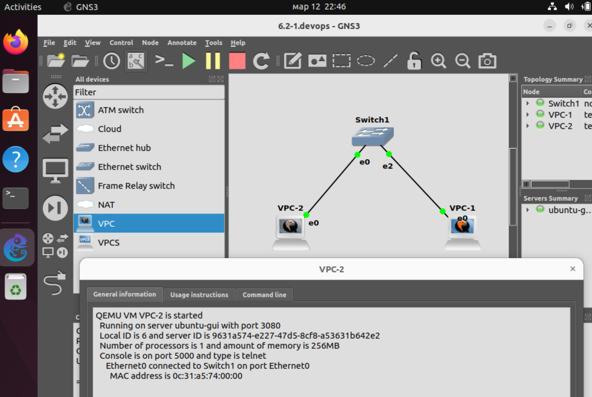

### 6.2. Типы виртуализации: KVM, QEMU  [Кулагин Игорь]
**Задание 1.**
>Какие виртуализации существуют? Приведите примеры продуктов разных типов виртуализации.

- Аппаратная виртуализация - виртуализация с поддержкой специальной процессорной архитектуры. В отличие от программной виртуализации, с помощью данной техники возможно использование изолированных гостевых систем, управляемых гипервизором напрямую, за счет чего достигается высокое по сравнению c программной виртуализацией быстродействие. Примеры продуктов, реализующих такой подход к вирутацлизации: VMware ESXi, Microsoft Hyper-V, KVM, XenServer.

- Программная виртуализация - тип виртуализации, когда аппаратные ресурсы для VM полностью эмулируются на программным обеспечением. Пример продуктов: QEMU или эмуляторы игровых консолей.

- Контейнерная виртуализация - это технология, которая позволяет размещать приложения в контейнерах, каждый из которых изолирован друг от друга. Контейнеры используют ресурсы ядра операционной системы, но не требуют установки отдельной виртуальной машины. Это позволяет эффективнее использовать ресурсы компьютера и легко переносить приложения между различными средами. Примеры продуктов, где реализован подход контейнерной виртуализации: Docker, Kubernetes, LXC (LinuX Containers).

- Хостинговая виртуализация - на совсем понятно о чем именно речь, в лекции про это особо на рассказывали, а в хостинге можно арендовать и выделенную VM на базе какого-нибудь Hyper-V, который в рамках лекции был отнесен к аппаратной виртуализации. Вероятно, имеется ввиду подтип программной виртуализации, когда виртуализация выполнена на уровне операционной системы, которая базируется на ядре Linux. VM при такой виртуализации не изолированы полностью, как при аппаратной, и используют ядро хостовой операционной системы для получения доступа к аппаратным ресурсам самого хоста. Например, OpenVZ. 

**Задание 2.**
>Выполните действия и приложите скриншоты по каждому этапу:

>Установите QEMU в зависимости от системы (в лекции рассматривались примеры).
```
sudo apt install qemu qemu-kvm qemu-system qemu-utils
```
>Создайте виртуальную машину.



>Установите виртуальную машину. Можете использовать пример по ссылке.

---


**Задание 3.**
>Выполните действия и приложите скриншоты по каждому этапу:

>Установите KVM и библиотеку libvirt. Можете использовать GUI-версию из лекции.
```
sudo apt install qemu-kvm virt-manager virtinst libvirt-clients bridge-utils libvirt-daemon-system -y
sudo systemctl enable --now libvirtd
sudo systemctl start libvirtd
```

>Создайте виртуальную машину.

>Установите виртуальную машину. Можете использовать пример по ссылке.



**Задание 4.**
> Выполните действия и приложите скриншоты по каждому этапу:

>Создайте проект в GNS3, предварительно установив GNS3.
```
sudo apt-get update
sudo apt-get install gns3-server gns3-gui
```

>Создайте топологию, как на скрине ниже.
>Для реализации используйте машину на базе QEMU. Можно дублировать, сделанную ранее.

---

