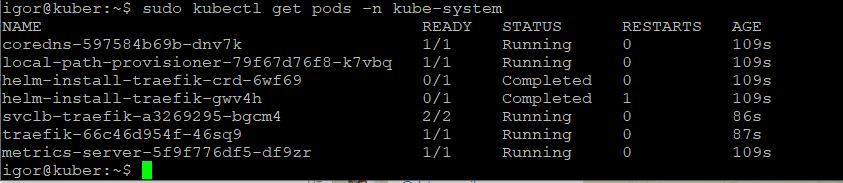
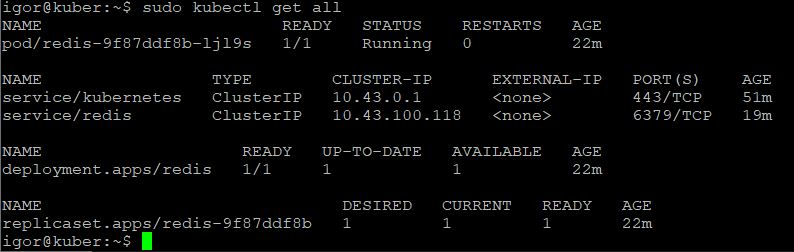

# Домашнее задание к занятию "6.5. Kubernetes. Часть 1" - Кулагин Игорь
## Задание 1
> 1. Запустите Kubernetes локально, используя k3s или minikube на свой выбор.
> 2. Добейтесь стабильной работы всех системных контейнеров.
> 3. В качестве ответа пришлите скриншот результата выполнения команды kubectl get po -n kube-system.



## Задание 2
> Измените файл с учётом условий:
> - redis должен запускаться без пароля;
> - создайте Service, который будет направлять трафик на этот Deployment;
> - версия образа redis должна быть зафиксирована на 6.0.13.

> Запустите Deployment в своём кластере и добейтесь его стабильной работы.

> В качестве решения пришлите получившийся файл.

```
---
apiVersion: apps/v1
kind: Deployment
metadata:
  name: redis
spec:
  selector:
    matchLabels:
      app: redis
  replicas: 1
  template:
    metadata:
      labels:
        app: redis
    spec:
      containers:
      - name: master
        image: bitnami/redis:6.0.13
        env:
         - name: ALLOW_EMPTY_PASSWORD
           value: "yes"
        ports:
         - containerPort: 6379
```
---
```
apiVersion: v1
kind: Service
metadata:
  name: redis
spec:
  selector:
    app: redis
  ports:
    - protocol: TCP
      port: 6379
      targetPort: 6379
```
---


## Задание 3
>Напишите команды kubectl для контейнера из предыдущего задания:

>В качестве решения пришлите получившиеся команды.

> - выполнения команды ps aux внутри контейнера;

`sudo kubectl exec -it redis-9f87ddf8b-ljl9s -- ps aux`

> - просмотра логов контейнера за последние 5 минут;

`sudo kubectl logs --since=5m redis-9f87ddf8b-ljl9s`

> - удаления контейнера;

`sudo kubectl delete -f redis.yaml && sudo kubectl delete -f redis_svc.yaml`

> - проброса порта локальной машины в контейнер для отладки.

`sudo kubectl port-forward pod/redis-9f87ddf8b-ljl9s 1111:6379`
