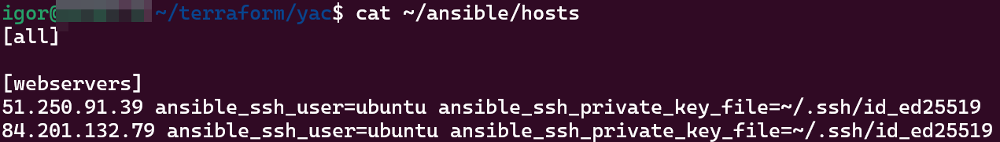
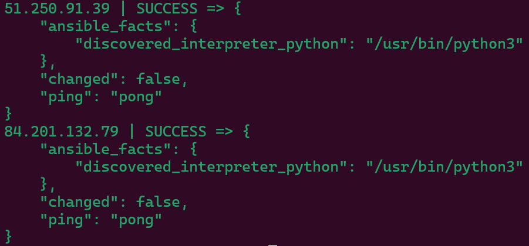
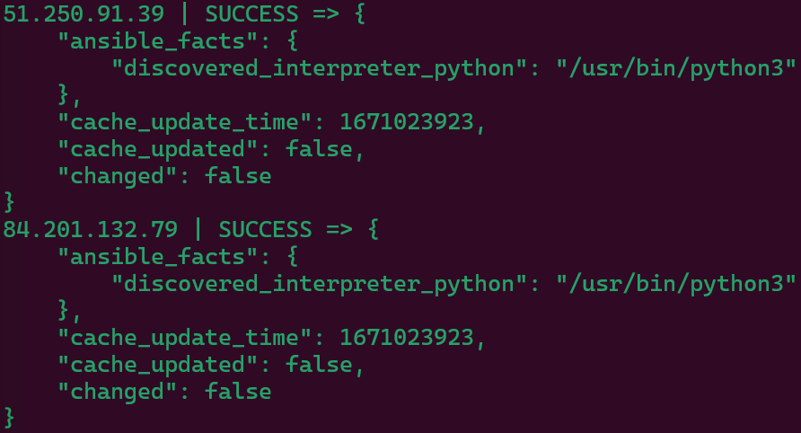
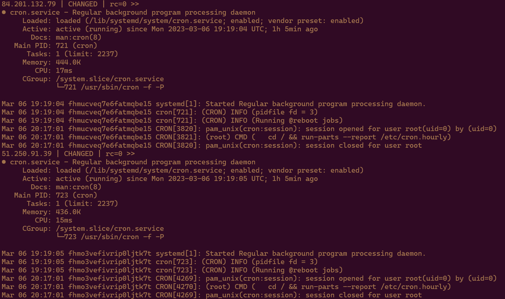
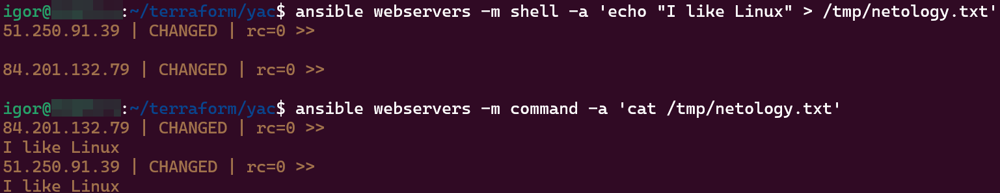

# Домашнее задание к занятию "7.1. Ansible. Часть 1" - Кулагин Игорь
## Задание 1
>Какие преимущества даёт подход IAC?

- Нет необходимости в ручной настройке.
- Скорость: настройка ("поднятие") инфраструктуры занимает на порядок меньше времени.
- Воспроизводимость: поднимаемая инфраструктура всегда идентична.
- Масштабируемость: один инженер может с помощью одного и того же кода настраивать и управлять огромным количеством машин.

## Задание 2
>Выполните действия и приложите скриншоты действий.

>Создайте файл inventory. Предлагается использовать файл, размещённый в папке с проектом, а не файл inventory по умолчанию.

>Проверьте доступность хостов с помощью модуля ping.

## Задание 3
>Какая разница между параметрами forks и serial?

Разница между параметрами "forks" и "serial" заключается в том, что "forks" управляет количеством параллельных процессов на каждом хосте, тогда как "serial" управляет количеством хостов, на которых выполняются задачи последовательно

## Задание 4
>Выполните действия и приложите скриншоты запуска команд.

`ansible webservers -b -m ansible.builtin.apt -a "name=mc state=present"`

`ansible webservers -m command -a "systemctl status cron"`

`ansible webservers -m shell -a 'echo "I like Linux" > /tmp/netology.txt'`

