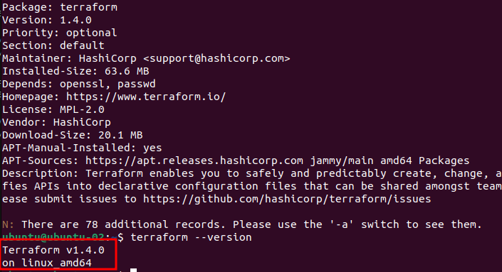
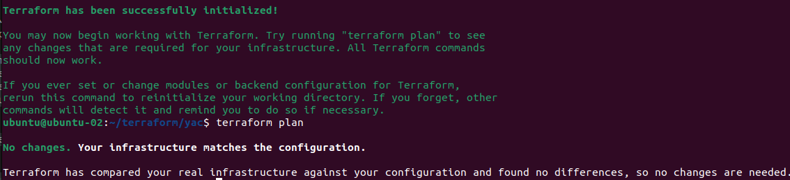

# Домашнее задание к занятию "7.2. Terraform" - Кулагин Игорь
## Задание 1
>Опишите виды подхода к IaC:

- **Функциональный подход** - код описывает желаемое состояние инфраструктуры в виде декларативных описаний. Это означает, что код описывает, что нужно сделать, но не описывает, как это нужно сделать. 

- **Процедурный подход** - код описывает последовательность шагов, необходимых для настройки и развертывания инфраструктуры. Это означает, что код описывает, как нужно выполнить действия для достижения желаемого состояния инфраструктуры. 

- **Интеллектуальный подход** - использует алгоритмы машинного обучения и оптимизации для автоматической настройки и управления инфраструктурой.

## Задание 2
>Как вы считаете, в чём преимущество применения Terraform?

Terraform, как один из продуктов, реализующих подход IaC, позволяет автоматизировать создание, изменение и удаление инфраструктуры с помощью кода, что сокращает время настройки и минимизирует ошибки, по сравнению с ручной настройкой инфраструктуры. Серьезным преимуществом Terraform перед конкурентами является его поддержка всех основных провайдеров публичных "облаков", а также обширное комьюнити.

## Задание 3
>Какие минусы можно выделить при использовании IaC?

Сложность конфигурации инфраструктуры с помощью подхода IaC и высокая цена ошибки. Для внедрении в реальной компании будут издержки на обучение персонала и на сам переход на IaC. У компании может возникнуть зависимость от конкретного инструмента или облачного провайдера. Но плюсов видится больше.

## Задание 4
>Установите Terraform на компьютерную систему (виртуальную или хостовую), используя лекцию или инструкцию.
```
sudo apt update && \
sudo apt upgrade -y && \
sudo apt install -y gnupg software-properties-common curl && \
curl -fsSL https://apt.releases.hashicorp.com/gpg | sudo apt-key add - && \
sudo apt-add-repository -y "deb [arch=amd64] https://apt.releases.hashicorp.com $(lsb_release -cs) main" && \
sudo apt update && sudo apt install -y terraform
```



- Конфигурируем terraform на использование зеркал Яндекса:
`touch ~/.terraformrc`
```
provider_installation {
  network_mirror {
    url = "https://terraform-mirror.yandexcloud.net/"
    include = ["registry.terraform.io/*/*"]
  }
  direct {
    exclude = ["registry.terraform.io/*/*"]
  }
}
```
- Создаем файл для будущей конфигурации инфраструктуры и указываем провайдера: `nano ~/terraform/yac/yac-main.tf`
```
terraform {
  required_providers {
    yandex = {
      source = "yandex-cloud/yandex"
    }
  }
  required_version = ">= 0.13"
}

provider "yandex" {
  zone = "ru-central1-a"
}
```
- Выполняем команду `terraform init` в папке с конфигурационным файлом.
