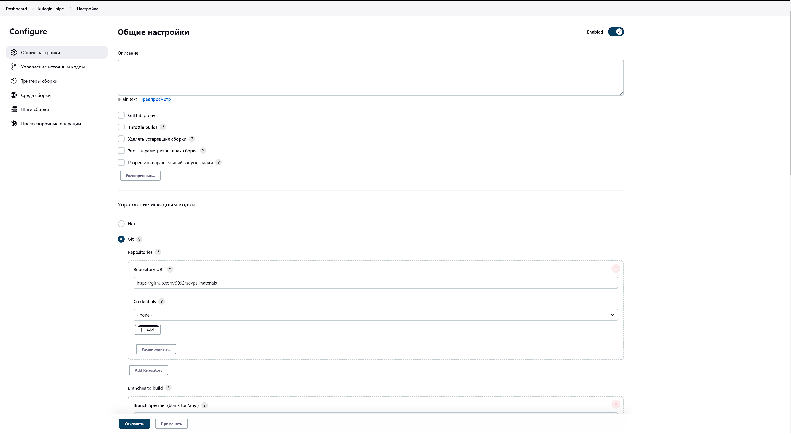
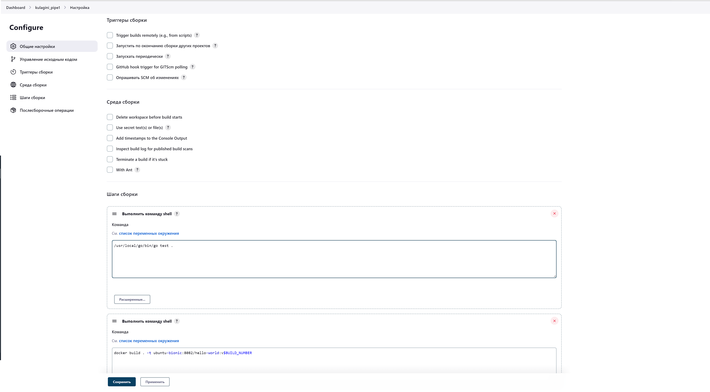
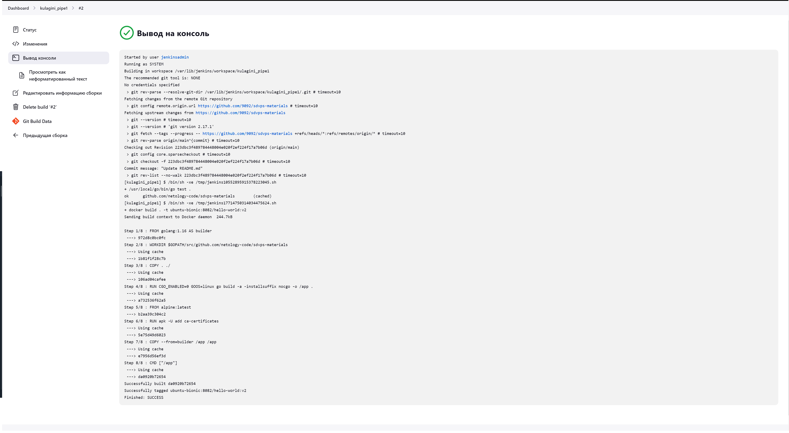
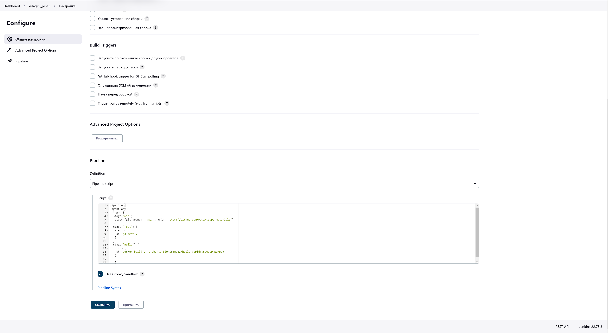
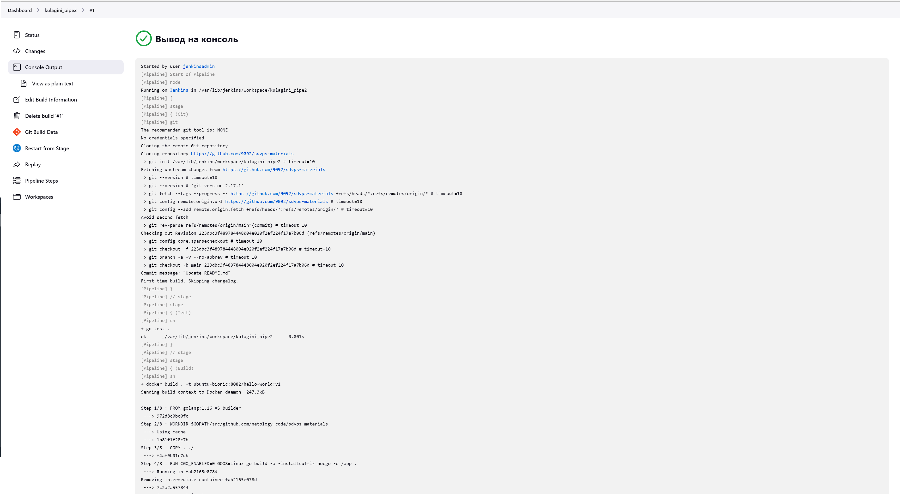
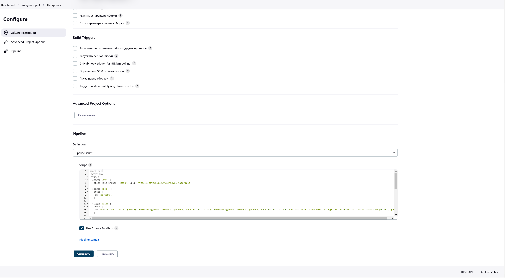
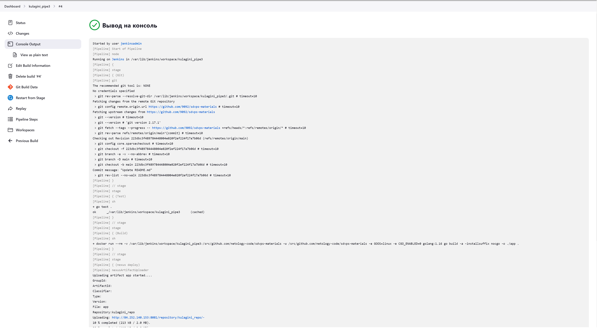
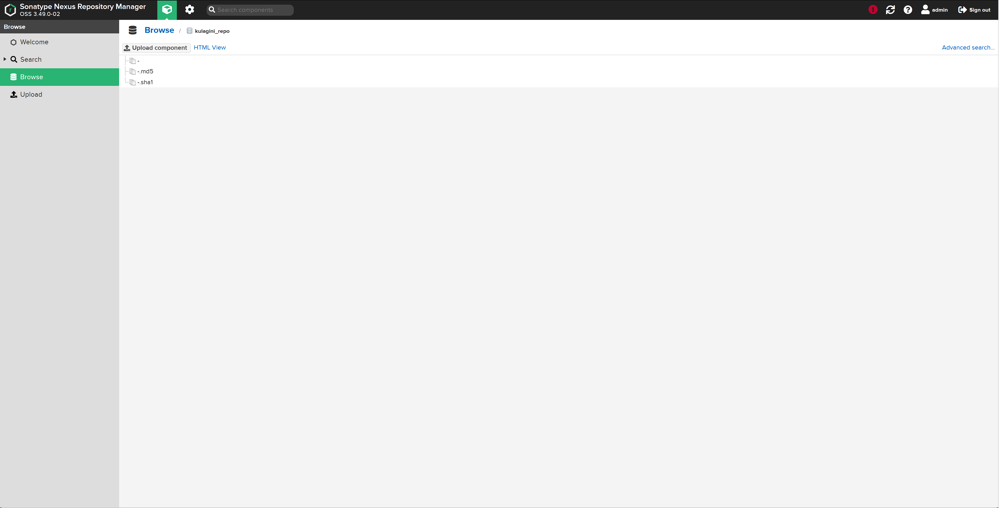

### 8.2. Что такое DevOps. СI/СD  - Кулагин Игорь
## Задание 1

>Создайте в jenkins Freestyle Project, подключите получившийся репозиторий к нему и произведите запуск тестов и сборку проекта go test . и docker build ..

>В качестве ответа пришлите скриншоты с настройками проекта и результатами выполнения сборки.


---

---


## Задание 2
>Создайте новый проект pipeline.

>Перепишите сборку из задания 1 на declarative в виде кода.

>В качестве ответа пришлите скриншоты с настройками проекта и результатами выполнения сборки.


```
pipeline {
 agent any
 stages {
  stage('Git') {
   steps {git branch: 'main', url: 'https://github.com/9092/sdvps-materials'}
   }
  stage('Test') {
   steps {
    sh 'go test .'
    }
   }
  stage('Build') {
   steps {
    sh 'docker build . -t ubuntu-bionic:8082/hello-world:v$BUILD_NUMBER'
    }
   }
  }
 }
```
---

---


## Задание 3
> Установите на машину Nexus.

> Создайте raw-hosted репозиторий.

> Измените pipeline так, чтобы вместо Docker-образа собирался бинарный go-файл.

> Загрузите файл в репозиторий с помощью jenkins.

> В качестве ответа пришлите скриншоты с настройками проекта и результатами выполнения сборки.


```
pipeline {
 agent any
 stages {
  stage('Git') {
   steps {git branch: 'main', url: 'https://github.com/9092/sdvps-materials'}
    }
  stage('Test') {
   steps {
    sh 'go test .'
    }
   }
  stage('Build') {
   steps {
    sh 'docker run --rm -v "$PWD":$GOPATH/src/github.com/netology-code/sdvps-materials -w $GOPATH/src/github.com/netology-code/sdvps-materials -e GOOS=linux -e CGO_ENABLED=0 golang:1.16 go build -a -installsuffix nocgo -o ./app .'
    }
   }
    
  stage ('nexus deploy') {
   steps {
    nexusArtifactUploader(
      nexusVersion: 'nexus3',
      protocol: 'http',
      nexusUrl: '84.252.140.153:8081',
      groupId: '',
      version: '',
      repository: 'kulagini_repo',
      credentialsId: 'ef8cfd65-27ed-4298-aa78-bb5262afcf3f',
      artifacts: [
        [artifactId: '',
          classifier: '',
          file: 'app',
          type: '']
          ]
      )
   }
  }         
 }
}

 ```
---

---

---
