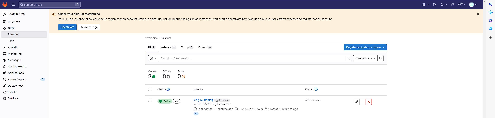
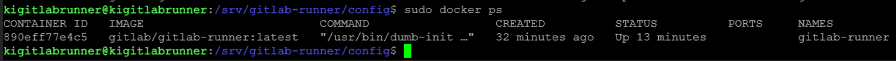
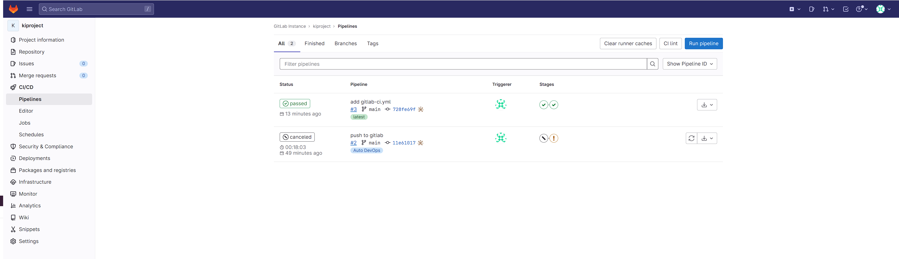
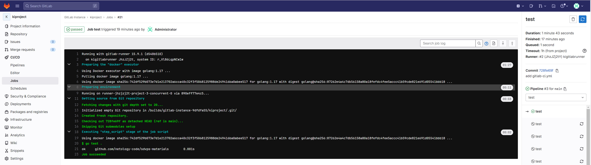
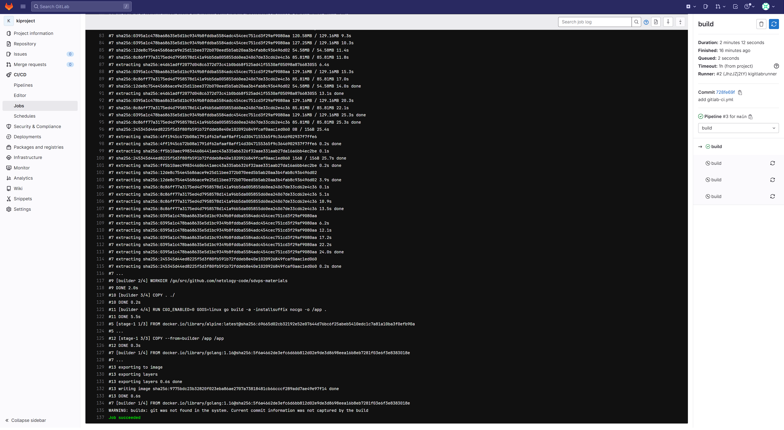

### 8.3. GitLab - Кулагин Игорь
### Задание 1

> Разверните GitLab локально, используя Vagrantfile и инструкцию, описанные в [этом репозитории](https://github.com/netology-code/sdvps-materials/tree/main/gitlab).   

> Создайте новый проект и пустой репозиторий в нём.

> Зарегистрируйте gitlab-runner для этого проекта и запустите его в режиме Docker. Раннер можно регистрировать и запускать на той же виртуальной машине, на которой запущен GitLab.

>В качестве ответа в репозиторий шаблона с решением добавьте скриншоты с настройками раннера в проекте.

**Конфигурационный файл `gitlab-runner`:**

```
concurrent = 1
check_interval = 0
shutdown_timeout = 0

[session_server]
  session_timeout = 3600

[[runners]]
  name = "kigitlabrunner"
  url = "http://158.160.60.165/"
  id = 2
  token = "JhzJZj2tYsRztkuPkz5E"
  token_obtained_at = 2023-03-11T18:38:35Z
  token_expires_at = 0001-01-01T00:00:00Z
  executor = "docker"
  [runners.cache]
    MaxUploadedArchiveSize = 0
  [runners.docker]
    tls_verify = false
    image = "ruby"
    privileged = true
    disable_entrypoint_overwrite = false
    oom_kill_disable = false
    disable_cache = false
    volumes = ["/cache", "/var/run/docker.sock:/var/run/docker.sock"]
    shm_size = 0
```
---

---

---


## Задание 2

> Запушьте [репозиторий](https://github.com/netology-code/sdvps-materials/tree/main/gitlab) на GitLab, изменив origin. Это изучалось на занятии по Git.

> Создайте .gitlab-ci.yml, описав в нём все необходимые, на ваш взгляд, этапы.

> В качестве ответа в шаблон с решением добавьте: 
> - файл gitlab-ci.yml для своего проекта или вставьте код в соответствующее поле в шаблоне; 
> - скриншоты с успешно собранными сборками.

**Содержимое файла gitlab-ci.yml:**

```stages:
  - test
  - build

test:
  stage: test
  image: golang:1.17
  script: 
   - go test .

build:
  stage: build
  image: docker:latest
  script:
   - docker build .
```
---

---

---

