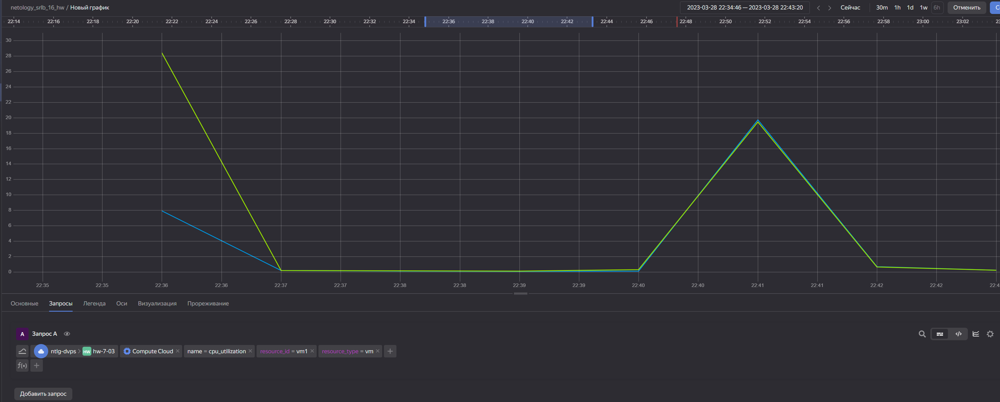
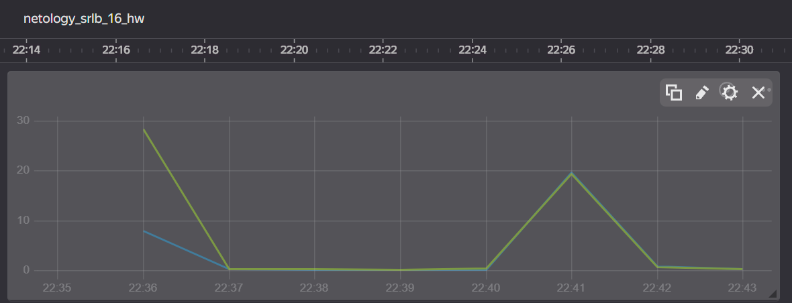

# 9.1. Обзор систем IT-мониторинга - Кулагин Игорь
## Задание 1
Создайте виртуальную машину в Yandex Cloud Compute Cloud и с помощью Yandex Monitoring создайте дашборд, на котором будет видно загрузку процессора.

---
